# IWAS Implementation Blueprint

> Canonical, module-wise engineering plan for the Inventory and Warehouse Analytics System (IWAS)
>
> Status: implementation baseline
>
> Last reviewed: 2026-08-21

## 1. How to Use This Document

This document is the implementation contract for IWAS. A developer should be able to scaffold, implement, test, and deploy the project from this file without inventing business rules.

Authority order:

1. `CSC470_Project09_Warehouse_Analytics.pdf` is authoritative for functional scope, formulas, thresholds, sample outputs, reports, and assessment deliverables.
2. The project owner's fixed stack and three-layer constraint are authoritative for technology and project boundaries.
3. This blueprint resolves implementation details that the PDF does not define.
4. `IWAS_PROJECT_PLAN.md` and the existing Codex master prompt remain useful source material, but this document supersedes their conflicting implementation recommendations.

Decision labels used below:

| Label | Meaning |
|---|---|
| `SOURCE` | Directly required by the assignment PDF. Do not change without a requirements change. |
| `OWNER` | Fixed by the project owner, including stack and three-layer architecture. |
| `ASSUMPTION` | Deterministic default for a source gap. Keep isolated and documented. |
| `RECOMMENDATION` | Engineering or UX decision that may change without changing source behavior. |
| `PREFLIGHT` | External production fact that must be verified before production data is trusted. Development can continue against the canonical demo schema. |

Rules for future changes:

- Never silently turn an assumption into a source requirement.
- Record changed assumptions in the decision log, tests, configuration, and traceability table.
- Never add source-data CRUD, even to make a demo easier.
- Never duplicate a formula in controllers, Razor, JavaScript, or report templates.
- A formal report must never present a knowingly incomplete financial or ordering total as complete.

## 2. Product Definition

### 2.1 Objective

`SOURCE`: IWAS is a read-only analytical web application for an existing warehouse data source. It implements:

- M1: FIFO stock valuation.
- M2: reorder, EOQ, days-to-ROP, and dead-stock analysis.
- M3: supplier on-time and late-delay analysis.
- M4: local binary-cosine requisition-to-catalogue matching.
- M5: five A4 reports using real computed values.

### 2.2 Actors

| Actor | Interaction with IWAS | Source ownership |
|---|---|---|
| Warehouse Manager | Runs all analysis and reports | Primary assignment user |
| Storekeeper | Views matching and clarification-needed results | Reviews externally; no IWAS resolution workflow |
| Purchase Officer | Views reorder and supplier analysis and printable draft | Acts outside IWAS |
| Viewer | Views authorized dashboards and reports | `RECOMMENDATION` role |
| Gate Office | Produces receipt records outside IWAS | External source system |
| Dispatch Desk | Produces issue records outside IWAS | External source system |
| Departments | Produce free-text requisitions outside IWAS | External source system |
| Database Administrator | Exposes canonical read views and SELECT-only account | Deployment actor |

### 2.3 In Scope

- Read and validate four source datasets.
- Calculate M1-M4 results on demand.
- Present derived lists, details, warnings, and clarification-needed results.
- Generate R1-R5 as HTML preview and A4 PDF.
- Authenticate configured users and authorize read-only modules.
- Log security and analytical events without copying sensitive source text.
- Provide local schema and deterministic demo data.
- Provide tests, diagrams, API documentation, deployment instructions, and viva assets.

### 2.4 Explicitly Out of Scope

No UI, API, service, repository, scheduled job, or report action may create, edit, delete, approve, reserve, receive, issue, adjust, or persist:

- items or catalogue prices;
- stock movements or opening balances;
- supplier or delivery records;
- requisitions or clarification decisions;
- purchase orders or purchase requisitions;
- warehouse transfers, barcodes, notifications, users, or roles.

The R3 purchase requisition draft is generated output only. The clarification queue is a computed filtered view only. Login and logout are security operations and are not prohibited domain mutations.

### 2.5 Measurable Quality Targets

| Area | Target |
|---|---|
| Correctness | All PDF worked examples and boundary tests pass exactly. |
| Read-only safety | Application save paths reject writes and the production SQL principal has SELECT only. |
| Accessibility | `RECOMMENDATION`: WCAG 2.2 AA for application pages and keyboard-only workflows. |
| Browser support | Current and previous major versions of Edge, Chrome, and Firefox; responsive at 360, 768, 1024, and 1440 CSS pixels. |
| Typical API latency | p95 under 2 seconds for filtered interactive analysis on the agreed demo volume. |
| Formal report latency | p95 under 30 seconds and hard timeout at 120 seconds on the agreed demo volume. |
| Determinism | Same source snapshot, configuration, and parameters produce byte-equivalent canonical business payloads and semantically identical reports; volatile transport metadata such as `generatedAtUtc`, trace IDs, and report generation timestamps is excluded from byte comparison. |
| Traceability | Every `SOURCE` requirement maps to code ownership and tests. |

Performance targets are acceptance-test targets, not promises for an unknown production data volume. Establish production baselines during schema preflight.

## 3. Non-Negotiable Invariants

1. Operational source data is read-only at the route, service, repository, EF Core, and SQL permission levels.
2. The solution has exactly three main application projects: `IWAS.Presentation`, `IWAS.Business`, and `IWAS.Models`.
3. Dependencies point down only: Presentation -> Business -> Models; Presentation may consume Models contracts but cannot access data infrastructure.
4. Controllers validate transport input, call one use case, and map the result. They contain no formulas and no EF queries.
5. Every business date and range is explicit, ISO `YYYY-MM-DD` at HTTP boundaries, and inclusive unless a section says otherwise.
6. Every list has a stable secondary sort so output does not change between executions.
7. Financial calculations use `decimal`; similarity uses `double` only inside the pure similarity calculator.
8. Reports consume the same business use cases as interactive pages.
9. Derived matches, clarification status, report files, and analysis results are not persisted by default.
10. Invalid source data is never silently corrected, coerced, dropped, or counted in an authoritative total.

## 4. Architecture

### 4.1 System Context

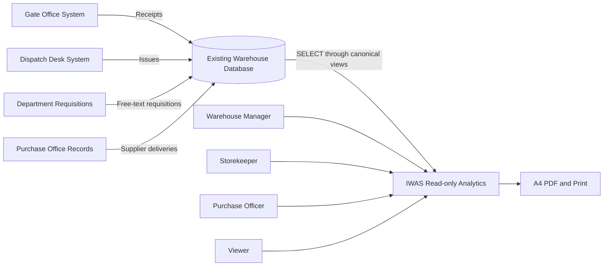

### 4.2 Layer and Trust Boundaries

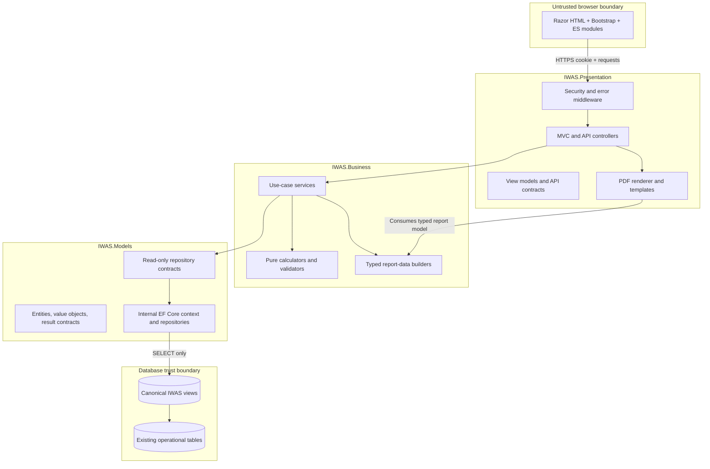

### 4.3 Dependency Rules

Allowed project references:

```text
IWAS.Presentation -> IWAS.Business
IWAS.Presentation -> IWAS.Models
IWAS.Business     -> IWAS.Models
```

Enforcement:

- Concrete DbContext and repository implementations are `internal` in `IWAS.Models`.
- `IWAS.Models` exposes DI registration through one public extension method; it does not expose the DbContext type to Presentation.
- Presentation controllers may reference entity/result contracts but not `IWAS.Models.Data` or concrete repositories.
- Architecture tests scan assembly references and namespaces and fail on a forbidden dependency.
- `IReportDocumentRenderer` belongs to Presentation. Business returns typed report data and never returns PDF bytes.

### 4.4 Module Dependency Graph

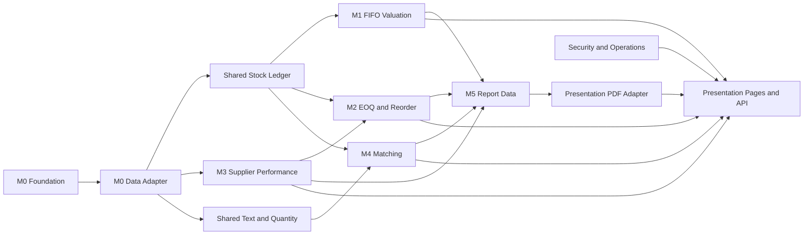

## 5. Technology Baseline

| Concern | Decision |
|---|---|
| Runtime | `RECOMMENDATION`: .NET 10 LTS, `net10.0`, current supported patch. |
| Web | ASP.NET Core MVC, Razor Views, API controllers, ProblemDetails. |
| Language | C# with nullable reference types, implicit usings, analyzers, warnings as errors in CI. |
| Persistence | EF Core 10 SQL Server provider, read-only canonical views. |
| UI | HTML5, Bootstrap 5, project CSS, vanilla JavaScript ES modules, locally hosted assets. |
| PDF | QuestPDF behind a Presentation adapter, subject to recorded license eligibility; replaceable without Business changes. |
| Tests | xUnit, `WebApplicationFactory`, SQL Server integration database, Microsoft Playwright for .NET browser tests. |
| API docs | OpenAPI generated from controllers and checked into `docs/api-contracts.md` as a human-readable contract. |
| Package control | Central package management plus committed per-project `packages.lock.json` files and locked restore; pin exact versions in the implementation commit. |

Do not add React, Angular, Vue, Blazor, a frontend bundler, a global state store, a generic repository framework, AutoMapper, MediatR, or an external AI service.

## 6. Repository and Module Layout

```text
IWAS/
|-- IWAS.sln
|-- IWAS_IMPLEMENTATION_BLUEPRINT.md
|-- IWAS_PROJECT_PLAN.md
|-- README.md
|-- .editorconfig
|-- .gitignore
|-- global.json
|-- Directory.Build.props
|-- Directory.Packages.props
|-- src/
|   |-- IWAS.Models/
|   |   |-- Entities/
|   |   |-- Enums/
|   |   |-- ValueObjects/
|   |   |-- Results/
|   |   |-- Reports/
|   |   |-- Options/
|   |   |-- Repositories/
|   |   |   |-- Abstractions/
|   |   |   `-- Queries/
|   |   |-- Data/
|   |   |   |-- IwasReadOnlyDbContext.cs
|   |   |   |-- Configurations/
|   |   |   |-- Repositories/
|   |   |   `-- ReadSnapshotRunner.cs
|   |   `-- DependencyInjection.cs
|   |-- IWAS.Business/
|   |   |-- Common/
|   |   |   |-- Clock/
|   |   |   |-- Exceptions/
|   |   |   |-- Validation/
|   |   |   `-- Pagination/
|   |   |-- StockLedger/
|   |   |-- StockValuation/
|   |   |-- SupplierPerformance/
|   |   |-- ReorderAnalysis/
|   |   |-- RequisitionMatching/
|   |   |-- Reporting/
|   |   `-- DependencyInjection.cs
|   `-- IWAS.Presentation/
|       |-- Api/V1/
|       |-- Controllers/
|       |-- ViewModels/
|       |-- Views/
|       |-- Auth/
|       |-- Authorization/
|       |-- Middleware/
|       |-- Reports/
|       |   |-- IReportDocumentRenderer.cs
|       |   |-- QuestPdfReportDocumentRenderer.cs
|       |   `-- Templates/
|       |-- Extensions/
|       `-- wwwroot/
|           |-- css/
|           |-- fonts/
|           |-- icons/
|           `-- js/
|-- tests/
|   |-- IWAS.Business.Tests/
|   `-- IWAS.Integration.Tests/
|       |-- Architecture/
|       |-- Data/
|       |-- Api/
|       |-- Security/
|       |-- Reports/
|       `-- Browser/
|-- database/
|   |-- development-schema.sql
|   |-- development-seed.sql
|   |-- canonical-views.example.sql
|   |-- read-only-user.sql
|   |-- verify-production-permissions.sql
|   `-- verify-denied-writes.ci.sql
|-- docs/
|   |-- srs.md
|   |-- api-contracts.md
|   |-- decisions.md
|   |-- requirements-traceability.md
|   |-- threat-model.md
|   |-- operations-runbook.md
|   |-- viva-test-cases.md
|   `-- diagrams/
`-- .github/workflows/ci.yml
```

Module ownership:

| Module | Owns | Does not own |
|---|---|---|
| Models | Source read models, typed results, repository query contracts, EF mappings | Formulas, HTTP, HTML, PDF layout |
| StockLedger | Chronological movement validation and layer consumption | Money formatting, controllers |
| M1 | FIFO value and remaining priced layers | Stock mutation |
| M3 | Supplier metrics and item delay profiles | Selecting purchase orders |
| M2 | Demand, EOQ, ROP, reorder decision, dead stock | Supplier metric duplication |
| M4 | Normalization, cosine, ranking, quantity parsing, price/stock enrichment | LLMs, approval, persistence |
| M5 | Typed R1-R5 data and formal completeness checks | PDF-vendor API |
| Presentation | HTTP, auth, view state, HTML, PDF rendering | Business formulas, EF queries |

## 7. Canonical Data Contract

### 7.1 Production Adapter Strategy

`RECOMMENDATION`: expose four canonical SQL views. This contains legacy table names, collations, value mappings, and nullable quirks in the database adapter instead of spreading them through Business.

```text
dbo.vw_IWAS_Items
dbo.vw_IWAS_StockMovements
dbo.vw_IWAS_SupplierDeliveries
dbo.vw_IWAS_Requisitions
```

If the DBA cannot create views, EF mappings may target existing tables, but they must expose the same C# contract and pass the same compatibility tests.

### 7.2 Canonical Columns

`vw_IWAS_Items`:

| Column | SQL shape | Rule |
|---|---|---|
| `ItemId` | `nvarchar(100)` | Required, trimmed, unique under the shared case-insensitive ID rule. |
| `Name` | `nvarchar(200)` | Required. |
| `Unit` | `nvarchar(50)` | Required. |
| `Category` | `nvarchar(100)` | Empty is allowed; display may show `Uncategorized` without changing source. |
| `HoldingCostPerUnitPerYear` | `decimal(19,4)` | Must be >= 0. |
| `OrderingCostPerPurchaseOrder` | `decimal(19,4)` | Must be >= 0. |
| `Description` | `nvarchar(2000)` | Empty is allowed but cannot produce a match. |
| `CatalogueUnitPrice` | `decimal(19,4) null` | `ASSUMPTION`; no substitute price is allowed. |

`vw_IWAS_StockMovements`:

| Column | SQL shape | Rule |
|---|---|---|
| `MovementId` | `nvarchar(100)` | Required and unique. |
| `ItemId` | `nvarchar(100)` | Required FK to canonical item. |
| `MovementDate` | `date` | Required business date. |
| `MovementSequence` | `bigint null` | Preferred same-day chronology. |
| `MovementType` | `nvarchar(10)` | Canonical values `Receipt` or `Issue`. |
| `Quantity` | `decimal(19,4)` | Must be > 0. |
| `UnitPurchasePrice` | `decimal(19,4) null` | Required and >= 0 for receipt; ignored with warning for issue. |

`vw_IWAS_SupplierDeliveries`:

| Column | SQL shape | Rule |
|---|---|---|
| `DeliveryRecordKey` | `nvarchar(200)` | Adapter-supplied stable unique row/order key. |
| `SupplierId` | `nvarchar(100)` | Required. |
| `SupplierName` | `nvarchar(200)` | Required and consistent within a supplier ID. |
| `ItemId` | `nvarchar(100)` | Required FK to canonical item. |
| `PromisedDeliveryDate` | `date` | Required. |
| `ActualDeliveryDate` | `date null` | Open rows are allowed but excluded from delivered-order metrics. |

`vw_IWAS_Requisitions`:

| Column | SQL shape | Rule |
|---|---|---|
| `RequisitionId` | `nvarchar(100)` | Required and unique. |
| `Department` | `nvarchar(200)` | Required. |
| `RequisitionDate` | `date` | Required. |
| `Description` | `nvarchar(4000)` | Required for useful matching; empty becomes clarification. |

### 7.3 Production Preflight Gates

The application can be built against the development schema before these facts are known. Production readiness is blocked until all are recorded in `docs/decisions.md`:

| Gate | Required evidence | Failure behavior |
|---|---|---|
| P1 Schema mapping | Actual object and column map for all canonical fields | Readiness unhealthy; app does not serve analysis |
| P2 Chronology | Same-day movement sequence is trustworthy | Production M1/M2/M4 stock results block with `ambiguous_movement_order`; ordinal fallback is demo-only |
| P3 History completeness | Movements start from zero or include opening layers, and `ReliableHistoryFrom` records the earliest trustworthy date covering the requested 365-day demand window | FIFO blocks on prefix underflow; M2 blocks with `insufficient_demand_history` when coverage is unknown/short |
| P4 Catalogue price | Real catalogue price mapping or explicit acceptance of unavailable price | M4 still matches; price and total remain null |
| P5 Base lead time | Per-item overrides or accepted default of 5 days | M2 uses validated default and labels source as configured |
| P6 Delivery identity | One canonical row equals one delivered purchase order and has a stable key | M3/R4 blocked if counts cannot be trusted |
| P7 SQL isolation | SQL `SNAPSHOT` is available on the source or a transactionally consistent reporting replica | Production multi-query analysis/report readiness is blocked otherwise; `READ COMMITTED` and `SERIALIZABLE` are not authoritative production fallbacks |
| P8 Branding | Company name and optional logo/font license confirmed | Default text header `Padma Trading Ltd`; no logo |

### 7.4 Entity Relationships

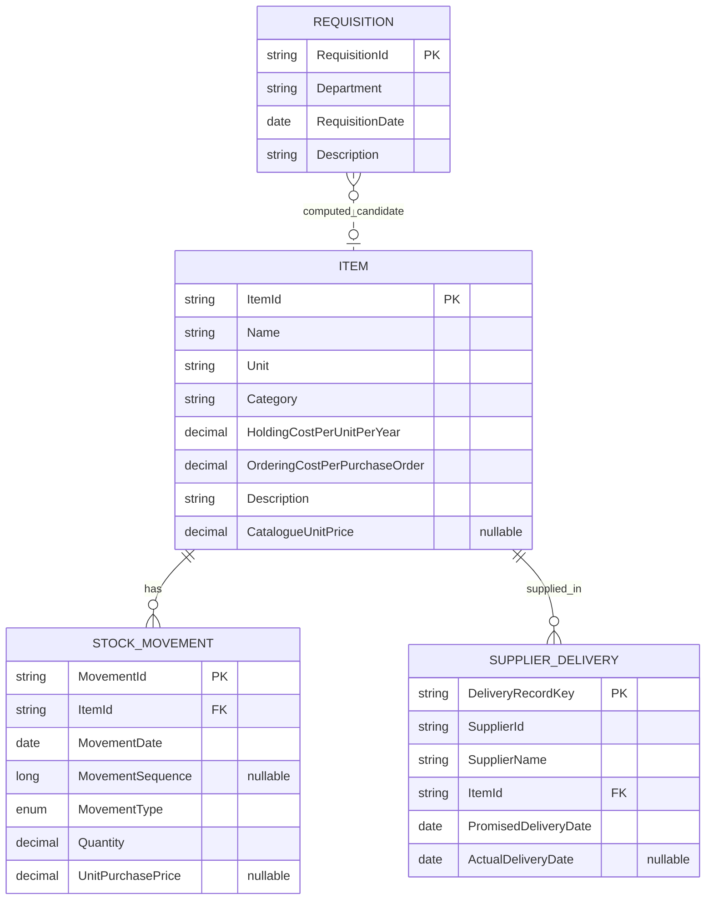

The requisition-item relationship is never an EF navigation and is never persisted.

### 7.5 Read-only Enforcement

Application controls:

- Set `QueryTrackingBehavior.NoTracking` globally and use `AsNoTracking` in every repository query.
- Override and reject all four `SaveChanges` families: sync/async and `acceptAllChangesOnSuccess` overloads.
- Do not expose `DbSet`, `Database`, DbContext, migrations, `ExecuteSql`, or entity attach/update methods outside the internal data namespace.
- Repositories expose query methods only. Interface names containing `Add`, `Create`, `Update`, `Delete`, `Save`, or `Execute` fail an architecture test.
- Production startup never calls `EnsureCreated`, `Migrate`, seed code, or DDL.

Database controls:

- Use a dedicated login/user that has `CONNECT` and `SELECT` on canonical views only.
- Do not grant `db_datawriter`, `INSERT`, `UPDATE`, `DELETE`, `ALTER`, `CONTROL`, or stored-procedure `EXECUTE`.
- Encrypt the SQL connection and validate the server certificate in production.
- `database/verify-production-permissions.sql` performs permission/catalog introspection and a harmless SELECT only. `database/verify-denied-writes.ci.sql` runs negative DML/execute tests only against disposable development/CI databases. Never trial DML against a production source, even inside a rollback, because identity, trigger, audit, and external side effects may survive.

### 7.6 Query and Snapshot Contracts

Repository queries return projected read models, not mutable tracked entities. Required bulk operations prevent N+1 reads:

```csharp
Task<ItemStockDataset?> GetItemStockDatasetAsync(
    string itemId, DateOnly through, CancellationToken ct);

Task<WarehouseStockDataset> GetWarehouseStockDatasetAsync(
    DateOnly through, CancellationToken ct);

Task<IReadOnlyList<ItemDemandRow>> GetIssueDemandAsync(
    DateOnly from, DateOnly through, CancellationToken ct);

Task<IReadOnlyList<SupplierDeliveryRow>> GetDeliveredRowsAsync(
    DateOnly from, DateOnly through, string? supplierId, CancellationToken ct);

Task<int> CountOpenRowsByPromisedPeriodAsync(
    DateOnly from, DateOnly through, string? supplierId, CancellationToken ct);

Task<IReadOnlyList<RequisitionRow>> GetRequisitionsAsync(
    DateOnly from, DateOnly through, CancellationToken ct);
```

- Apply source-only predicates (dates and exact item/supplier/requisition IDs) in SQL. Apply SQL paging only when every requested filter and sort key is a canonical source column.
- For M1-M4 queries with computed filters/sorts, open the request snapshot, `COUNT` and reject an over-limit candidate set, then load that bounded set in the same snapshot, calculate all rows in Business, filter, sort, and finally page. Paging source rows before calculation is forbidden because it changes totals and page membership.
- Stable movement order: `MovementDate`, `MovementSequence`, then ordinal `MovementId`.
- If an item/date has multiple movements and chronology is not proven unique, production returns `ambiguous_movement_order`. Development/demo may opt into ordinal MovementId fallback as `ASSUMPTION FIFO-01` and must emit a warning. Never force receipts before issues.
- Every multi-query analysis/report shares one scoped DbContext and one SQL `SNAPSHOT` transaction against the source or reporting replica. Production startup fails if this cannot be guaranteed. A disposable development fixture may exercise `SERIALIZABLE` for compatibility diagnostics, but its output is not acceptance evidence.
- Repositories never open hidden contexts/transactions, never return `IQueryable`, and never issue parallel EF operations on the shared context.
- Materialize the immutable result/report model, close the read transaction, then serialize JSON or render PDF.
- `IReadSnapshotRunner.ExecuteAsync` owns the transaction. Nested module calls detect and join the active scoped read snapshot rather than opening another transaction; an outer dashboard/report use case therefore sees one source version.
- Interactive bulk endpoints may return row-level failures. Formal reports fail atomically on any blocking row so totals are never misleading.

## 8. Shared Business Conventions

### 8.1 Dates and Time

- HTTP dates are ISO `YYYY-MM-DD` and bind to `DateOnly`.
- All `from`/`through` ranges are inclusive.
- A rolling 365-day window is `analysisDate.AddDays(-364)` through `analysisDate`.
- A rolling 180-day issue window is `analysisDate.AddDays(-179)` through `analysisDate`.
- Future analysis dates are rejected by default against `IBusinessClock.Today` in `Asia/Dhaka`.
- The clock is injected and fixed in tests. Server-local time is never used directly.
- Report generation timestamp is a BCL `DateTimeOffset` in UTC rendered in the configured business timezone; business filters remain `DateOnly`.
- Source IDs are opaque strings. Trim request-edge whitespace, compare identity with `StringComparer.OrdinalIgnoreCase`, preserve original text for display, and reject source keys that collide under that rule. Stable ordering uses normalized ID then original ordinal ID.

### 8.2 Numbers and Rounding

| Value | Internal | Comparison | Display |
|---|---|---|---|
| Money | `decimal`, scale up to 4 | Unrounded | BDT, 2 decimals, away from zero |
| Source quantity | `decimal(19,4)` | Unrounded | Up to 4 decimals, trim zeros |
| EOQ raw | `decimal` converted from checked square root | Unrounded raw | 4 decimals in API details |
| Suggested EOQ | `decimal` | Not used for ROP | Nearest whole unit, away from zero; PDF example gives 382 |
| ROP/safety stock | `decimal` | Unrounded | Up to 2 decimals |
| Percent | ratio `decimal` in `[0,1]` | Raw ratio | Percentage with 2 decimals |
| Similarity | integer term counts for decisions; `double` in `[0,1]` for output | Exact integer cross-products and exact 4/5 threshold | Percentage with 2 decimals |
| Delay | `decimal` days | Unrounded | Up to 2 decimals |

Currency configuration is a label and formatting rule, not a conversion engine. Validate `CurrencyCode == "BDT"` until a real multi-currency requirement exists.

### 8.3 Validation Severity

| Severity | Meaning | Interactive behavior | Formal report behavior |
|---|---|---|---|
| Blocking | Result would be false or financially unsafe | Single item: 422. Bulk: failed row and `isComplete=false`. | Entire report returns 422; no PDF. |
| Warning | Result is valid but based on an explicit assumption | Return result plus warning code. | Include a compact assumptions/data-quality note. |
| Informational | Expected empty or unavailable optional value | Show neutral state. | Show `Not available`; totals use only defined fields. |

Common blocking source errors:

- duplicate primary/source key;
- orphan item reference;
- blank required ID/name/unit;
- unknown movement type;
- quantity <= 0;
- receipt price missing or negative for M1/R2/R4 valuation;
- chronological issue exceeds available receipts;
- contradictory supplier names for one supplier ID;
- actual delivery before a logically impossible source minimum, or duplicate delivery key;
- numeric overflow or non-finite similarity result.

Warnings include zero receipt price, issue row containing an ignored purchase price, null same-day movement sequence, missing optional catalogue price, and configured rather than source lead time.

### 8.4 Stable Failure Contract

Business exceptions:

```text
RequestValidationException -> 400
EntityNotFoundException    -> 404
SourceDataException        -> 422
CalculationException       -> 422
AnalysisTimeoutException   -> 503
```

Every exception carries a stable machine code and safe dimensions, never raw SQL or full requisition text.

### 8.5 Bulk Result Contract

Interactive warehouse-wide analyses use one contract:

```text
PagedAnalysisBatch<T>
  Parameters
  Page, PageSize, TotalCount, HasNextPage
  SuccessfulCount, FailedCount, ReturnedCount
  GeneratedAtUtc
  IsComplete
  Data: T[]
  Issues: AnalysisIssue[]
  Summary: TSummary?
```

Business first creates an ordered internal union of `AnalysisRow<T>` values and safe row errors. Source filters apply before calculation; computed filters apply to successful values, while a failed candidate remains visible as an issue because its computed membership is unknowable. Computed sorting places errors null-last, then stable ordinal ID. Paging is applied to that union; `data` and `issues` contain the successful and failed members of the current page.

`totalCount`, `successfulCount`, and `failedCount` describe the entire filtered candidate set, not only the current page; `returnedCount == data.length + issues.length`. `isComplete == (failedCount == 0)`. Any aggregate `summary` is null when incomplete unless a field is explicitly named and documented as success-only. `CannotCalculate` is UI text for an `AnalysisIssue`, not an M2 `ActionCode` and not a partial business value.

Formal reports use internal snapshot-aware complete methods (`AnalyzeAllForReportAsync`/`MatchAllForReportAsync`) rather than looping API pages. They COUNT before loading, enforce report and input caps, return a complete immutable collection from the active snapshot, and fail the entire report on the first material issue.

## 9. M0 - Foundation and Data Access

### 9.1 Responsibilities

- Create the solution, projects, references, analyzers, configuration, and dependency injection.
- Implement canonical entities/read models and EF mappings.
- Implement query-only repositories and snapshot execution.
- Add the business clock, exception hierarchy, pagination, validation primitives, and common result types.
- Create development schema/seed, canonical view example, and read-only SQL scripts.
- Make an empty authenticated shell build and run before feature UI begins.

### 9.2 Configuration Objects

```json
{
  "IWAS": {
    "CompanyName": "Padma Trading Ltd",
    "CurrencyCode": "BDT",
    "BusinessTimeZone": "Asia/Dhaka"
  },
  "Data": {
    "ReliableHistoryFrom": null,
    "StrictMovementChronology": true,
    "IsolationMode": "Snapshot"
  },
  "Matching": {
    "AutoMatchThreshold": 0.80,
    "TopCandidateCount": 3,
    "NormalizationCacheMinutes": 10,
    "MaximumParsedQuantity": 1000000
  },
  "Reorder": {
    "SafetyStockRate": 0.20,
    "DeadStockDays": 180,
    "AnnualDemandDays": 365,
    "DefaultBaseLeadTimeDays": 5,
    "ItemLeadTimeOverrides": {}
  },
  "Supplier": {
    "WatchListThreshold": 0.80,
    "PerformanceWindowDays": 365
  },
  "Reporting": {
    "PageSize": "A4",
    "MaximumPeriodDays": 366,
    "RequestTimeoutSeconds": 120,
    "SqlCommandTimeoutSeconds": 90,
    "MaximumRows": 10000,
    "PersistGeneratedReports": false
  },
  "AnalysisLimits": {
    "MaximumItems": 50000,
    "MaximumMovementsPerRequest": 2000000,
    "MaximumDeliveriesPerRequest": 500000,
    "MaximumRequisitionsPerRequest": 100000,
    "MaximumCatalogueItems": 50000,
    "MaximumTermsPerDocument": 256,
    "MaximumTotalTermsPerRequest": 5000000
  },
  "Execution": {
    "LoginRequestSeconds": 10,
    "InteractiveRequestSeconds": 30,
    "InteractiveSqlSeconds": 25,
    "ReadinessRequestSeconds": 3,
    "ReadinessSqlSeconds": 2,
    "ShutdownGraceSeconds": 150
  }
}
```

Startup validation:

- Company name 1-200 characters; timezone must resolve; currency must be `BDT`.
- Matching and supplier thresholds are in `[0,1]`; source defaults cannot drift in production without an explicit requirements decision.
- In source-conformant mode, matching/watch thresholds must equal `0.80`, safety stock `0.20`, dead-stock days `180`, and annual-demand days/divisor `365` exactly.
- Safety stock rate is `0.20`, dead stock is 180, annual demand is 365 for source-conformant mode.
- Lead times are 0-365 days and override keys must identify existing canonical items when first used.
- Production requires non-null `ReliableHistoryFrom`, strict chronology, and `Snapshot` isolation against the source or reporting replica. Any other `IsolationMode` fails startup.
- Normalization-cache duration is 1-1440 minutes; top candidates is 1-10.
- Every analysis limit is positive. Preflight COUNT queries must reject `analysis_input_too_large` before materializing rows; no endpoint truncates to a cap.
- SQL budgets are shorter than request budgets, and shutdown grace exceeds the 120-second report budget.
- Invalid production options fail startup with safe, specific diagnostics.

### 9.3 M0 Exit Gate

- Clean restore/build passes.
- Architecture tests pass.
- SQL Server integration fixture reads all four canonical datasets.
- Every `SaveChanges` overload throws.
- Restricted SQL login can SELECT and cannot INSERT/UPDATE/DELETE.
- Route inventory contains no operational domain mutation endpoint.
- Invalid options prevent startup.

## 10. Shared Stock Ledger

M1, M2, M4, R1, R2, R3, and R4 need one authoritative stock chronology implementation.

### 10.1 Contract

```csharp
StockLedgerResult Consume(
    IReadOnlyList<StockMovementInput> orderedMovements,
    DateOnly through);
```

Result:

```text
ItemId
ThroughDate
TotalReceived
TotalIssued
ClosingQuantity
RemainingLayers[]
Warnings[]
```

Each remaining layer contains movement ID, receipt date, source sequence, remaining quantity, and nullable purchase price. M1 validates and values prices; quantity-only consumers do not fail merely because a price is absent.

### 10.2 Algorithm

1. Filter movements with `MovementDate <= through`.
2. Validate unique movement IDs, item consistency, type, positive quantity, and stable order.
3. Sort by date, present sequence before absent sequence, sequence, then ordinal movement ID.
4. For a receipt, enqueue a new layer.
5. For an issue, repeatedly consume the oldest non-empty layer.
6. If the issue has remaining quantity after the queue is empty, throw `stock_history_insufficient` with the movement ID and shortage, not a negative result.
7. Remove zero layers and return conservation totals.

Invariant checks:

```text
TotalReceived - TotalIssued == ClosingQuantity
sum(RemainingLayer.Quantity) == ClosingQuantity
every remaining quantity > 0
closing quantity >= 0
```

### 10.3 Edge Decisions

| Case | Decision |
|---|---|
| No movement through date | Valid zero position with no layers. |
| Future movement | Excluded. |
| Same-day sequence absent | Production blocking error when multiple movements share the date; opt-in demo fallback warns. |
| Same-day duplicate sequence | Production blocks with `ambiguous_movement_order` unless the source contract proves MovementId is chronological and unique for that tie; demo-only ordinal fallback warns. |
| Issue before available receipt | Blocking 422 at the exact issue; later receipts do not repair history. |
| Receipt price null | Quantity result valid; valuation consumers fail. |
| Receipt price zero | Valid with `zero_receipt_price` warning. |
| Issue has price | Ignore price and warn. |
| Fractional quantity | Supported to 4 decimals. |
| Duplicate movement ID | Blocking source error. |
| Unknown item/type | Blocking source error. |
| History starts with opening stock not represented | Must be mapped as an opening receipt; otherwise P3 fails. |

## 11. M1 - FIFO Stock Valuation

### 11.1 Source Rules

For an item and as-of date:

```text
ClosingQuantity = sum(Receipts) - sum(Issues)
FifoValue = sum(RemainingLayerQuantity * ReceiptUnitPrice)
```

Issues consume the oldest receipt layer first. Weighted average, LIFO, current price, last price, and average price are forbidden substitutes.

### 11.2 Public Use Cases

```csharp
Task<StockValuationResult> CalculateItemAsync(
    string itemId, DateOnly asOf, CancellationToken ct);

Task<PagedAnalysisBatch<StockValuationResult>> CalculateWarehouseAsync(
    DateOnly asOf, PageRequest page, CancellationToken ct);
```

`StockValuationResult`:

```text
ItemId, ItemName, Unit, AsOfDate
TotalReceived, TotalIssued, ClosingQuantity
FifoValue
Layers[]: MovementId, ReceiptDate, RemainingQuantity,
          UnitPurchasePrice, LayerValue
Warnings[]
```

### 11.3 Processing

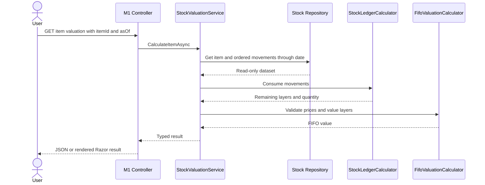

### 11.4 Edge Decisions

- Missing item: 404 `item_not_found`.
- Item with no movement: quantity/value 0 and empty layers.
- Missing or negative price on any remaining or consumed receipt involved in the ledger: M1 fails 422. Valid FIFO history requires prices for every consumed receipt because valuation integrity cannot be inferred selectively.
- Zero receipt price is accepted and visible as BDT 0.00 with a warning.
- Currency multiplication is checked for overflow.
- Formal R2 fails if any included item cannot be valued. Interactive warehouse results may show failed rows and no total.
- Layers sort oldest remaining first.

### 11.5 Mandatory Gate Tests

- PDF example: 100@520, 80@535, issue 120, 60@550, issue 30 -> 90; layers 30@535 and 60@550; BDT 49,050.
- Single receipt; multiple receipts; partial layer; exact layer depletion; multiple-layer depletion; zero closing stock.
- Issue before any receipt; issue exceeds available quantity; later receipt does not hide earlier oversell.
- Same-date explicit sequence; missing-sequence fallback; duplicate sequence stable ordering.
- Cutoff excludes later movement; leap-day date; fractional quantities.
- Missing, negative, zero, and very large receipt price; arithmetic overflow.
- Property tests for quantity conservation and layer-value sum.

M1 is complete only when the exact PDF test and all invariants pass.

## 12. M3 - Supplier Performance

M3 is built before final M2 because supplier delay contributes to M2 lead time.

### 12.1 Source Rules

```text
OnTime = ActualDeliveryDate <= PromisedDeliveryDate
OnTimeRatio = OnTimeOrders / DeliveredOrders
LateDelayDays = ActualDeliveryDate - PromisedDeliveryDate
AverageLateDelay = sum(LateDelayDays for late rows) / LateOrders
WatchList = OnTimeRatio < 0.80
```

Standing defaults:

```text
OnTimeRatio == 1.00 -> Excellent  [ASSUMPTION for sample compatibility]
0.80 <= ratio < 1  -> Good       [ASSUMPTION]
ratio < 0.80       -> Watch List [SOURCE]
```

Ratios are stored and compared on `[0,1]`. The threshold is `0.80`, not `80`.

### 12.2 Period and Row Semantics

- A row counts as a delivered purchase order when `ActualDeliveryDate` is non-null and falls in the inclusive requested period.
- Open rows with null actual date are excluded from delivered metrics. `OpenRowsExcluded` is a separate informational query counting rows whose promised date falls in the inclusive requested period and whose actual date is still null; it is not part of the PDF formula and never changes the denominator.
- One canonical delivery row equals one purchase order as required by P6.
- Early deliveries count as on-time and contribute no zero to the late-only average.
- No late rows means `AverageLateDelayDays = null`, displayed as `-`.
- Suppliers with zero delivered rows in the period do not appear in the list.

### 12.3 Public Use Cases

```csharp
Task<PagedAnalysisBatch<SupplierPerformanceResult>> AnalyzeAsync(
    DateOnly from,
    DateOnly through,
    string? supplierId,
    SupplierStanding? standing,
    PageRequest page,
    CancellationToken ct);

Task<ItemSupplierDelayResult> ResolveDelayForItemAsync(
    string itemId,
    DateOnly from,
    DateOnly through,
    CancellationToken ct);
```

Result fields:

```text
SupplierId, SupplierName, From, Through
DeliveredOrders, OnTimeOrders, LateOrders, OpenRowsExcluded
OnTimeRatio, AverageLateDelayDays, Standing
```

The paged API also returns `SupplierPerformanceSummary` over the entire filtered candidate set: delivered orders, on-time orders, weighted on-time ratio (`sum(OnTimeOrders) / sum(DeliveredOrders)`, never an average of supplier percentages), watch-list supplier count, and open rows excluded. The summary is null when any candidate fails or the delivered denominator is zero.

### 12.4 Multiple Supplier Rule for M2

`ASSUMPTION SUP-01`: for an item in the M2 supplier window, select the supplier with:

1. the greatest delivered-order count;
2. then the most recent actual delivery date;
3. then ordinal SupplierId.

Return the selected supplier ID/name, selection reason, row count, and delay. If there are no delivered rows, supplier delay is 0 and the result carries `no_supplier_history`. Do not average unrelated suppliers together. Replace this strategy behind `IItemSupplierDelayResolver` if the source later exposes a preferred supplier.

### 12.5 Edge Decisions

| Case | Decision |
|---|---|
| `from > through` | 400. |
| Period over 366 days in UI/API | 400; internal M2 uses its configured 365-day window. |
| Actual equals promised | On time. |
| Actual before promised | On time; delay excluded. |
| Null actual | Open, excluded from denominator. |
| Duplicate delivery key | Blocking source error. |
| Same supplier ID with conflicting nonblank names | Blocking supplier row; do not merge silently. |
| Same name with different IDs | Separate suppliers. |
| Orphan item | Blocking source error for item delay and formal R4. |
| Average fractional delay | Keep raw decimal; display 2 decimals. |
| 79.999% / 80% / 100% | Watch / Good / Excellent using raw ratio. |

### 12.6 Mandatory Gate Tests

- PDF example: 17/20 = 0.85; delays 2,4,6 -> 4; Good.
- 79.99% Watch List; exactly 80% Good; exactly 100% Excellent.
- All early/on-time -> null average delay.
- Actual/promised equality, inclusive period boundaries, null actual rows.
- Multiple-supplier selection and both tie-breakers.
- Duplicate key, conflicting supplier names, no deliveries, orphan item.

## 13. M2 - Reorder, EOQ, and Dead Stock

### 13.1 Source and Assumption Rules

```text
D = sum of issue quantities in rolling 365 days [ASSUMPTION DEM-01]
AverageDailyDemand = D / 365
EOQRaw = sqrt((2 * D * OrderingCost) / HoldingCost)
LeadTimeDemand = EffectiveLeadTimeDays * AverageDailyDemand
SafetyStock = 0.20 * LeadTimeDemand
ROP = LeadTimeDemand + SafetyStock
ReorderNow = StockOnHand <= ROP
DaysToROP = 0, when ReorderNow
DaysToROP = ceil((StockOnHand - ROP) / AverageDailyDemand), when demand > 0
DaysToROP = null, when demand == 0 and not already at ROP
EffectiveLeadTime = ConfiguredBaseLeadTime + SelectedSupplierAverageLateDelay
```

The source formula is literal and independent of closing quantity: `IsDeadStock = no issue in the inclusive 180-day window`. Equivalently, the last issue is at least 180 elapsed days before analysis, or the item has never been issued. `HasDisposableStock = IsDeadStock && StockOnHand > 0` is the separate `ASSUMPTION DEAD-01` used only to prioritize replenishment messaging and include rows in R4; zero-stock items can satisfy the literal dead-stock flag but are not disposal candidates.

### 13.2 Public Use Cases

```csharp
Task<ReorderAnalysisResult> AnalyzeItemAsync(
    string itemId, DateOnly analysisDate, CancellationToken ct);

Task<PagedAnalysisBatch<ReorderAnalysisResult>> AnalyzeWarehouseAsync(
    ReorderQuery query, CancellationToken ct);
```

Result fields:

```text
Item identity and unit
AnalysisDate, DemandWindowFrom, DemandWindowThrough
StockOnHand, AnnualDemand, AverageDailyDemand
OrderingCost, HoldingCost
BaseLeadTimeDays, SupplierDelayDays, EffectiveLeadTimeDays
SelectedSupplierId/Name and selection reason
LeadTimeDemand, SafetyStock, ReorderPoint
EoqRaw, SuggestedOrderQuantity
ReorderNow, DaysToROP
IsDeadStock, HasDisposableStock, LastIssueDate, DeadStockReason
ActionCode, Warnings[]
```

### 13.3 Orchestration

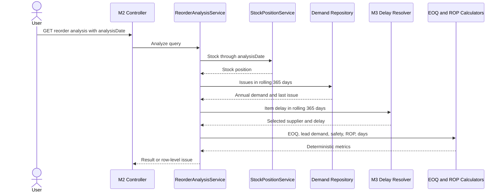

### 13.4 Decision Precedence

R3/UI action is derived in this exact order:

1. Blocking data/calculation failure -> return an `AnalysisIssue`; the UI may display `Cannot calculate`, but no `ReorderAnalysisResult` or `ActionCode` is fabricated.
2. `AnnualDemand == 0` -> `ReviewNoDemand`; preserve formula fields (`ROP=0`, `EOQ=0`) only when holding cost is valid, but never display `Order 0 now`.
3. `HasDisposableStock` -> `ReviewDeadStock`; do not recommend replenishment merely because a formula boundary is met.
4. `StockOnHand <= ROP` -> `OrderNow` with suggested quantity.
5. `DaysToROP` available -> `OrderInDays`.
6. Otherwise -> `Ok`.

`ReorderNow` still exposes the literal source formula. `ActionCode` applies the safe presentation precedence above and is explicitly an assumption.

### 13.5 Edge Decisions

| Case | Decision |
|---|---|
| `D == 0`, `H > 0` | EOQ 0, daily demand 0, ROP 0, days null unless formula says already at ROP; action `ReviewNoDemand`. |
| Any `D >= 0`, `H <= 0` | Blocking `holding_cost_invalid`; validate the denominator before EOQ and never simplify `0 / 0` to zero. |
| Ordering cost < 0 | Blocking source error. |
| Ordering cost == 0 | EOQ 0; warning. |
| Base lead time < 0 or >365 | Startup/request configuration error. |
| Supplier delay null | Add 0 and report `no_late_deliveries` or `no_supplier_history`. |
| Fractional effective lead time | Use unrounded decimal in ROP. |
| Stock < 0 | Stock ledger already blocks it. |
| Issue exactly 179 days ago | Not dead. |
| Issue exactly 180 days ago | Dead under the literal rule when there is no newer issue, regardless of stock. |
| Never issued | Dead under the literal rule; reason `NeverIssued`. `HasDisposableStock` still requires positive stock. |
| No movement and zero stock | `IsDeadStock=true`, `HasDisposableStock=false`; expose the distinction and omit from R4 disposal review. |
| Suggested EOQ rounds to 0 while D > 0 | Minimum display suggestion 1 whole unit; raw EOQ remains visible. |
| Leap year | Still divide by source-mandated 365 and use a 365-date inclusive window. |
| Reliable source coverage begins after `analysisDate - 364` | Blocking `insufficient_demand_history`; do not treat missing history as zero demand. |

### 13.6 Mandatory Gate Tests

- PDF example: D=3650, ordering=800, holding=40, base L=5, delay=0, stock=90 -> raw EOQ `sqrt(146000) = 382.099463490856...`, suggested display 382, daily 10, ROP 60, reorder false, days 3.
- Stock equal/below/above exact unrounded ROP.
- Zero demand/action precedence; zero/negative holding and ordering costs.
- Supplier delay increases effective lead time, safety stock, and ROP without copying M3 logic.
- Rolling window inclusivity and leap-day cases.
- 179/180/181-day dead-stock boundaries; never-issued and zero-stock literal flags; independent positive-stock disposal filter.
- Multiple supplier selection is surfaced in result.
- Very large inputs and overflow protection.

## 14. M4 - Requisition-to-Catalogue Matching

### 14.1 Scope

`SOURCE`: use local binary term-set cosine similarity. No OpenAI API, embeddings, LLM, Python service, or external network call. TF-IDF is deferred and binary cosine remains the default even if a later strategy is added.

### 14.2 Searchable Text and Normalization

Catalogue candidates use `Item.Description` only because the PDF specifies matching against descriptions. Item name/category/unit are display fields and do not inflate similarity.

`SOURCE GAP`: the PDF's worked sets retain `office` in the catalogue terms but omit the same word from the requisition terms even though both are described as stop-word filtered. One symmetric stop-word list cannot produce those exact sets. The field-aware context-removal assumption below resolves the demo deterministically; retain a pure cosine test over the PDF-provided sets separately from normalization tests.

Pipeline:

1. Normalize Unicode to NFKC and lowercase invariantly.
2. Lexically identify quantity-like spans before term matching. Remove their numeric/number-word/package tokens from matching even when the later compatibility result is ambiguous, while preserving candidate spans and parser status for display.
3. On requisitions only, remove request-context phrases such as `for [the] <Department> [office|section]`; this reproduces the PDF's removal of `accounts office` without deleting meaningful `office` from catalogue descriptions.
4. Replace punctuation and hyphens with spaces; preserve Unicode letters/digits.
5. Tokenize contiguous letter/digit sequences. A token longer than 64 Unicode scalar values is excluded with `token_too_long_ignored`; it is never dropped silently. More than the configured per-document term cap blocks with `normalization_limit_exceeded`.
6. Remove this exact v1 English stop-word set from `Matching/stopwords.en.txt`, one ASCII token per line: `a, an, and, are, as, at, be, by, for, from, in, into, is, it, of, on, or, that, the, this, to, with`. Any change increments `StopWordSetVersion` and reruns all golden tests.
7. Apply conservative plural rules in order:
   - `...ies` with length > 4 -> `...y`;
   - `...es` only for `s`, `x`, `z`, `ch`, or `sh` endings;
   - trailing `s` with length > 3 except words ending `ss`, `us`, or `is`.
8. Deduplicate into an ordinal term set.

English normalization is the baseline. Bengali and other Unicode terms are preserved and compare by exact normalized token; there is no transliteration, stemming, synonym expansion, or spelling correction.

### 14.3 Similarity and Ranking

For distinct term sets A and C:

```text
Common = count(A intersection C)
Similarity = Common / (sqrt(count(A)) * sqrt(count(C)))
```

- If either set is empty, similarity is 0.
- Keep integer `CommonTermCount`, `RequestTermCount`, and `ItemTermCount` with every candidate.
- Compare candidates exactly without square roots: candidate 1 outranks candidate 2 when `common1^2 * itemCount2 > common2^2 * itemCount1`, because request term count is shared.
- Candidates are tied when those cross-products are exactly equal. Ordinal ItemId ordering is display-only and never resolves an automatic-match tie.
- Compare the source threshold exactly as `common^2 * 25 >= 16 * requestCount * itemCount`, equivalent to similarity >= 4/5.
- Calculate `double` similarity only after exact rank/threshold decisions for display/API output; a non-finite/out-of-range value is a calculation error.
- Sort candidates by exact similarity descending, then ordinal ItemId.
- A unique qualifying top score is auto-matched.
- A qualifying exact top tie is clarification with reason `AmbiguousTopScore`.
- A unique top below threshold is clarification with reason `BelowThreshold`.
- No catalogue items is clarification with reason `CatalogueEmpty`; all empty descriptions is `NoUsableCatalogueText`.
- Multiple candidates above 80% are allowed; only a unique highest candidate auto-matches. Return the top three for transparency.

### 14.4 Quantity Parser

Return `QuantityParseResult` with nullable quantity, status, raw/normalized unit hint, matched span, and `UnitCompatibility = Compatible | Unknown | Conflicting | NotApplicable`. Do not return a fabricated default.

Supported, in precedence order:

```text
1 dozen, one dozen -> 12
2 dozen, two dozen -> 24
integer + adjacent unit/noun token, such as 12 pens -> lexical candidate 12
simple standalone integer when it is the only numeric token -> that integer
number words one through twelve + adjacent unit/noun token -> lexical candidate
```

Rules:

- Dozen converts to base units only.
- Valid quantity is >0 and <= configured maximum.
- Pass 1, before matching, recognizes only the listed lexical forms and records the adjacent token; two different quantities, ranges, negatives, decimals, fractions, dimensions, dates, item codes, `box of 12`, or unknown package conversions return null with a specific reason.
- Pass 2 runs only after a unique match. Normalize the adjacent token and `Item.Unit` through versioned `Matching/unit-aliases.json`; v1 maps `unit|units|each|ea|piece|pieces|pc|pcs -> each`, `ream|reams -> ream`, `box|boxes -> box`, and `dozen|dozens -> dozen`. Unique mapped equality is `Compatible`, two known unequal units are `Conflicting`, an ordinary item noun or unknown alias is `Unknown`, and a quantity without an adjacent token is `NotApplicable`.
- Dozen always converts to 12 or 24 base units as mandated by the source; its noun/unit compatibility is evaluated separately and never changes the numeric quantity.
- A conflicting packaging/unit result makes stock sufficiency unknown; `Unknown` retains the parsed quantity but adds `quantity_unit_unverified`.
- Quantity parsing never changes similarity status.

### 14.5 Match Enrichment

The public use case requires an explicit analysis date for reproducibility. Validate `analysisDate >= RequisitionDate`; a stock position from before the requisition is not a valid enrichment:

```csharp
Task<RequisitionMatchResult> MatchAsync(
    string requisitionId, DateOnly analysisDate, CancellationToken ct);

Task<PagedAnalysisBatch<RequisitionMatchResult>> MatchPeriodAsync(
    DateOnly from, DateOnly through, DateOnly analysisDate,
    MatchStatus? status, PageRequest page, CancellationToken ct);
```

For a unique auto-match:

- `CatalogueUnitPrice` comes only from the item catalogue.
- Null price -> match remains valid, `PricingStatus=Unavailable`, total null.
- Total exists only when both parsed quantity and catalogue price exist.
- Stock on hand is computed by the shared stock ledger through explicit `analysisDate`.
- `SufficientStock` exists only when parsed quantity is valid and unit compatibility is not contradicted.
- No stock is reserved or issued.

For clarification:

- Return the best candidate when one exists, score, top candidates, and reason.
- Do not expose price/total/sufficiency as if a match were accepted.
- The clarification list recomputes results; it has no resolve, approve, edit, or dismiss command.

### 14.6 Result Contract

```text
RequisitionId, Department, RequisitionDate, RequisitionText
AnalysisDate
Status: AutoMatched | ClarificationRequired
ClarificationReason nullable
MatchedItemId/Name/Unit nullable
BestSimilarity
NormalizedRequisitionTerms[]
TopCandidates[]: ItemId, ItemName, Similarity, CommonTermCount
Quantity, QuantityStatus, QuantityUnitHint, UnitCompatibility
CatalogueUnitPrice, TotalPrice, PricingStatus
StockOnHand, SufficientStock
Warnings[]
NormalizerVersion, StopWordSetVersion
```

The API may return normalized terms to authenticated matching roles for explainability; R5 does not print source text or all terms.

### 14.7 Snapshot-Safe Normalization Cache

- Every request first loads or streams the authoritative item ID/description rows inside its active SQL snapshot after COUNT-based caps pass. A singleton never caches catalogue rows, catalogue membership, or a term set associated only with an item ID.
- The optional bounded cache stores only the pure output of normalizing one immutable description value. Key: SHA-256 of the exact NFKC input bytes plus normalizer, stop-word, context, and unit-alias versions; value: immutable term set; absolute TTL 10 minutes and size limit from `AnalysisLimits`.
- Concurrent misses for the same content key share one computation. Cache failure falls back to in-request normalization; it never substitutes source data from another snapshot or persists match results.
- Response metadata may report normalization-cache hits/counts, never a fictitious catalogue age. Formal R5 and acceptance runs may disable the optimization; business results must be identical.
- Tests cover hit, expiry, eviction, concurrent same-key computation, source description changes, version changes, and disabled-cache equivalence.

### 14.8 Matching Flow

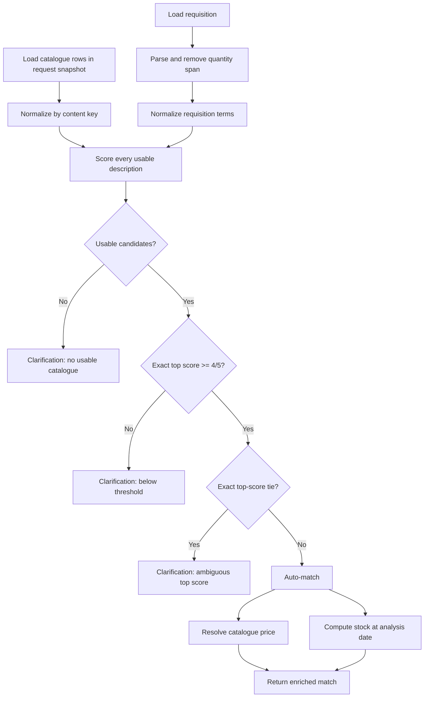

### 14.9 Mandatory Gate Tests

- Exact PDF terms produce common=4, norms sqrt(5), score 0.80, and auto-match.
- Request-context removal removes `accounts office`; catalogue `office` remains.
- Exact threshold, just below, just above, unique/multiple qualifying candidates, exact qualifying tie, and exact below-threshold tie.
- Empty request, empty description, empty catalogue, duplicate descriptions, deterministic ItemId ordering.
- Stop words, punctuation, hyphen, plural exceptions, Unicode normalization, Bengali exact tokens.
- `one dozen`, `1 dozen`, `two dozen`, `2 dozen`, 12, number words, zero, negative, range, multiple numbers, dimension, and unknown pack.
- Missing/zero price, missing quantity, stock sufficient/equal/insufficient, missing receipt price in quantity-only stock path.
- Content-normalization cache hit, expiry/eviction, concurrent same-key work, changed source text, failure fallback, versioned key, and disabled-cache equivalence.
- Similarity property tests: symmetry, bounded result, identical non-empty sets equal 1.
- At least ten seeded demonstration requisitions cover all required categories; production code contains no hardcoded expected match.

## 15. M5 - Reporting

### 15.1 Architecture

Business owns `IReportDataService`, one typed model per report, and completeness validation. Presentation owns `IReportDocumentRenderer`, QuestPDF templates, HTML previews, response headers, and filenames.

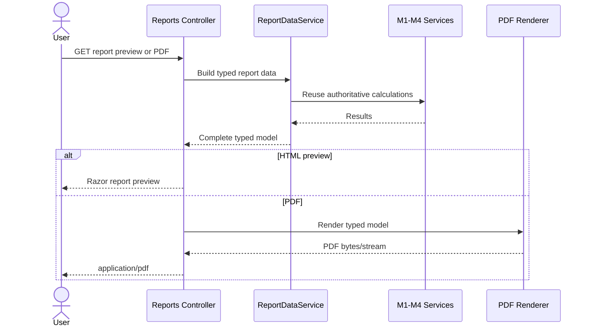

No report builder reimplements FIFO, EOQ, supplier metrics, similarity, or stock position.

Report-only Business contracts are complete and unpaged:

```csharp
Task<IReadOnlyList<StockValuationResult>> CalculateAllForReportAsync(...);
Task<IReadOnlyList<ReorderAnalysisResult>> AnalyzeAllForReportAsync(...);
Task<IReadOnlyList<SupplierPerformanceResult>> AnalyzeAllForReportAsync(...);
Task<IReadOnlyList<RequisitionMatchResult>> MatchAllForReportAsync(...);
```

These internal methods join the active `IReadSnapshotRunner` transaction, COUNT before loading, enforce both `Reporting.MaximumRows` and relevant `AnalysisLimits`, and return immutable complete models. They never loop interactive API pages. Any failed candidate aborts the report with ProblemDetails; rows are never silently omitted.

### 15.2 Global Report Contract

Every report includes:

- company header and optional approved logo;
- exact report title;
- parameter date or inclusive period;
- generation timestamp in Asia/Dhaka;
- page `n of total`;
- BDT formatting and item units;
- filter summary and data-quality/assumption note when applicable;
- repeated table header on each page;
- no truncated row across a page unless the PDF library cannot keep an oversized row together.

PDF decisions:

- A4 portrait for R1, R2, and R5; A4 landscape for wide R3 and R4.
- Margins 14 mm, minimum 9 pt body text, 11 pt table header, 16 pt report title.
- Bundle Noto Sans and Noto Sans Bengali with their license files for offline Latin/Bengali glyph coverage.
- Filename is server-generated ASCII: `IWAS_R2_Stock_Valuation_2026-07-08.pdf`.
- `Content-Disposition` is `inline` for preview and `attachment` for download; the client cannot supply a path or filename.
- Generated bytes are held only for the response and disposed; no report file is written.
- Empty reports still produce a valid one-page PDF with parameters and `No records found`.
- Maximum external report period is 366 inclusive days; the default report row cap is 10,000 and is checked before rendering. Exceeding it returns 422 `report_too_large` rather than truncating or exhausting memory.

### 15.3 R1 - Daily Stock Movement

Parameter: `date`.

`ASSUMPTION RPT-01`: rows are items with a non-zero opening balance or at least one movement on the date. Stable sort: category, item name, item ID.

```text
Opening = stock through date - 1
Received = receipt quantity on date
Issued = issue quantity on date
Closing = Opening + Received - Issued
```

Columns: Item, Unit, Opening, Received, Issued, Closing. Footer counts movement rows by receipt/issue type, not quantities. Formal output fails on a stock integrity error.

### 15.4 R2 - FIFO Stock Valuation

Parameter: `asOf`.

`ASSUMPTION RPT-02`: include items with positive closing quantity. Columns: Item, Closing Quantity, FIFO Layers, Unit Prices, FIFO Value. Total warehouse value is the exact sum of complete M1 results. Zero-stock items are omitted and counted in metadata. Any unvalued positive stock blocks the PDF.

### 15.5 R3 - Reorder List and Draft

Parameter: `asOf`; optional category only in interactive preview.

Columns: Item, Stock, ROP, EOQ, Days to ROP, Action. Stable order: action priority, days to ROP null last, item name, item ID.

The printable draft section contains only successful `OrderNow` rows and fields already calculated: item ID/name, unit, suggested quantity, generated date. It is labeled `Draft - not a purchase order` and is not persisted. `ReviewNoDemand` and `ReviewDeadStock` are never included; any failed candidate aborts the formal report rather than becoming a `CannotCalculate` row.

### 15.6 R4 - Supplier Performance and Dead Stock

Parameters: supplier `from`, `through`, and dead-stock `asOf`; require `from <= through <= asOf` so the stock snapshot is not earlier than the supplier period.

Supplier section: Supplier, Delivered Orders, On Time %, Average Late Delay, Standing. Stable sort: Watch List first, on-time ratio ascending, supplier name/ID.

Dead-stock section includes `HasDisposableStock` items only under `ASSUMPTION DEAD-01`: Item, Quantity, FIFO Value, Last Issue/`Never issued`, and a fixed neutral note `Review for disposal or alternative use`. This is an R4 inclusion filter, not a change to literal `IsDeadStock` and not an automated disposal decision. Dead-stock value reuses M1. Any unvalued included stock blocks the formal report.

### 15.7 R5 - Requisition Matching Analysis

Parameters: requisition `from`, `through`, and stock `asOf`; require `from <= through <= asOf` so stock is never evaluated before a requisition in the report.

Use title `AI Requisition Matching Log` to match the PDF, but document that it is an on-demand analysis, not an immutable audit log. Columns: Requisition ID, Department, Matched Item or Best Candidate, Similarity, Status. Footer: total, auto-matched, clarification.

Stable sort: requisition date, requisition ID. Source text is not printed in full. If the catalogue changes, a regenerated historical report may change; include normalizer version and generation timestamp in metadata.

### 15.8 Report Gate Tests

- R1-R5 typed models use module services verified by interaction/architecture tests.
- Golden demo values match the PDF.
- Empty, one-row, multi-page, maximum permitted, long name, long ID, fractional quantity, large BDT, and Bengali text renders are visually checked.
- Page size/orientation, repeated headers, page numbers, footer totals, filename, content type, inline/download disposition, and no-store headers are asserted.
- Blocking row returns ProblemDetails and no partial PDF.
- Pin the CI OS/container image, Chromium/Playwright version, Noto font files, QuestPDF version, Poppler version, and render DPI. Hard assertions fail blank pages, missing text, layout overflow, or page-count changes; representative PNG diffs use a documented tolerance and human-reviewed baseline updates rather than treating cross-environment antialiasing as a business failure.

## 16. HTTP and API Contract

### 16.1 Transport Rules

- MVC routes return Razor HTML. API routes live under `/api/v1` and return JSON or ProblemDetails.
- API dates are ISO `YYYY-MM-DD`; JSON properties use camelCase.
- Analysis endpoints are GET because they are deterministic reads. Login/logout are the only application POST routes.
- Authenticated HTML, JSON, and PDF responses use `Cache-Control: no-store, private`.
- No CORS is enabled; browser calls are same-origin.
- Cancellation flows from `HttpContext.RequestAborted` through every service, repository, EF query, and renderer.
- List defaults: `page=1`, `pageSize=50`; hard maximum `pageSize=200`.
- Every sort parameter is an allowlisted enum; never interpolate client field names into SQL.
- Stable secondary sort is ID ordinal for items/suppliers/requisitions.
- `direction` is exactly `asc` or `desc`; omitted direction uses the endpoint default. Nulls sort last in both directions, followed by the documented ordinal ID tie-breaker.
- A page beyond the last page is a valid 200 empty page with the unchanged `totalCount`; `page < 1`, `pageSize < 1`, or an unknown filter/sort/direction is 400.
- General search strings are trimmed and 2-200 characters when supplied. Requisition `q` searches requisition ID and department only, never description text. IDs are 1-100 characters. Query strings are capped at the edge.
- OpenAPI must exactly reflect route policies, query bounds, result schemas, and error responses.

### 16.2 MVC Routes

| Method and route | Purpose |
|---|---|
| `GET /account/login` | Login form |
| `POST /account/login` | Cookie sign-in with antiforgery |
| `POST /account/logout` | Sign out with antiforgery |
| `GET /` | `date`; role-filtered `DashboardPageViewModel` |
| `GET /stock-valuation` | `itemId,asOf`; `StockValuationPageViewModel` |
| `GET /reorder` | `asOf,category,itemId,recommendation,deadStock,page,sort,direction`; `ReorderPageViewModel` |
| `GET /supplier-performance` | `from,through,supplierId,standing,page,sort,direction`; `SupplierPerformancePageViewModel` |
| `GET /requisitions/match` | `requisitionId,asOf`; `RequisitionMatchPageViewModel` |
| `GET /requisitions/clarifications` | `from,through,asOf,reason,page,sort,direction`; `ClarificationPageViewModel` |
| `GET /reports` | Report selector and parameter forms |
| `GET /reports/r1/preview` | HTML preview; required `date` |
| `GET /reports/r2/preview` | HTML preview; required `asOf` |
| `GET /reports/r3/preview` | HTML preview; required `asOf`, optional `category` |
| `GET /reports/r4/preview` | HTML preview; required `from,through,asOf` and `through <= asOf` |
| `GET /reports/r5/preview` | HTML preview; required `from,through,asOf` and `through <= asOf` |
| `GET /reports/r1.pdf` | Required `date,disposition`; `disposition=inline|attachment` |
| `GET /reports/r2.pdf` | Required `asOf,disposition`; `disposition=inline|attachment` |
| `GET /reports/r3.pdf` | Required `asOf,disposition`; no category filter in formal PDF |
| `GET /reports/r4.pdf` | Required `from,through,asOf,disposition`; `through <= asOf` |
| `GET /reports/r5.pdf` | Required `from,through,asOf,disposition`; `through <= asOf` |
| `GET /forbidden` | 403 recovery page |
| `GET /error` | Safe unexpected-error page |

For each analytical MVC GET, missing required analysis parameters render the typed page in `Idle` state; invalid supplied parameters render server validation without calling Business; a complete valid query executes on the server and returns the typed result, partial, or error state. Every item/requisition selector always includes a visible exact-ID text input and submit button; JavaScript may progressively enhance it into a combobox but cannot replace the fallback.

### 16.3 API Routes

| Route | Query | Response |
|---|---|---|
| `GET /api/v1/items` | `q,page,pageSize,sort,direction` | Paged item summaries |
| `GET /api/v1/items/{itemId}` | none | Item detail |
| `GET /api/v1/stock-valuations/{itemId}` | required `asOf` | M1 result |
| `GET /api/v1/stock-valuations` | `asOf,page,pageSize,sort,direction` | Paged analytical M1 batch |
| `GET /api/v1/reorder-analyses/{itemId}` | required `asOf` | M2 result |
| `GET /api/v1/reorder-analyses` | `asOf,category,itemId,recommendation,deadStock,page,pageSize,sort,direction` | Paged analytical M2 batch |
| `GET /api/v1/supplier-performance` | `from,through,supplierId,standing,page,pageSize,sort,direction` | Paged analytical M3 batch with summary |
| `GET /api/v1/requisitions` | `q,from,through,page,pageSize,sort,direction` | Paged summaries; `q` is ID/department only and list omits full text |
| `GET /api/v1/requisitions/{id}/match` | required `asOf` | M4 result |
| `GET /api/v1/requisition-matches` | `from,through,asOf,status,page,pageSize,sort,direction` | Paged analytical M4 batch; require `through <= asOf` |
| `GET /api/v1/requisition-clarifications` | `from,through,asOf,reason,page,pageSize,sort,direction` | Derived M4 clarification batch; require `through <= asOf` |

There is intentionally no `/api/v1/reports` JSON API. Report previews call Business directly through MVC; PDF routes use the same typed report data.

Allowed values are closed contracts:

| Endpoint | Filters | Sort allowlist and default |
|---|---|---|
| Items | none beyond `q` | `itemId,name,category,unit`; default `name asc` |
| M1 batch | none beyond `asOf` | `itemId,itemName,category,closingQuantity,fifoValue`; default `itemName asc` |
| M2 batch | `recommendation=orderNow|orderInDays|reviewNoDemand|reviewDeadStock|ok`; `deadStock=true|false` | `recommendation,daysToRop,itemName,stock,eoq,rop`; default recommendation priority then days null-last, item name, ID |
| M3 batch | `standing=excellent|good|watchList` | `standing,onTimeRatio,averageLateDelay,supplierName,deliveredOrders`; default Watch List first, ratio ascending, name, ID |
| Requisitions | none beyond source filters | `requisitionDate,requisitionId,department`; default `requisitionDate desc`, ID |
| M4 matches | `status=autoMatched|clarificationRequired` | `requisitionDate,requisitionId,similarity,status`; default date ascending, ID |
| Clarifications | `reason=belowThreshold|ambiguousTopScore|catalogueEmpty|noUsableCatalogueText|noUsableRequestText` | `requisitionDate,requisitionId,similarity,reason`; default date ascending, ID |

Items and requisitions can use SQL paging for source sorts. M1-M4 computed filters/sorts use the bounded calculate-then-page rule in Section 7.6. A header sort always requests the server and resets `page=1`; client-local sorting is allowed only when `page==1`, `hasNextPage==false`, and `totalCount==data.length` with no issues.

### 16.4 Paged Response

```json
{
  "data": [],
  "issues": [],
  "page": 1,
  "pageSize": 50,
  "totalCount": 0,
  "successfulCount": 0,
  "failedCount": 0,
  "returnedCount": 0,
  "hasNextPage": false,
  "generatedAtUtc": "2026-08-20T18:00:00Z",
  "isComplete": true,
  "summary": null
}
```

The envelope follows `PagedAnalysisBatch<T>` in Section 8.5. On a partial page, `data` holds successful current-page values, `issues` holds failed current-page entries, and the global success/failure counts remain explicit. For M3, `summary` is the server-computed full-filter `SupplierPerformanceSummary`; for other endpoints it is their documented aggregate or null. Any aggregate is null when incomplete. The UI says `X successful, Y failed of M`, never a misleading `Showing N of M`.

### 16.5 ProblemDetails

```json
{
  "type": "/problems/stock-history-insufficient",
  "title": "Source data cannot produce a stock position",
  "status": 422,
  "detail": "An issue exceeds the available receipt history for the selected item.",
  "instance": "/api/v1/stock-valuations/IT-1108",
  "code": "stock_history_insufficient",
  "traceId": "00-..."
}
```

A separate 400 field-validation response uses `type=/problems/validation_failed`, `code=validation_failed`, and an `errors` dictionary such as `{"asOf":["The date cannot be in the future."]}`. Integrity/calculation 422 responses never carry unrelated field errors.

Status mapping:

| Status | Use |
|---|---|
| 400 | Invalid ID/date/range/page/sort/options or malformed request |
| 401 | API authentication required; API never returns a login HTML redirect |
| 403 | Authenticated but policy denied |
| 404 | Route or requested canonical entity absent |
| 405 | Unsupported HTTP verb on an existing route |
| 422 | Source integrity/calculation/report completeness failure |
| 429 | Rate limit; include `Retry-After` |
| 503 | Database unavailable, readiness failure, or controlled analysis timeout |
| 500 | Unexpected fault with safe generic detail |

Canonical machine-code registry (titles are fixed server resources; `type` is `/problems/{code}`):

| Status | Codes |
|---|---|
| 400 | `validation_failed`, `invalid_date_range`, `invalid_page`, `invalid_sort`, `invalid_option`, `request_too_large` |
| 404 | `entity_not_found` |
| 422 | `source_schema_incompatible`, `duplicate_source_key`, `orphan_item_reference`, `invalid_source_value`, `ambiguous_movement_order`, `stock_history_insufficient`, `receipt_price_missing`, `supplier_identity_conflict`, `delivery_identity_ambiguous`, `insufficient_demand_history`, `holding_cost_invalid`, `numeric_overflow`, `normalization_limit_exceeded`, `analysis_input_too_large`, `report_too_large` |
| 429 | `rate_limit_exceeded`, `concurrency_limit_exceeded` |
| 503 | `dependency_unavailable`, `analysis_timeout`, `readiness_failed` |
| 500 | `unexpected_error` |

Every thrown Business exception maps through this single registry; adding a code requires registry, OpenAPI, UI-copy, and contract-test changes. The `errors` object appears only for 400 field validation. Production responses never include stack traces, SQL, file paths, connection strings, configuration values, or source text.

### 16.6 API Contract Tests

- Every route verifies success, invalid/missing/boundary parameters, content type, caching, cancellation, and policy.
- Enumerate endpoint metadata and fail if an action lacks explicit authorization/anonymous metadata.
- Enumerate verbs and fail on operational domain POST/PUT/PATCH/DELETE.
- Assert decimal/date/similarity serialization and stable ordering.
- Assert non-JSON upstream/proxy errors are normalized by the browser client.
- Snapshot OpenAPI and require reviewed changes.

## 17. Frontend UX and Design Blueprint

### 17.1 Design Direction

The first screen after authentication is the working dashboard, not a marketing page. The UI is a quiet, dense analytical workspace modeled on professional inventory-report patterns: persistent navigation, compact filter bands, KPI strips, sortable tables, and direct drill-in. Odoo's stock and valuation reports are references for information density and filtering only; IWAS must not copy their inline editing or operational actions.

Guardrails:

- No hero, decorative illustration, gradient, floating page section, nested card, or ornamental animation.
- Commands are limited to filter, search, sort, calculate, inspect, refresh, open, print, download, sign in, and sign out.
- Computed phrases such as `Order 45 now` and `Review for disposal` are text/status, never action buttons.
- Every core filter form works as a GET without JavaScript; JavaScript progressively enhances requests and rendering.
- Business calculations and status decisions never run in JavaScript.

### 17.2 Information Architecture and Roles

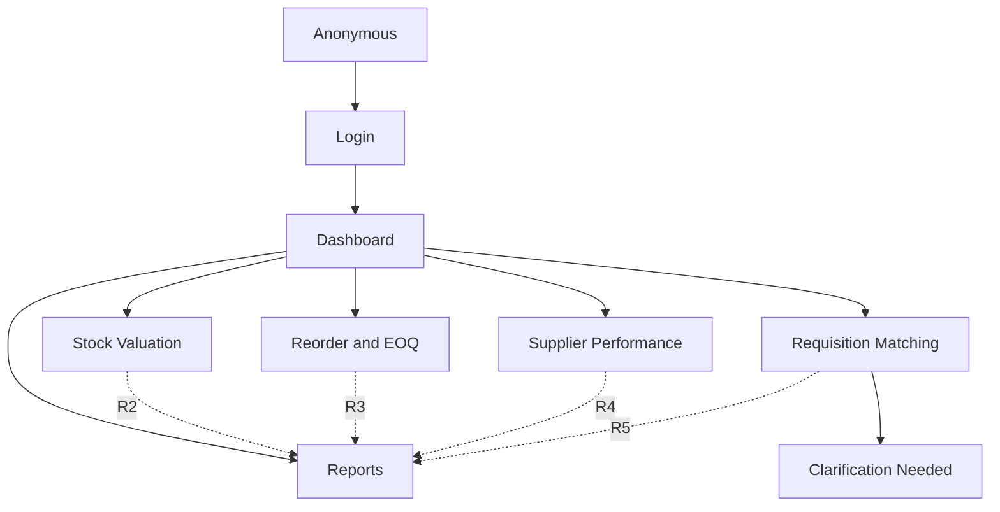

| Page | Manager | Storekeeper | Purchase Officer | Viewer |
|---|:---:|:---:|:---:|:---:|
| Dashboard | Yes | Yes | Yes | Yes |
| M1 Stock Valuation | Yes | Yes | No | No |
| M2 Reorder | Yes | No | Yes | No |
| M3 Supplier Performance | Yes | No | Yes | No |
| M4 Match/Clarifications | Yes | Yes | No | No |
| R1/R2 | Yes | Yes | No | Yes |
| R3/R4 | Yes | No | Yes | Yes |
| R5 | Yes | Yes | No | Yes |

Navigation hides unauthorized entries, but controllers and APIs enforce the same named policies. Viewer report access does not grant raw catalogue/requisition APIs.

Exact policy grants:

| Policy | Manager | Storekeeper | Purchase Officer | Viewer |
|---|:---:|:---:|:---:|:---:|
| `CanReadCatalogue` | Yes | Yes | Yes | No |
| `CanUseM1` | Yes | Yes | No | No |
| `CanUseM2` | Yes | No | Yes | No |
| `CanUseM3` | Yes | No | Yes | No |
| `CanUseM4` | Yes | Yes | No | No |
| `CanViewR1R2` | Yes | Yes | No | Yes |
| `CanViewR3R4` | Yes | No | Yes | Yes |
| `CanViewR5` | Yes | Yes | No | Yes |

Every MVC, API, preview, and PDF route names exactly one of these policies; lookup calls inherit the policy of the analytical page and never broaden access.

### 17.3 Application Shell

Desktop at `>= 992px`:

```text
+----------------------+--------------------------------------------------+
| IWAS                 | Page title                    User / Role menu   |
| Dashboard            +--------------------------------------------------+
| Stock Valuation      | Filter band                                      |
| Reorder and EOQ      +--------------------------------------------------+
| Supplier Performance| KPI/result strip                                 |
| Requisition Matching+--------------------------------------------------+
|   Clarification     | Main analytical table or detail                  |
| Reports              |                                                  |
| Sign out             |                                                  |
+----------------------+--------------------------------------------------+
```

- Sidebar width 240 px; header height 56 px; analytical content uses remaining width.
- Sidebar uses a charcoal surface with a restrained green brand accent, not a one-color blue/slate theme.
- Mobile navigation uses a native `<details>` disclosure plus CSS layout, with a labelled `<summary>`, current-page link, and ordinary links that remain usable without JavaScript. Bootstrap JavaScript is not required for navigation or any core workflow.
- At `<992px`, filters stack and tables remain semantic horizontal-scroll regions.
- At 360 px, KPI strips become one column; at 768 px, two columns; desktop uses up to five stable tracks.
- Add a focus-visible skip link and `aria-current=page` on active navigation.
- Sign out is an icon-plus-text POST form with antiforgery.

### 17.4 Visual Tokens

| Token | Value |
|---|---|
| Canvas | `#F5F7F8` |
| Surface | `#FFFFFF` |
| Primary text | `#202A2F` |
| Muted text | `#5B6670` |
| Border | `#D6DCE1` |
| Navigation | `#202A2F` |
| Primary command | `#146C43` |
| Link/focus | `#0B63CE` |
| Warning | text `#7A4D00`, background `#FFF4CE`, border `#E5C06B` |
| Critical | text `#9F1C14`, background `#FDECEC`, border `#E6AAA6` |
| Success | text `#176B3A`, background `#E7F6EC`, border `#A7D7B8` |
| Information | text `#0B4F9C`, background `#EAF2FF`, border `#A9C6EA` |

- System font stack: locally available Noto/Segoe UI with bundled Noto Sans Bengali for source text and PDFs.
- Base 15px/1.5, table 14px, page title 24px, section title 18px. Do not scale type with viewport width.
- Numeric cells use tabular numerals.
- Radius: controls 4px, panels 6px, never over 8px except semantic status pills.
- Desktop controls at least 32px; touch controls 44px. Icon-only tools are stable square controls with accessible names/tooltips.
- Use locally bundled Bootstrap Icons where a familiar symbol exists; do not draw custom SVG icons.
- Focus ring is 3px, high contrast, and unobscured.
- Status always includes text and optionally an icon; color is never the only signal.

### 17.5 Shared Page Pattern

Every analytical page follows this unframed order:

1. Page header: H1, concise current date/period, permitted report icon/action.
2. Full-width filter band with persistent labels and one primary command.
3. Flat KPI strip for the most important computed values.
4. Data-quality/assumption alert when present.
5. Main semantic table or result detail.
6. Retrieval timestamp and pagination.

Do not put the page inside a card. Cards are reserved for the login form and individual compact KPI cells.

### 17.6 Page Specifications

#### Login

- Centered single form, maximum width 420px; brand, username, password, Sign In.
- `autocomplete=username` and `current-password`; allow paste/password managers.
- Generic failure; focus validation summary; retain username only.
- No remember-me, CAPTCHA, feature text, or registration link.

#### Dashboard

- Server-render initial model for the business-local selected date.
- KPI cells: warehouse FIFO value, reorder-now count, dead-stock count, watch-list supplier count, clarification count. A failed contributing module shows `Unavailable`, not zero.
- Role-filter KPI cells/links. Viewer sees report-level summaries only.
- Attention table: Type, Entity, Condition, Status, View Analysis. No charts.
- Changing date updates all authorized KPIs under one visible parameter; partial failure sets `isComplete=false` and suppresses unsafe aggregate totals.

#### Stock Valuation

- Searchable accessible item combobox, as-of date, Compute Valuation, R2 report icon.
- Idle text asks for item/date. No-stock is a successful result: quantity 0, BDT 0.00, no remaining layers.
- KPI strip: closing quantity, FIFO value, receipts, issues.
- Layers: Receipt Date, Movement ID, Remaining Quantity, Unit Price, Layer Value.
- Footer sums quantities/value and must equal KPI values.

#### Reorder and EOQ

- Filters: analysis date, optional category/item, segmented `Recommendation status`, dead-stock toggle.
- Default sort: `OrderNow`, `OrderInDays`, review states, `Ok`; then days null last, item name/ID.
- Desktop columns: Item, Unit, Stock, Annual Demand, Daily Demand, EOQ, Base Lead, Supplier Delay, Effective Lead, ROP, Days, Dead Stock, Recommendation.
- On small screens, retain every column in the same semantic table and use the labelled horizontal-scroll region. Do not hide, duplicate, or move authoritative cells into a JavaScript-only dialog.
- No `Order` button.

#### Supplier Performance

- Filters: inclusive date range, optional supplier, standing.
- KPI strip consumes the server `summary`: delivered orders, weighted on-time ratio, watch-list supplier count, open rows excluded. On partial analysis, suppress it and show success/failure counts.
- Columns: Supplier, Delivered, On Time, On-time %, Late, Average Late Delay, Standing.
- No delivered rows is an empty result; it never displays a misleading 0% supplier row.

#### Requisition Matching

- Accessible requisition search or exact ID, explicit stock analysis date, Run Matching.
- Render full requisition text as plain text with `dir=auto`; never unsafe HTML.
- Result status, item, score, quantity, unit price/total, stock, sufficiency.
- Top candidates table: Rank, Item, Similarity, Common term count.
- Clarification shows reason and best candidate but no Approve/Edit/Resolve action.
- Missing quantity or price is `Unavailable` with its reason and does not cancel a valid semantic match.

#### Clarification Needed

- Filters: requisition period, stock as-of date, reason.
- Columns: Requisition ID, Department, Date, wrapped Text Excerpt, Best Candidate, Score, Reason, Inspect. The excerpt is a non-authoritative preview of at most 160 grapheme clusters, cut only at a grapheme boundary; Inspect shows the full authoritative text.
- Inspect links to the matching page using ID and analysis date. It does not mutate state.
- The page title uses `Clarification Needed`; documentation may call it a queue to match the PDF.

#### Reports

Use a dense master-detail list rather than five decorative cards:

```text
+----------------------------+--------------------------------------+
| R1 Daily Movement         >| Selected report title                |
| R2 FIFO Valuation          | Date/range fields                    |
| R3 Reorder List            | [Preview] [Open PDF] [Download PDF]  |
| R4 Supplier and Dead Stock |                                      |
| R5 Matching Log            |                                      |
+----------------------------+--------------------------------------+
```

Report actions validate parameters, open the same server-generated content, and surface ProblemDetails on failure. `Preview` uses HTML, `Open PDF` sends `disposition=inline`, and `Download PDF` sends `disposition=attachment`. Below 768px the report selector becomes a full-width native select or stacked link list above the parameter form; no horizontal master-detail dependency remains. No saved reports or report history.

### 17.7 Dense Table Standard

- Use `<table>`, `<caption>`, `<thead>`, `<tbody>`, and `scope=col`.
- Wrap in a labelled `.table-responsive` region; horizontal overflow is allowed only there.
- Sticky headers on desktop only; disable in print and whenever they obscure focus.
- Content-driven row height with 40-44px target; never fixed height for wrapped source text.
- Numeric cells right-aligned; names/status left; short IDs may be non-wrapping.
- Sort buttons update `sort`/`direction`, reset `page=1`, request the server, and then update `aria-sort`; final tie-breaker remains source-stable ID/order. Local sorting is permitted only when the response proves the full error-free result is loaded.
- Complete results show `Showing N of M`. Partial results show `X successful, Y failed of M`; never count a failed row as displayed data.
- `N/A` means not computable; `0` means real zero. Do not conflate them.
- No selection checkbox, inline edit, bulk action, drag handle, or context menu.
- Long names wrap with `overflow-wrap:anywhere`; only machine IDs may use more aggressive breaking.

### 17.8 Filters and URL State

- Filter forms use GET and persistent visible labels.
- Server supplies Asia/Dhaka today; the browser timezone never chooses the business date.
- Require Apply/Calculate; do not fire expensive analysis on every change.
- Item/requisition comboboxes debounce 300 ms after two characters, cancel prior fetches, support Arrow keys/Enter/Escape, and keep a hidden authoritative ID. Requisition lookup sends ID/department fragments only, never source description text.
- Back/Forward restores filters and reruns the canonical GET.
- Do not put source text, credentials, or computed data in URLs/localStorage.
- Local sorting/filtering is allowed only when `page==1`, `hasNextPage==false`, `failedCount==0`, and `totalCount==data.length`; otherwise it is a server query that resets to page 1.

### 17.9 Request State Machine

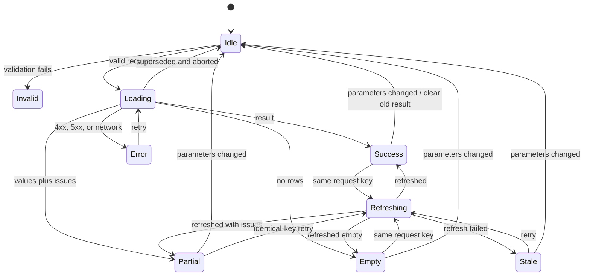

| State | Required behavior |
|---|---|
| Idle | Neutral prompt naming required inputs. |
| Loading | `aria-busy=true`, skeleton rows/spinner, duplicate submit blocked. |
| Refreshing | Keep same-key result and label `Updating`. |
| Success | Result and `Retrieved at` timestamp. |
| Partial | Render successful rows and row issues, suppress aggregate summary, and announce `X successful, Y failed of M`. |
| Empty | Page-specific message, active filters, Clear Filters when useful. |
| Invalid | Focus linked validation summary; associate inline errors. |
| 400 | Same as Invalid; preserve inputs, clear old result, and focus the first field error. |
| 404 | Retain entered ID/date for correction. |
| 422 | Clear unsafe result, show data-integrity message and trace ID. |
| Offline/500 | Retry; no stack trace. |
| 429 | Clear unsafe changing-key result; show the server `Retry-After` duration and enable retry when it expires. |
| 503 | Show temporarily unavailable/timeout copy with trace ID and Retry; never show old data as current. |
| Stale | Allowed only for identical parameter key; persistent warning includes retrieval time. |
| 401 | Redirect once to login with encoded local return URL. |
| 403 | Dedicated forbidden page; no redirect loop. |
| Aborted | No alert; only newest request may update DOM. |

On any parameter-key change, hide/clear the prior result before client or server validation. Stale content is allowed only while refreshing the identical canonical key; changing even one date, ID, filter, page, sort, or direction invalidates it.

### 17.10 JavaScript Ownership

| Module | Responsibility |
|---|---|
| `api-client.js` | Same-origin fetch, AbortController, content-type checks, ProblemDetails, 401 handling |
| `request-state.js` | Idle/loading/refresh/stale/error transitions and ARIA state |
| `query-state.js` | Canonical GET parameters and Back/Forward restoration |
| `formatters.js` | BDT, quantity, percent, date, N/A; no formulas |
| `item-combobox.js` | Accessible debounced item lookup |
| `requisition-combobox.js` | Read-only requisition lookup |
| `table-controls.js` | Server sort/filter/page requests and `aria-sort`; local sort only for proven complete results |
| `stock-valuation.js` | M1 request and layer renderer |
| `reorder.js` | M2 request, filters, rows/details |
| `supplier-performance.js` | M3 request and standing rows |
| `requisition-matching.js` | M4 request and candidate/result renderer |
| `clarification-queue.js` | Derived list request and inspect links |
| `reports.js` | Safe R1-R5 preview/download navigation |
| `dashboard.js` | Optional same-date refresh; initial view is server-rendered |

Application scripts are ES modules with versioned local URLs. Use `textContent`, DOM properties, and `DocumentFragment`; never source-driven `innerHTML`, inline handlers, or `eval`. Bootstrap CSS and Bootstrap Icons are pinned and hosted locally; the baseline ships no Bootstrap JavaScript, and any later local vendor script must remain nonessential to core/no-JavaScript workflows and pass the CSP/license gates.

### 17.11 Accessibility and Locale

- `RECOMMENDATION`: meet WCAG 2.2 AA on every responsive variation.
- One H1, logical headings, header/nav/main landmarks, skip link, semantic tables, and persistent labels.
- Keyboard access for every command; no hover-only or drag-only interaction.
- Polite live region for loading/result count; alert region for errors without announcing every row.
- On error, focus validation/error summary. On success, keep focus on initiating control and announce completion.
- Contrast at least 4.5:1 for normal text and 3:1 for meaningful boundaries/large text.
- Verify 200% text zoom, 320px reflow, visible focus, 24px minimum pointer target and 44px primary touch controls.
- Respect `prefers-reduced-motion`; no essential motion.
- Use `<html lang=en>`, `dir=auto` on mixed source text, and language attributes when known.
- Preserve Unicode/Bengali and never transliterate. Full detail views never truncate authoritative source text; explicitly labelled list excerpts may use the grapheme-safe 160-character preview rule.
- Display BDT explicitly; dates use `<time datetime=...>` and `08 Jul 2026` display.

### 17.12 Browser, Visual, and Print Gates

Automated Playwright viewports: 1440x900, 1024x768, 768x1024, 390x844, and 320x800.

Required checks:

- Login, logout, session expiry return, and unsafe return URL rejection.
- Role-specific navigation plus direct-route 403.
- Every page state in the state table, including stale refresh and latest-request-wins race.
- Exact M1-M4 golden results and edge states.
- Keyboard combobox, server sorting, native mobile-navigation disclosure, and visible focus.
- Axe scan with zero serious/critical issues on stable states.
- No viewport overflow except labelled table regions; no overlapping/clipped controls or text.
- Long English/Bengali source text, 100-character IDs, large BDT, null values, fractional quantities.
- JavaScript-disabled smoke: navigation, GET filters, login, and direct report links work.
- Print-media check hides chrome/filters/buttons, removes sticky positioning, repeats headings, and keeps text readable.

Manual release check: keyboard-only completion, screen-reader landmarks/table navigation, 200% zoom, Bengali glyphs on the deployment image, and physical/A4 PDF inspection.

## 18. Security and Privacy Module

Authentication and roles are not assignment-PDF requirements. They are an isolated web-deployment control and must not alter Business or source data.

### 18.1 Security Baseline

`RECOMMENDATION`: use OWASP ASVS 5.0 Level 1 as the minimum verification baseline, plus selected Level 2 controls for authentication, session management, access control, data protection, and logging. Track applicable ASVS IDs and exceptions in `docs/threat-model.md`.

Primary risks:

| Threat | Control |
|---|---|
| Accidental or malicious source mutation | No mutation surface, internal no-tracking context, all save overloads blocked, SELECT-only view principal |
| Broken access control | Authenticated fallback policy, named module policies, route-matrix tests |
| Credential attacks | PasswordHasher, generic failure, dummy hash, login rate limits, no plaintext secrets |
| XSS from requisition/catalogue text | Razor encoding, DOM `textContent`, CSP, PDF-safe text, no `Html.Raw` |
| SQL injection | EF parameterization, allowlisted sort/filter, no client SQL/raw write API |
| CSRF/session abuse | Antiforgery login/logout, secure host cookie, local return URL, absolute expiry |
| Report/resource exhaustion | Page/range/row limits, per-user rate and concurrency limits, cancellation/timeouts |
| Sensitive-data leakage | No-store, no source text/body logs, safe ProblemDetails, restricted telemetry |
| Proxy/header spoofing | Allowlisted forwarded proxies/networks and finite forward limit |
| Dependency/supply-chain compromise | Locked restore, vulnerability/SAST/secret scans, SBOM, immutable artifacts |

### 18.2 Authentication Profiles

Authentication users are deployment configuration, not warehouse entities:

```text
UserId, Username, DisplayName, PasswordHash,
Roles[], Enabled, AuthVersion
```

- Use ASP.NET Core `PasswordHasher<ConfiguredUser>`; never custom crypto.
- Normalize username case-insensitively and require uniqueness.
- Store production profiles in an external secret provider or protected deployment configuration. The baseline loads and validates one immutable profile set at startup; it does not claim live environment-variable reload.
- Validate known roles and at least one enabled WarehouseManager.
- There is no user-management UI/API.
- Password/role/disable changes are operational configuration. Increment `AuthVersion`, deploy the same profile version to every replica, drain traffic, and perform a coordinated restart before restoring traffic; this is the baseline revocation mechanism. A later reloadable cross-replica `IAuthProfileStore` requires its own consistency design and tests.
- Unknown users are checked against one fixed dummy hash and receive the same `Sign-in failed` message.

Environment behavior:

| Environment | Behavior |
|---|---|
| Development | Local seeded SQL setup uses a separate admin identity; running app is SELECT-only. User secrets; developer exception page only on localhost. |
| Test | Disposable SQL Server, deterministic users, real cookie flow plus narrow test-auth fixtures. |
| Staging | Production headers/auth/rate limits with non-production data and separate keys/secrets. |
| Production | External secrets, persistent protected key ring, no Swagger/developer page/default credentials. |

Unknown environment names fail startup. Staging/production never run migrations, DDL, or seed scripts.

### 18.3 Cookie Contract

| Setting | Production value |
|---|---|
| Scheme | `IWAS.Cookie` |
| Name | `__Host-IWAS.Auth` |
| Domain | Omitted |
| Path | `/` |
| HttpOnly | `true` |
| Secure | `Always` |
| SameSite | `Lax` |
| Persistent/remember me | Disabled |
| Idle expiry | 30 minutes, sliding |
| Absolute expiry | 8 hours from `auth_time` |
| Validation | Recheck enabled/roles/AuthVersion against the startup-loaded profile at most every 5 minutes; configuration revocation requires the coordinated restart above |

- Claims contain stable user ID, normalized username, display name, role, `auth_time`, and `auth_version`; never passwords or source data.
- Persist Data Protection keys outside the release directory, encrypt at rest, restrict filesystem/secret access, and share across replicas of one environment.
- Use a distinct Data Protection application name/key ring per environment.
- Key loss or cookie tampering clears the cookie and asks for login; it never exposes key details.
- Do not enable ASP.NET session state.
- Accept login/logout POST only with antiforgery. Logout GET does not exist.
- Accept a return URL only when `Url.IsLocalUrl` succeeds.

### 18.4 Authorization Policies

Named policies mirror the UI matrix:

```text
CanReadCatalogue
CanUseM1
CanUseM2
CanUseM3
CanUseM4
CanViewR1R2
CanViewR3R4
CanViewR5
```

- Set an authenticated fallback policy.
- Every endpoint has a named policy or explicit `AllowAnonymous`; endpoint-metadata tests enforce this.
- Anonymous ordinary MVC pages and HTML report previews redirect to login with a validated local return URL. `/api/v1/**` and `/reports/*.pdf` suppress cookie redirects and return exact 401/403 status (ProblemDetails for JSON APIs; empty/safe status response for PDF routes).
- Hidden navigation is convenience, never authorization.
- Health routes are network-restricted platform endpoints, not business authorization exceptions.

### 18.5 Browser and HTTP Controls

Production headers:

```text
Content-Security-Policy:
  default-src 'self';
  base-uri 'self';
  object-src 'none';
  frame-ancestors 'none';
  form-action 'self';
  script-src 'self';
  style-src 'self';
  img-src 'self' data:;
  font-src 'self';
  connect-src 'self';
  upgrade-insecure-requests

Strict-Transport-Security: max-age=31536000
X-Content-Type-Options: nosniff
X-Frame-Options: DENY
Referrer-Policy: no-referrer
Permissions-Policy: camera=(), microphone=(), geolocation=(), payment=(), usb=()
Cross-Origin-Opener-Policy: same-origin
Cross-Origin-Resource-Policy: same-origin
X-XSS-Protection: 0
```

- Introduce CSP in report-only mode in staging only while fixing violations, then enforce it.
- Serve pinned Bootstrap CSS, Bootstrap Icons, application scripts, styles, and fonts locally; no external CDN/analytics/eval/inline event handler. Bootstrap JavaScript is not part of the baseline.
- HTTPS and HSTS outside development. Add HSTS `includeSubDomains` only after confirming every subdomain.
- Trust forwarded headers only from configured proxy addresses/networks before HTTPS/auth middleware.
- Set explicit AllowedHosts, disable CORS, and remove unnecessary server headers.
- Login, forbidden, error, authenticated pages/data/previews/PDFs, and every dynamic ProblemDetails response are `Cache-Control: no-store`; fingerprinted static assets may be immutable cached.
- Request body max 64 KiB; no upload endpoint. Server-generated report filenames eliminate path traversal/CRLF input.

### 18.6 Rate, Concurrency, and Timeout Budgets

Initial defaults, subject to representative load testing:

| Policy | Limit | Partition |
|---|---|---|
| Login IP | 20 attempts / 15 minutes | Trusted client IP |
| Known account failures | 5 / 15 minutes | Stable configured user ID |
| Unknown usernames | Shared bounded bucket | Not arbitrary attacker input |
| Interactive API | 120 / minute, queue 0 | Authenticated user ID |
| Reports | 6 / 5 minutes, max 2 concurrent/user | User ID |
| Process report concurrency | 4, queue 0 | Process-wide |

- `ILoginAttemptTracker` atomically records failures after password verification. It is bounded by configured-account count plus one shared unknown-user bucket, stores no plaintext username, and keys known accounts by HMAC of normalized username. Single-instance deployment may use a locked in-memory implementation; multiple replicas require a distributed atomic store before scale-out.
- General authenticated-user and per-user report limits run in the application from validated claims. The trusted proxy enforces only IP/global/process-edge limits; it cannot infer user identity from the encrypted cookie.
- Return 429 ProblemDetails. Set `Retry-After` to the exact window reset when known; fixed-window/concurrency rejection deliberately assigns a documented conservative retry value when an exact reset is unavailable.
- Timeouts come only from validated `Execution` and `Reporting` options: login 10 seconds; interactive request 30 with SQL 25; reports 120 with SQL 90; readiness 3 with SQL 2.
- Propagate cancellation. Client cancellation produces no replacement 500; controlled server timeout returns 503 `analysis_timeout`.
- Retry at most twice only for confirmed transient connection-open errors and only within the original budget. Never retry validation, authorization, source-integrity, or completed expensive report work.
- Multi-replica deployments configure the distributed login tracker and proxy IP/global limits before readiness may pass.

### 18.7 Privacy and Retention

Classify inventory/prices, supplier performance, requisition IDs/text, and reports as confidential business data. Requisition text may contain personal data and receives the strictest handling.

- Collect only the canonical source fields and configured auth profile.
- Do not persist matches, clarification lists, dashboard snapshots, or PDFs.
- Do not log passwords, cookies, authorization headers, connection strings, full query strings, source text, report contents, or SQL parameters/statements. IIS/proxy/APM configuration drops or redacts query strings; requisition search URLs contain only ID/department fragments.
- Business IDs may appear only in restricted structured diagnostic events when necessary; never as metric labels.
- No localStorage for business/auth data and no external fonts/CDNs/telemetry scripts.
- Recommended retention, subject to owner policy: application logs 30 days, security events 90, metrics 30, sampled traces 7.
- Writes to the Data Protection key ring, telemetry backend, or transient rate limiter are operational security writes, not warehouse-source writes.

### 18.8 Mandatory Security Tests

- Every SaveChanges overload is denied. SQL DML/execute denial tests run only against disposable CI/development databases; production evidence is DBA-reviewed grants plus permission/catalog introspection and harmless SELECT, never trial writes.
- Route/verb inventory proves no operational mutation route.
- Generic login failure, dummy-hash path, disabled user, tampered cookie, idle/absolute expiry, coordinated-restart AuthVersion revocation, and bounded atomic login tracking.
- Exact cookie flags and no persistent cookie.
- Login/logout antiforgery, absent logout GET, and rejection of external/protocol-relative return URL.
- Every role against every MVC/API/report group.
- SQL metacharacters remain parameters; malicious source HTML is encoded in Razor, DOM rendering, JSON, and PDF.
- Overlong ID/search/body/query, malformed/reversed date, excessive page/range, CRLF/path filename attempts, and Unicode edges fail safely.
- CSP/headers/TLS/proxy behavior and no unsafe directives.
- Rate limits are bounded and return 429/Retry-After; cancellation reaches EF/report rendering.
- Captured logs/traces contain none of the forbidden sensitive values.
- Production startup rejects missing secrets, permission introspection showing warehouse DML/execute grants, invalid roles/options, unavailable key store, incompatible views, or failed P1-P7 preflight.

## 19. Observability and Operations

### 19.1 Structured Events

Required event IDs:

```text
AUTH_LOGIN_SUCCEEDED
AUTH_LOGIN_FAILED
AUTH_LOGOUT
AUTHORIZATION_DENIED
RATE_LIMIT_REJECTED
M1_VALUATION_COMPLETED
M2_REORDER_ANALYSIS_COMPLETED
M3_SUPPLIER_ANALYSIS_COMPLETED
M4_MATCH_COMPLETED
M5_REPORT_GENERATED
SOURCE_DATA_INTEGRITY_ERROR
REQUEST_TIMEOUT
DEPENDENCY_UNAVAILABLE
```

Fields: TraceId, route template, module, role, pseudonymous actor ID (environment-specific HMAC), business date/range, report type, record count, duration milliseconds, outcome, issue code. Trusted client IP appears only in access-controlled security events after forwarded-header validation; it is excluded from ordinary analytical logs. A safe business ID appears only when incident diagnosis requires it. Store event timestamps UTC and business dates separately. Never log request/response bodies.

### 19.2 Metrics and Traces

Low-cardinality metrics:

```text
iwas.analysis.requests{module,outcome}
iwas.analysis.duration{module}
iwas.analysis.rows{module}
iwas.data_integrity.errors{module,type}
iwas.match.outcomes{outcome}
iwas.report.requests{report_type,outcome}
iwas.report.duration{report_type}
iwas.report.bytes{report_type}
iwas.report.active
iwas.auth.attempts{outcome}
iwas.authorization.denied{policy}
iwas.rate_limit.rejections{policy}
iwas.rate_limit.active_partitions{policy}
iwas.db.duration{operation}
iwas.db.errors{type}
iwas.db.pool.active
process.runtime.dotnet.gc.heap.size
process.runtime.dotnet.thread_pool.queue.length
process.cpu.utilization
process.memory.working_set
```

Never label metrics with username, URL, item/supplier/requisition ID, or source text. Trace HTTP, use case, report-rendering, and SQL spans through OpenTelemetry; disable SQL statement/parameter capture.

Initial service targets:

- 99.5% monthly availability.
- p95 interactive latency under 3 seconds.
- p95 report latency under 30 seconds.
- 5xx below 1%.

Alert definitions and ownership:

| Condition | Window/minimum | Owner and runbook |
|---|---|---|
| Readiness unhealthy | 3 consecutive probes or 2 minutes | Platform on-call; `docs/runbooks/sql-outage.md` or `source-schema-mismatch.md` |
| 5xx ratio >2% | 5 minutes, at least 100 requests | Application on-call; `docs/runbooks/application-errors.md` |
| Interactive p95 >3s | 15 minutes, at least 100 requests | Application on-call; `docs/runbooks/performance.md` |
| Report p95 >30s or active reports at process cap | 15 minutes/20 reports, or cap for 5 minutes | Application on-call; `docs/runbooks/excessive-report-load.md` |
| Failed logins >50 or rate rejects >20 | 5 minutes | Security owner; `docs/runbooks/auth-abuse.md` |
| Source-integrity errors >5 | 10 minutes | Data owner; `docs/runbooks/source-integrity.md` |
| TLS/secret/key expiry | 30 days warning, 7 days critical | Platform/security owner; relevant rotation runbook |

Threshold changes require a dated operational decision after baseline load testing.

### 19.3 Health Endpoints

| Endpoint | Check | Response |
|---|---|---|
| `/health/live` | Process only | 200 unless process cannot serve |
| `/health/ready` | Validated config/key ring, fast SELECT, cached P1-P7 schema/chronology/history/delivery-identity/permission/isolation preflight | 200 only when all mandatory checks are healthy; otherwise 503 |

- Responses expose status and release ID only, no database/server/exception detail, and use no-store.
- Restrict endpoints at the platform network. Prefer OTLP push or a private metrics endpoint.
- Source database outage or any mandatory preflight/config/key failure returns 503; do not serve unlabelled cached analysis. Optional telemetry exporters use a separate diagnostic check and may be degraded without changing readiness.

### 19.4 Deployment Topology

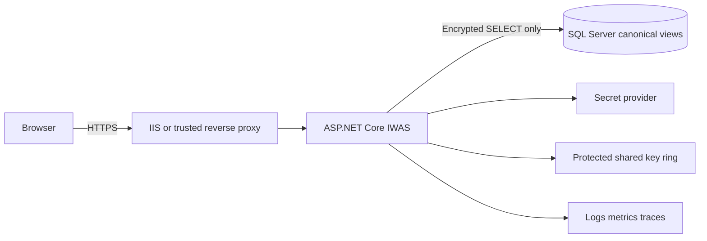

- Recommended baseline: IIS/reverse proxy plus Kestrel, .NET 10 hosting runtime, dedicated least-privileged OS identity.
- Keep secrets/config outside the artifact; use different identities, keys, telemetry, and hostnames per environment.
- SQL Server is reachable only from app hosts. Containerization is optional.
- Production deployment never modifies the source schema. Run the canonical-view contract and SELECT-only checks before traffic switch.
- Preserve the Data Protection key ring across releases/replicas. Back it up encrypted daily with 30-day retention (RPO 24 hours), restrict restore to the platform identity and two-person emergency role, and rehearse restore quarterly. After suspected compromise, rotate the protection credential/key ring, revoke old cookies by replacing the ring, increment all AuthVersions, and perform the coordinated restart.
- Baseline deployment is side-by-side versioned IIS directories/sites behind the trusted reverse proxy. Deploy the new directory, pass readiness/smoke, atomically switch the proxy route, retain the prior directory, and never overwrite a live artifact.
- On shutdown, mark readiness unhealthy, stop accepting new report work, let IIS/proxy drain connections, and allow the configured 150-second grace (greater than the 120-second report budget). Cancel remaining request/SQL/render work at expiry and emit one safe shutdown event.

### 19.5 Release and Rollback

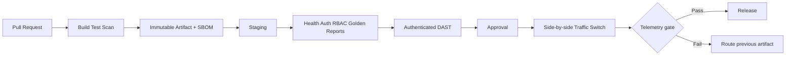

- Publish once and promote the same checksummed artifact.
- Record release ID, commit, lock hash, SBOM, approver, deployment time, and smoke results.
- Retain at least two prior artifacts and compatible non-secret configuration manifests.
- Roll back for readiness/smoke failure, sustained 5xx/latency, auth/key failure, or confirmed calculation regression.
- Rollback changes app artifact/config only; there is no source-database rollback because IWAS writes no source data.
- Exact golden-value calculations run only in CI/staging fixtures. After production deploy or rollback, verify health, authentication, RBAC, one bounded known-safe read, and report headers/metadata without asserting demo values or seeding production.
- Recovery recommendation: 30-minute application RTO and zero application-owned business-data RPO.

Required runbooks: deploy, rollback, application errors, performance, SQL outage, source-schema mismatch, credential rotation, TLS renewal, Data Protection compromise, auth abuse, excessive report load, log/disk pressure, and source-integrity incident. Each names owner, trigger, diagnosis, containment, recovery, verification, and escalation.

## 20. Verification Strategy

### 20.1 Test Projects and Boundaries

`IWAS.Business.Tests` contains fast deterministic calculator/service tests with fake repositories, clock, options, and cache. `IWAS.Integration.Tests` contains:

- architecture and endpoint metadata tests;
- real SQL Server EF mapping/query/snapshot/permission tests;
- MVC/API/auth/security tests through `WebApplicationFactory`;
- PDF model/render/content/layout tests;
- Playwright browser/accessibility/responsive/print tests.

Do not use EF Core InMemory or SQLite to claim SQL Server compatibility. CI provisions SQL Server with an admin fixture identity, then launches the app with a separate SELECT-only identity. Local developers supply `IWAS_TEST_SQL_CONNECTION` or use the documented container fixture; Docker is not required for normal application runtime.

### 20.2 Deterministic Demo Dataset

`database/development-seed.sql` must include:

- exact M1 A4 Paper movements and prices ending at 90 reams and BDT 49,050;
- M2 inputs D=3650, ordering cost 800, holding cost 40, base lead 5, stock 90, and zero supplier delay for the isolated case;
- M3 supplier with 20 delivered orders, 17 on time, and late delays 2/4/6;
- report rows shown by the assignment samples, with sample-only values visibly separated from formulas;
- at least the following ten matching cases.

Canonical matching catalogue descriptions for the demo:

```text
IT-1108: paper a4 white office ream
IT-3320: pen gel black ink office        (catalogue price BDT 15)
IT-3321: pen gel blue ink office
IT-2201: marker whiteboard black permanent office
IT-4401: stapler metal office desk
IT-5501: toner cartridge laser printer hp
IT-6601: fax machine ribbon thermal      (catalogue price null)
```

Demo requisitions:

| ID | Text | Required demonstration result |
|---|---|---|
| RQ-0871 | `Black gel pens with smooth ink for the accounts office, one dozen.` | IT-3320 at exact 0.80; quantity 12; BDT 180 |
| RQ-0872 | `paper a4 white office ream` | IT-1108 at 1.00; quantity unavailable |
| RQ-0873 | `two dozen blue gel pens with ink` | IT-3321; quantity 24; plural rule |
| RQ-0874 | `12 black permanent whiteboard markers` | IT-2201; numeric quantity 12 |
| RQ-0875 | `gel pen ink office` | Exact qualifying tie between black/blue pens; clarification |
| RQ-0876 | `ergonomic chair with arm rest` | No relevant candidate; clarification |
| RQ-0877 | `3 metal desk staplers` | IT-4401; quantity 3 |
| RQ-0878 | `fax machine ribbons, 2` | IT-6601; matched, quantity 2, price unavailable |
| RQ-0879 | `black gel pen ink office, 10-12 units` | IT-3320; ambiguous quantity; match status independent |
| RQ-0880 | `white A4 office papers, ream` | IT-1108; plural normalization; missing quantity |

These expectations live in tests/seed documentation, never in production matching code. Add a Unicode/Bengali exact-token fixture in tests using escaped Unicode literals so encoding behavior is verified without changing the English matching scope.

### 20.3 Mandatory Test Matrix

| Area | Required coverage |
|---|---|
| Source preflight | Missing/wrong columns, duplicate IDs, orphans, invalid values/types, null chronology, duplicate delivery key, optional price warning, inconsistent supplier name, SELECT-only permission |
| Snapshot consistency | Writer changes data between reads; current request sees one version, next request sees new version; cancellation closes transaction |
| Batch/query count | No per-item/per-requisition N+1; SQL filters/paging; no parallel shared-context call; stable secondary ordering |
| Shared dates | Inclusive boundaries, leap day, future rejection, 365/180 windows, minimum/maximum date overflow |
| M1 | All gate tests in 11.5 plus conservation/property tests |
| M3 | All gate tests in 12.6 plus actual-date period and supplier-selection metadata |
| M2 | All gate tests in 13.6 plus action precedence and raw/display values |
| M4 | All gate tests in 14.9 plus exact rational threshold/tie comparisons and the ten demos |
| M5 | R1-R5 totals, filters, ordering, empty/multi-page/large/error reports and PNG visual checks |
| API | ProblemDetails, ISO dates, decimal JSON, pagination/sort bounds, 401/403, 405, 429, cancellation, content type/cache headers |
| Security | All tests in 18.8; proxy/header/CSP/privacy assertions |
| Frontend | All flows/viewports/states in 17.12; no overlap/overflow outside tables |
| Operations | Health behavior, missing secrets/options/view contract, release ID, graceful shutdown |

### 20.4 Invariants and Property Tests

- FIFO conservation and nonnegative remaining layers for generated valid movement sequences.
- Adding a receipt after the cutoff does not change an earlier valuation.
- Cosine is symmetric, bounded, identical non-empty sets score 1, and adding an unrelated term cannot increase the score.
- Exact threshold comparison agrees with a high-precision reference across generated term counts.
- On-time + late equals delivered; delay average uses only positive delays.
- EOQ is nonnegative for valid inputs and increases monotonically with positive demand/ordering cost when holding cost is fixed.
- ROP equals lead demand plus safety stock; supplier delay cannot lower effective lead time.
- PDF totals equal exact report-model totals.

### 20.5 Coverage and Quality Gates

- Business calculators: at least 90% line and 85% branch coverage.
- Overall solution: at least 80% line coverage.
- No exclusions for security, source validation, or calculation code.
- Coverage does not replace boundary/property/interaction tests.
- Release build treats nullable/analyzer warnings as errors.
- `dotnet format --verify-no-changes`, locked restore, unit/integration/browser/PDF tests all pass.
- High/critical vulnerable dependency, committed secret, high-confidence SAST finding, authenticated DAST high/critical finding, or serious/critical accessibility violation blocks release.
- Medium dependency risk requires a dated owner-approved waiver.
- Generate and retain SBOM, test results, coverage, PDF previews, and selected responsive screenshots with the CI artifact.
- Required pinned tools and machine outputs: `dotnet list package --vulnerable --include-transitive --format json`; .NET analyzers plus CodeQL SARIF; gitleaks JSON/SARIF; OWASP ZAP report; CycloneDX SBOM; and a pinned .NET license scanner JSON report.
- License allowlist: MIT, Apache-2.0, BSD-2-Clause, BSD-3-Clause, ISC, OFL-1.1, and the explicitly reviewed QuestPDF license. Unknown, missing, or copyleft licenses block pending a dated legal/owner review; waivers identify package/version, rationale, owner, and expiry.

### 20.6 CI/CD Stages

1. Validate repository structure, dependency graph, formatting, lock file, and secret scan.
2. Restore locked packages and build Release.
3. Run Business tests and coverage.
4. Start SQL Server; apply development schema/seed with fixture admin; create restricted app login.
5. Run data, snapshot, API, security, and report integration tests with restricted app login.
6. Start app and run Playwright/axe/responsive/print checks.
7. Run dependency vulnerability/SAST/license scans and create SBOM.
8. Publish immutable application artifact once.
9. Deploy that artifact to staging and run health, auth/RBAC, golden calculation, report, and browser smoke tests.
10. Run authenticated OWASP ZAP against staging with a least-privileged scan account. High/critical findings block; medium findings require an owner-approved waiver expiring within 30 days.
11. Require promotion approval, deploy side-by-side, switch traffic only after readiness, and enforce the production telemetry gate.

## 21. Delivery Plan and Build Gates

Only one phase is active at a time. Do not proceed through a formula gate while its worked example fails.

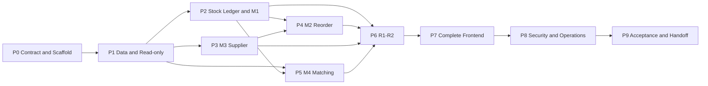

### Phase 0 - Contract and Scaffold

Deliver:

- solution/projects/references, central package management, analyzers, CI skeleton;
- `docs/decisions.md` populated from Section 23;
- canonical options and validation;
- base MVC shell, safe error handling, configured demo authentication;
- development SQL scripts and preflight command skeleton.

Exit:

- clean build; architecture tests; invalid configuration test; exactly three application projects.

### Phase 1 - Data and Read-only Boundary

Deliver:

- entities/read models, canonical mappings, repositories, batch queries, snapshot runner;
- schema compatibility/readiness check;
- all SaveChanges blocks and restricted SQL identity scripts;
- seed data and real SQL Server fixture.

Exit:

- all four sources read; P1-P7 preflight behavior tested; no N+1 baseline; app/DB write denial proven.

### Phase 2 - Shared Stock Ledger and M1

Deliver:

- ledger/layer calculator, position and valuation services, M1 API/Razor page, initial R2 typed model;
- exact error/warning contracts and unit/property/integration/browser tests.

Exit:

- BDT 49,050 golden result, sequence/underflow boundaries, JSON/UI layer reconciliation all pass.

### Phase 3 - M3 Supplier Performance

Deliver:

- supplier calculator/service, multiple-supplier resolver, API/page, R4 supplier typed section;
- period, open-row, tie-break, classification, and source-integrity tests.

Exit:

- 85%, four-day delay, 80%/100% boundaries pass; item delay contract is ready for M2.

### Phase 4 - M2 Reorder and Dead Stock

Deliver:

- demand, EOQ, lead-time, ROP, days, action, dead-stock services;
- M3 integration, API/page, R3 and R4 dead-stock typed models;
- formula, precedence, window, boundary, overflow, and browser tests.

Exit:

- EOQ 382, ROP 60, three days pass; supplier delay changes ROP; 180-day boundary passes.

### Phase 5 - M4 Matching

Deliver:

- context remover, normalizer/stop words/plural rules, exact binary-cosine ranker, two-pass quantity parser, snapshot-safe content-normalization cache;
- match enrichment, APIs/pages/clarification-needed list, R5 typed model;
- ten seeded cases and property/cache/security tests.

Exit:

- exact 0.80, qualifying tie, one/two dozen, missing price/quantity, stock sufficiency, and all ten demos pass.

### Phase 6 - M5 Reports

Deliver in order:

1. R1 daily movement.
2. R2 FIFO valuation.
3. R3 reorder/draft.
4. R4 supplier/dead stock.
5. R5 matching analysis.

Then add shared QuestPDF header/footer/fonts, preview/download routes, limits/timeouts, and visual regression fixtures.

Exit:

- all A4 requirements, sample totals, empty/multi-page/Bengali/large rows, no partial report, and PDF content headers pass.

### Phase 7 - Complete Frontend

Deliver:

- dashboard, full application shell/navigation, shared components/design tokens;
- GET fallback forms, all ES modules, request state machine, pagination/sort/filter;
- responsive, accessibility, print stylesheet, session-expiry flow.

Exit:

- required Playwright viewports/states/roles pass; no serious accessibility issue, overlap, or page-level horizontal overflow.

### Phase 8 - Security and Operations Hardening

Deliver:

- production auth cookie/profile validation, full policies, CSP/headers, rate/timeouts, trusted proxy config;
- Data Protection storage, privacy/log redaction, OpenTelemetry, health, deployment/runbooks;
- dependency/SAST/DAST/SBOM gates.

Exit:

- authorization matrix, antiforgery, cookie, rate/timeout, headers, privacy, startup/readiness, and staging DAST pass.

### Phase 9 - Acceptance and Handoff

Deliver:

- SRS, context/DFD/ER/class diagrams, API contracts, traceability, threat model, README, viva cases, demo script;
- clean-environment deployment, rollback rehearsal, final real-computed R1-R5 PDFs.

Exit:

- Section 24 Definition of Done is signed off and the full clean CI pipeline passes from a fresh checkout.

## 22. Module Interface Summary

| Consumer | Authoritative dependency | Notes |
|---|---|---|
| M1 | StockLedger + stock repository | Adds price validation/value only |
| M3 | Delivery repository + SupplierMetricCalculator | Actual-date period |
| M2 | StockPosition + demand repository + M3 delay resolver + calculators | No duplicated supplier math |
| M4 | Requisition/item repositories + normalizer/ranker/parser + StockPosition | No M1 price requirement for stock quantity |
| R1 | Stock movement/position use cases | Daily counts are movement rows |
| R2 | M1 | No custom FIFO |
| R3 | M2 | Draft is derived output |
| R4 | M3 + M2 dead status + M1 value | Formal completeness required |
| R5 | M4 | On-demand analysis, not persisted log |
| Dashboard | Existing module query services | A failed module never becomes zero |

Dependency injection lifetimes:

- DbContext, repositories, snapshot runner, and use-case services: scoped.
- Pure stateless calculators/normalizer/parser: singleton only if they contain no mutable request state.
- Content-normalization cache: singleton bounded pure-function cache keyed by description content/version; never caches catalogue rows or item membership.
- Clock/options/loggers: framework-managed singleton/options monitor as appropriate.
- PDF renderer: singleton only if vendor API is thread-safe; otherwise scoped. Confirm in adapter tests.

## 23. Decisions and Traceability

### 23.1 Resolved Source Gaps

| ID | Type | Default decision | Isolation/change point |
|---|---|---|---|
| A01 | OWNER | Web application using the fixed ASP.NET Core/Razor/Bootstrap stack | None without owner change |
| A02 | OWNER | SQL Server and EF Core, exactly three application projects | Data adapter within Models |
| A03 | ASSUMPTION | Annual demand is issue quantity in inclusive rolling 365 dates | `IAnnualDemandCalculator` |
| A04 | ASSUMPTION | Catalogue price is nullable; never substitute receipt price | Canonical item view/mapping |
| A05 | ASSUMPTION | Base lead time defaults to configured 5 days | `IBaseLeadTimeProvider` |
| A06 | SOURCE plus assumption | M3 late-only average is added to base lead time | `IItemSupplierDelayResolver` |
| A07 | ASSUMPTION | Supplier selected by record count, latest actual date, then SupplierId | Resolver strategy |
| A08 | ASSUMPTION | Business time zone is Asia/Dhaka; future analysis rejected | `IBusinessClock`/options |
| A09 | RECOMMENDATION | Cookie auth with four configured read-only roles | Presentation auth folder/policies |
| A10 | ASSUMPTION | Qualifying exact top match tie goes to clarification | Exact ranker |
| A11 | ASSUMPTION | Dead-stock value uses M1 FIFO | R4 report-data builder |
| A12 | ASSUMPTION | Demo may use MovementId fallback; production requires proven same-day sequence | Source adapter/preflight |
| A13 | ASSUMPTION | Requisition context/quantity terms are removed before shared lexical normalization | Versioned normalizer profile |
| A14 | ASSUMPTION | Standing is Excellent at 100%, Good from 80% to below 100% | Supplier classifier |
| A15 | ASSUMPTION | Open supplier rows are excluded from delivered metrics; informational open count uses promised date in range and null actual date | Delivery query/service |
| A16 | SOURCE plus assumption | `IsDeadStock` means no issue in 180 days regardless of stock; positive stock is a separate R4/disposal filter | Dead-stock calculator/R4 builder |
| A17 | ASSUMPTION | No-demand/dead-stock presentation takes precedence over an unusable order suggestion | Action classifier |
| A18 | ASSUMPTION | M4 stock date is explicit per request; reports provide `asOf` | M4 contracts/routes |
| A19 | RECOMMENDATION | QuestPDF adapter; R3/R4 landscape and other reports portrait | Presentation report adapter |
| A20 | ASSUMPTION | R5 is recomputed analysis, not immutable audit history | R5 metadata/copy |
| A21 | ASSUMPTION | R1 includes non-zero opening balance or movement-on-date items | R1 report-data builder |
| A22 | ASSUMPTION | R2 includes positive closing-stock items and counts omitted zero-stock items in metadata | R2 report-data builder |
| A23 | ASSUMPTION | M4 requires `asOf >= requisitionDate`; R4/R5 require `asOf >= through` | Contracts/routes |

Only P1-P8 in Section 7.3 remain external production facts. They do not block development against the canonical demo schema, but unresolved blocking gates must keep production readiness unhealthy.

### 23.2 Requirement Traceability Matrix

| ID | Source requirement | Business/Data owner | HTTP/UI owner | Report | Mandatory evidence |
|---|---|---|---|---|---|
| RO-01 | Analyze only; no add/update/delete | Read-only DbContext/repositories | No domain mutation route/control | All | Route, architecture, SaveChanges, SQL permission tests |
| DATA-01 | Item catalogue fields | Item repository/mapping | Item lookup | R1-R4 | Mapping/preflight tests |
| DATA-02 | Movement fields | Stock repository/ledger | M1/M2 APIs | R1-R4 | Mapping/order/integrity tests |
| DATA-03 | Supplier delivery fields | Delivery repository/M3 | M3 API/page | R4 | Delivery identity/period tests |
| DATA-04 | Requisition fields | Requisition repository | M4 APIs/pages | R5 | Mapping/search/privacy tests |
| M1-01 | Closing stock quantity | StockLedgerCalculator | Stock Valuation page/API | R1/R2 | PDF and conservation tests |
| M1-02 | Oldest receipts consumed first | StockLedgerCalculator | FIFO layer table | R2 | Layer sequence/underflow tests |
| M1-03 | FIFO remaining-layer value | FifoValuationCalculator | FIFO KPI | R2/R4 | BDT 49,050 test |
| M2-01 | EOQ formula | EoqCalculator | Reorder table | R3 | Raw 382.099/display 382 test |
| M2-02 | Daily demand D/365 | AnnualDemandCalculator | Reorder details | R3 | D=3650 -> 10 test |
| M2-03 | 20% safety and ROP | ReorderPointCalculator | Reorder table | R3 | ROP 60 test |
| M2-04 | Reorder at S <= ROP | ReorderDecisionCalculator | Status/action | R3 | Equal/below/above tests |
| M2-05 | Days to ROP | ReorderPointCalculator | Days column | R3 | Three-day/zero-demand tests |
| M2-06 | No issue in 180 days | DeadStockCalculator | Dead-stock filter/status | R4 | 179/180/never/zero tests |
| M3-01 | On-time actual <= promised | SupplierMetricCalculator | Supplier table | R4 | Equality/early tests |
| M3-02 | On-time percentage | SupplierMetricCalculator | Percentage/standing | R4 | 17/20=85% test |
| M3-03 | Late-only average delay | SupplierMetricCalculator | Average delay | R4/M2 | 2,4,6 -> 4 and null tests |
| M3-04 | Below 80% Watch List | SupplierClassifier | Badge/filter | R4 | Raw 80% boundary tests |
| M3-05 | Delay contributes to M2 | Delay resolver/Reorder service | Reorder details | R3 | Cross-module integration test |
| M4-01 | Binary cosine descriptions | BinaryCosineRanker | Match/candidates | R5 | Exact term-set and properties |
| M4-02 | At least 80% auto-match | Exact ranker | Match status | R5 | Exact rational boundary tests |
| M4-03 | Below threshold clarification | Matching service | Clarification Needed | R5 | Below/empty/tie tests |
| M4-04 | One dozen -> 12 | QuantityParser | Quantity/total | R5 | Quantity grammar tests |
| M4-05 | Price from catalogue | Matching service | Price/total | R5 | Null price/no substitute test |
| M4-06 | Stock availability | StockPositionService | Stock/sufficiency | R5 | asOf/equality/unknown quantity tests |
| M4-07 | 10+ demonstrations | Demo seed/tests | Demo workflow | R5 | RQ-0871 through RQ-0880 |
| M5-01 | R1 Daily Movement | R1ReportDataBuilder | Preview/PDF route | R1 | Sample/empty/multi-page tests |
| M5-02 | R2 FIFO Valuation | R2 builder reusing M1 | Preview/PDF route | R2 | Total reconciliation |
| M5-03 | R3 Reorder and draft | R3 builder reusing M2 | Preview/PDF route | R3 | Action/draft tests |
| M5-04 | R4 Supplier and dead stock | R4 builder reusing M1/M2/M3 | Preview/PDF route | R4 | Section/totals tests |
| M5-05 | R5 Matching log | R5 builder reusing M4 | Preview/PDF route | R5 | Counts/status tests |
| M5-06 | A4/header/title/date/page | Presentation PDF adapter/templates | Open/download UX | R1-R5 | Rendered-page tests |
| DEL-01 | SRS/use cases/NFRs | Documentation | N/A | N/A | `docs/srs.md` review |
| DEL-02 | Context/DFD/ER/class diagrams | Documentation | N/A | N/A | Mermaid render review |
| DEL-03 | Working M1-M5 | All module owners | All required pages | R1-R5 | Clean CI and demo |

### 23.3 Core Class/Contract Diagram

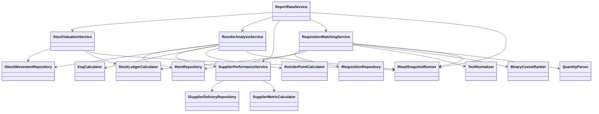

## 24. Definition of Done

### Architecture and Scope

- [ ] Exactly three application projects and allowed references only.
- [ ] Controllers are thin; Presentation contains no formula or EF query.
- [ ] No unsupported ERP/WMS workflow, operational CRUD, approval, or persistence feature exists.
- [ ] Reports and dashboard reuse module services.

### Source and Read-only Safety

- [ ] Four canonical sources map and preflight correctly.
- [ ] Same-day chronology and opening/history completeness are signed off for production.
- [ ] No-tracking and all SaveChanges blocks are tested.
- [ ] Production principal has SELECT on intended views only and permission introspection shows no DML/execute grants; negative write tests pass only on disposable CI/development databases.
- [ ] Multi-query analysis uses one approved snapshot and no N+1/parallel shared context.

### Business Modules

- [ ] M1 returns correct quantity/layers/value and BDT 49,050.
- [ ] M3 returns 85%, four-day delay, and correct raw threshold standing.
- [ ] M2 returns raw EOQ, displayed 382, ROP 60, three days, supplier-delay integration, and exact dead-stock boundaries.
- [ ] M4 returns exact 0.80 on supplied sets, safe tie/empty behavior, quantity grammar, price/stock states, and ten demo results.
- [ ] All invalid/empty/boundary cases follow the documented status/warning/error contract.

### Reports

- [ ] R1-R5 use typed complete snapshot models and match module results.
- [ ] A4 size/orientation, header, title, date/period, page x/y, BDT, repeated headers, preview, download, and safe filename pass.
- [ ] Empty and multi-page PDFs work; long/Bengali text does not clip.
- [ ] A material bad row returns ProblemDetails and no partial PDF.

### Frontend

- [ ] All required pages, role navigation, filters, tables, details, report actions, and state-machine states exist.
- [ ] No create/edit/delete/approve/resolve/order action control exists.
- [ ] Responsive viewports, keyboard flow, 200% zoom, WCAG 2.2 AA checks, locale text, and print checks pass.
- [ ] No unsafe DOM insertion, overlap, clipped text, or page-level overflow outside table regions.
- [ ] GET/no-JavaScript fallbacks remain usable.

### Security and Operations

- [ ] Cookie/auth/antiforgery/return URL/RBAC/CSP/header/rate/timeout/privacy tests pass.
- [ ] Secrets and Data Protection keys are external, environment-separated, and recoverable.
- [ ] ProblemDetails/logs/traces reveal no sensitive values.
- [ ] Health, metrics, alerts, deploy, rollback, and incident runbooks exist and are rehearsed in staging.
- [ ] Locked restore, formatting, build, all tests, vulnerability/SAST/secret/license scans, SBOM, and DAST pass.

### Assessment and Handoff

- [ ] SRS, use cases, NFRs, context diagram, DFD 0/1, ERD, class diagram, API contract, traceability, threat model, README, viva tests, and demo script are complete.
- [ ] Real computed R1-R5 PDFs are retained as assessment artifacts outside application runtime.
- [ ] Full clean CI passes from a fresh checkout.
- [ ] No unresolved blocking production preflight gate is represented as complete.

## 25. Required Diagram Pack

Create these files under `docs/diagrams/` from the decisions in this blueprint:

| File | Required content |
|---|---|
| `context-diagram.md` | Actors, IWAS, source database, A4 outputs; no CRUD arrows |
| `dfd-level-0.md` | Four input stores -> M1-M5 processes -> user/report outputs |
| `dfd-level-1.md` | Stock ledger/M1, M3-to-M2, M4 ranking/enrichment, report reuse |
| `er-diagram.md` | Four canonical source entities; computed requisition relation labeled non-persistent |
| `class-diagram.md` | Repositories, calculators, use cases, report data; allowed dependencies |
| `trust-boundaries.md` | Browser, app layers, canonical views, secrets, key ring, telemetry |
| `deployment.md` | HTTPS proxy, application, SELECT-only SQL, health/telemetry |

DFD Level 0 baseline:

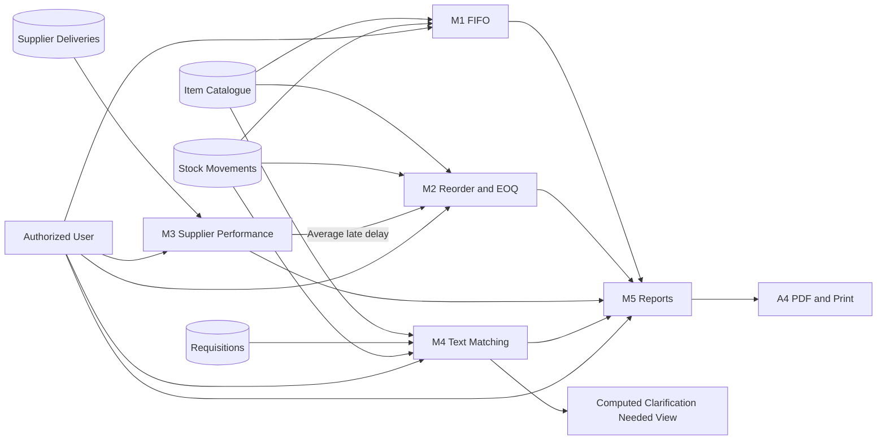

DFD Level 1 stock/reorder baseline:

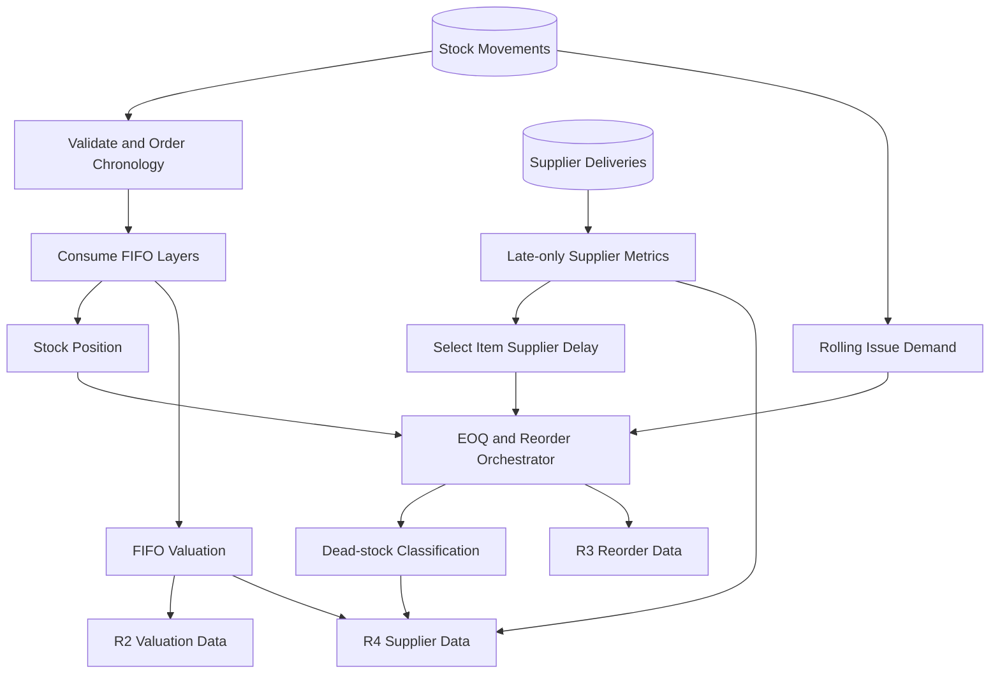

## 26. Implementation References

These references support current engineering recommendations; they do not expand assignment scope.

- [.NET support policy](https://dotnet.microsoft.com/en-us/platform/support/policy): .NET 10 is the current active LTS baseline and is supported through November 2028.
- [ASP.NET Core security topics](https://learn.microsoft.com/en-us/aspnet/core/security/?view=aspnetcore-10.0), [cookie authentication](https://learn.microsoft.com/en-us/aspnet/core/security/authentication/cookie?view=aspnetcore-10.0), [antiforgery](https://learn.microsoft.com/en-us/aspnet/core/security/anti-request-forgery?view=aspnetcore-10.0), and [rate limiting](https://learn.microsoft.com/en-us/aspnet/core/performance/rate-limit?view=aspnetcore-10.0).
- [OWASP ASVS 5.0](https://owasp.org/www-project-application-security-verification-standard/): verification baseline for application security controls.
- [WCAG 2.2](https://www.w3.org/TR/WCAG22/): accessibility recommendation for all responsive page variants.
- [Odoo stock report](https://www.odoo.com/documentation/19.0/applications/inventory_and_mrp/inventory/warehouses_storage/reporting/stock.html) and [Odoo stock valuation dashboard](https://www.odoo.com/documentation/18.0/applications/inventory_and_mrp/inventory/warehouses_storage/reporting/aging.html): dense inventory-report interaction references only.
- [QuestPDF Community License](https://www.questpdf.com/license/community.html) and [license configuration](https://www.questpdf.com/license/configuration.html): verify academic/project eligibility and record the selected license before accepting the dependency.

## 27. Final Implementation Instruction

Implement in the phase order in Section 21. For every phase:

1. confirm its dependency gates;
2. implement the smallest complete vertical slice;
3. run focused tests, then the full clean gate;
4. update traceability and decisions in the same change;
5. do not proceed while the phase's source worked example is failing.

If a real source fact conflicts with an assumption, change the adapter/strategy boundary, its tests, the decision register, and traceability together. Do not change PDF formulas, weaken the read-only boundary, hide partial data, or duplicate business logic to work around the conflict.
