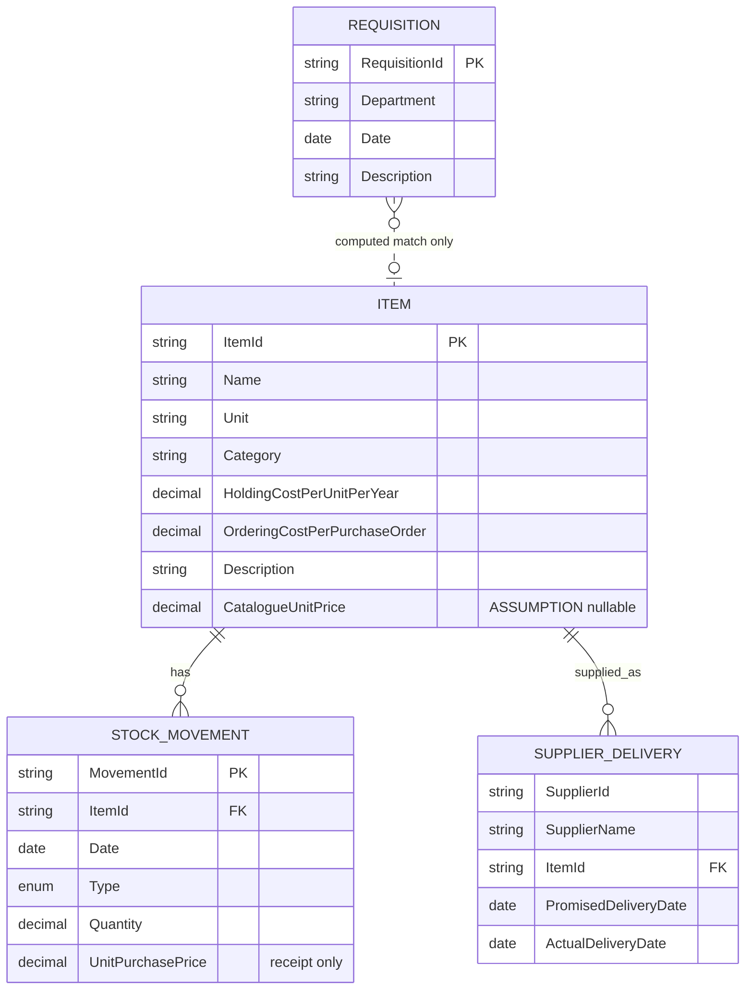
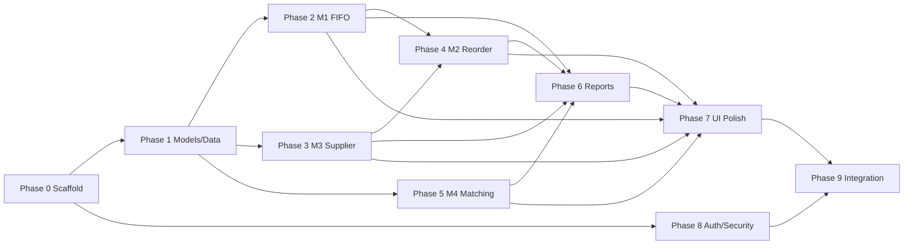

# IWAS_PROJECT_PLAN.md

# Inventory and Warehouse Analytics System (IWAS) — Implementation-Ready Project System Plan

> **Primary purpose of this document:** This file is the implementation blueprint for Codex. Codex should treat it as the controlling technical plan for the IWAS project, while treating the supplied project PDF as the source of truth for functional behavior.
>
> **Required stack from project owner:** ASP.NET Core backend; frontend using JavaScript, HTML, CSS, and Bootstrap; three-layer architecture organized as **Presentation**, **Business**, and **Models**.
>
> **Source constraint:** The system is analytical/read-only with respect to warehouse source records. It must **not implement add, delete, or update operations for source/domain records**. All marked `ASSUMPTION`, `RECOMMENDATION`, and `OPEN QUESTION` items below are outside or under-specified by the PDF and must not be mistaken for source requirements.

---

## 1. Source-of-Truth Summary

The supplied specification defines **Inventory and Warehouse Analytics System (IWAS)** as a desktop or web-based system for a trading company warehouse in Dhaka. Existing operational offices already record receipts, issues, supplier deliveries, and requisitions. IWAS does **not** create or maintain those operational records. Its job is to read them, perform computations and AI-style text matching, and generate printable reports.

The source defines four input datasets:

1. **Item catalogue**
   - Item ID
   - Name
   - Unit
   - Category
   - Holding cost per unit per year
   - Ordering cost per purchase order
   - Short free-text item description
2. **Stock movement**
   - Movement ID
   - Item ID
   - Date
   - Type: receipt or issue
   - Quantity
   - Unit purchase price for receipts
3. **Supplier delivery**
   - Supplier ID
   - Supplier name
   - Item ID supplied
   - Promised delivery date
   - Actual delivery date for each purchase order
4. **Requisition**
   - Requisition ID
   - Department
   - Date
   - Free-text requested-item description

The source defines five modules:

- **M1 — Stock Valuation (FIFO)**
- **M2 — Reorder and EOQ Analysis**
- **M3 — Supplier Performance**
- **M4 — AI Requisition-to-Catalogue Matching**
- **M5 — Reporting**

The source requires printable A4 reports R1–R5 and explicitly reiterates that the system must not implement CRUD mutation operations.

---

# 2. Project Goals

## 2.1 Functional Goals

IWAS must:

1. Read the four existing input datasets without modifying them.
2. Compute closing stock quantity and FIFO value for a selected item and date.
3. Show the receipt layers that remain in closing stock.
4. Compute EOQ for items.
5. Compute average daily demand.
6. Compute reorder point using 20% safety stock.
7. Flag items that must be reordered now.
8. Project the number of days until an item reaches reorder point when possible.
9. Detect dead stock using the source-defined 180-day no-issue rule.
10. Measure supplier on-time delivery percentage.
11. Measure average delay of late supplier deliveries.
12. Place suppliers below 80% on-time performance on a watch list.
13. Feed supplier delay information into reorder analysis as required by the source.
14. Match free-text requisitions to catalogue items using cosine similarity.
15. Automatically match when the best similarity is at least 80%.
16. Send lower-confidence matches to a clarification queue.
17. Parse requested quantity from requisition text at least to the extent demonstrated by the source example, including conversion of “one dozen” to 12.
18. Price successfully matched requisitions.
19. Show whether the matched item is currently in stock.
20. Generate and print reports R1–R5 in A4 format with company header, report title, date, and page number.

## 2.2 Quality Goals

The implementation should be:

- Correct against all formulas and worked examples in the PDF.
- Deterministic and testable.
- Read-only with respect to warehouse source data.
- Layered and easy to maintain.
- Secure against accidental write access.
- Easy to demonstrate during lab assessment/viva.
- Traceable from requirement -> service -> API -> UI -> test.

---

# 3. Scope

## 3.1 In Scope

### M1 — FIFO valuation
- Item/date selection.
- Closing stock quantity.
- FIFO valuation.
- Remaining FIFO layers.
- Print valuation report.

### M2 — Reorder / EOQ
- Annual demand.
- Average daily demand.
- EOQ.
- Supplier lead-time input/effective lead time.
- Reorder point.
- 20% safety-stock component.
- Reorder-now flag.
- Days to ROP.
- Dead-stock detection.
- Reorder report.
- Purchase requisition draft output described by R3.

### M3 — Supplier performance
- Date-period filtering.
- Orders delivered.
- On-time count and percentage.
- Late count.
- Average delay among late orders only.
- Standing/watch-list classification.
- Computed delay contribution to M2.

### M4 — AI requisition matching
- Read-only requisition retrieval.
- Text preprocessing.
- Stop-word removal.
- Binary term vectors.
- Cosine similarity.
- Best catalogue candidate.
- 80% auto-match threshold.
- Clarification queue.
- Quantity parsing.
- Matched-item pricing.
- Stock availability check.
- Matching log.

### M5 — Reports
- R1 Daily Stock Movement.
- R2 FIFO Stock Valuation.
- R3 Reorder List.
- R4 Supplier Performance and Dead Stock.
- R5 AI Requisition Matching Log.
- A4 PDF/print formatting.

## 3.2 Explicitly Out of Scope

The following must **not** be implemented as application features:

- Create item.
- Edit item.
- Delete item.
- Create receipt.
- Edit receipt.
- Delete receipt.
- Create issue.
- Edit issue.
- Delete issue.
- Create supplier delivery.
- Edit supplier delivery.
- Delete supplier delivery.
- Create requisition.
- Edit requisition.
- Delete requisition.
- Purchase order creation as a transactional workflow.
- Inventory transfer or stock adjustment.
- Supplier master-data maintenance.
- Catalogue maintenance.
- Requisition approval workflow.
- Any feature that writes back to the source warehouse tables.

A “purchase requisition draft” mentioned in report R3 should be a **generated printable/read-only document**, not a persisted transaction, unless the course supervisor explicitly authorizes otherwise.

---

# 4. Source Gaps, Assumptions, Recommendations, and Open Questions

This section is mandatory because the PDF contains a few data/function gaps. Codex must not silently invent answers.

## 4.1 Assumptions Used as Default Implementation Decisions

### ASSUMPTION A1 — Web application
Use ASP.NET Core as a web application rather than a desktop application because the project owner explicitly selected ASP.NET Core with browser frontend technologies.

### ASSUMPTION A2 — Database engine
Use SQL Server with Entity Framework Core for the production data adapter.

Reason: it integrates cleanly with ASP.NET Core and permits read-only mapping to existing tables/views.

Codex must isolate persistence behind repositories so a different source can be substituted later.

### ASSUMPTION A3 — Annual demand
For M2:

```text
D = sum of ISSUE quantities for the item during the 365-day window ending on the analysis date.
```

The PDF defines `D` as annual demand but does not define the exact extraction window. This rolling-365-day interpretation is the default.

### ASSUMPTION A4 — Catalogue price
The PDF requires M4 to price a matched requisition “from the catalogue” and its example uses BDT 15/unit, but the listed catalogue dataset does not include a catalogue-price field.

Default implementation:

```text
Item.CatalogueUnitPrice decimal? 
```

Treat this field as an extension to the catalogue mapping. If the real source table does not have it, matching still works but the UI/report must show:

```text
Price unavailable — catalogue price source not configured.
```

Do **not** silently substitute receipt purchase price unless the project owner approves that rule.

### ASSUMPTION A5 — Base lead time
M2 requires lead time `L`, but the listed supplier data contains promised and actual dates without an order date or explicit base lead-time value.

Default implementation introduces configuration-based base lead time:

```text
ReorderOptions.DefaultBaseLeadTimeDays = 5
```

The value `5` comes from the worked M2 example and is a safe demonstration default only.

Optionally support an item-specific override loaded from configuration:

```json
{
  "Reorder": {
    "DefaultBaseLeadTimeDays": 5,
    "ItemLeadTimeOverrides": {
      "IT-1108": 5
    }
  }
}
```

Do not create a fifth operational dataset.

### ASSUMPTION A6 — Effective lead time
When supplier delay is available for an item:

```text
EffectiveLeadTimeDays = BaseLeadTimeDays + AverageLateDelayDays
```

This follows the source example where supplier average delay is added to lead time used by M2.

### ASSUMPTION A7 — Multiple suppliers per item
If multiple suppliers have supplied one item, use the supplier with the largest number of delivery records in the selected trailing 365-day analysis window as the item’s default supplier for the M2 delay adjustment.

This rule is not specified by the PDF and should be replaced if the real business has a “preferred supplier” indicator.

### ASSUMPTION A8 — Time zone
Use `Asia/Dhaka` as the application reporting/business-date time zone because the warehouse is in Dhaka.

### ASSUMPTION A9 — Authentication
The PDF does not mandate authentication. The implementation should include simple read-only access control suitable for a web project, but no user-management CRUD UI.

Default:
- cookie authentication;
- users loaded from secure deployment configuration;
- no in-app user create/edit/delete feature.

## 4.2 Recommendations

### RECOMMENDATION R1 — .NET version
Target a supported ASP.NET Core LTS release selected at implementation time. If the project environment supports it, use:

```xml
<TargetFramework>net10.0</TargetFramework>
```

If the university environment requires another supported version, change only target/package versions, not the architecture.

### RECOMMENDATION R2 — Binary cosine first
Implement the source-defined **binary term-vector cosine similarity** as the required/default algorithm.

TF-IDF is explicitly optional in the source; it should be a later enhancement behind the same matcher interface, not the first implementation.

### RECOMMENDATION R3 — PDF generation
Use a server-side PDF renderer/library for reports because the source requires consistent A4 output with page numbers. Keep report layout logic behind `IReportService`.

### RECOMMENDATION R4 — No charts required
Do not spend time on charts unless requested later. The source assesses formulas, matching, and reports. Tables and KPI cards are sufficient.

## 4.3 Open Questions

These are not blockers for starting the implementation because defaults above are defined, but they should be confirmed before final submission:

1. Does the real item catalogue contain a current/catalogue unit price?
2. What is the true source of base supplier lead time per item?
3. If multiple suppliers supply an item, which supplier should drive M2 lead time?
4. Is annual demand intended as previous calendar year, current year-to-date annualized, or rolling 365 days?
5. What are the actual SQL table/view names and column names?
6. Is authentication required by the course instructor?
7. Do storekeeper and purchase-office staff log in, or is the warehouse manager the only application user?
8. For two catalogue items tied at >=80% similarity, should IWAS auto-match or send the requisition to clarification?
9. What exact company header/logo/address should appear on printed reports?
10. Should generated report PDFs be retained, or generated on demand only? Default is **on demand only** to preserve the no-write principle.

---

# 5. Architecture

## 5.1 Architectural Style

Use a strict three-layer architecture:

```text
┌───────────────────────────────────────────────┐
│ IWAS.Presentation                            │
│ ASP.NET Core MVC/API + Razor + JS/Bootstrap  │
└───────────────────┬───────────────────────────┘
                    │ calls
                    ▼
┌───────────────────────────────────────────────┐
│ IWAS.Business                                │
│ Calculations, matching, orchestration, rules  │
└───────────────────┬───────────────────────────┘
                    │ reads
                    ▼
┌───────────────────────────────────────────────┐
│ IWAS.Models                                  │
│ Entities, DTOs, EF Core context, repositories │
└───────────────────┬───────────────────────────┘
                    │ SELECT only
                    ▼
              Existing data source
```

## 5.2 Layer Responsibilities

### IWAS.Presentation
Responsible for:
- HTTP endpoints.
- MVC/Razor pages.
- API controllers.
- Authentication/authorization middleware.
- Input binding.
- View models.
- Frontend JS.
- Bootstrap UI.
- Error pages.
- Triggering report downloads.

Must **not**:
- implement FIFO logic;
- implement EOQ/ROP formulas;
- compute supplier metrics;
- compute cosine similarity;
- access EF Core `DbContext` directly.

### IWAS.Business
Responsible for:
- M1–M4 calculations.
- Cross-module orchestration.
- Report data preparation.
- Business validation.
- Threshold application.
- Quantity parsing.
- Text normalization/matching.
- Read-only workflows.

Must not know HTML, controllers, Bootstrap, or browser details.

### IWAS.Models
Responsible for:
- source-data entity models;
- result DTOs/contracts;
- EF Core `DbContext`;
- EF mappings;
- read-only repository interfaces and implementations;
- configuration models shared with Business;
- enums/value objects.

No business formulas should live in this project.

## 5.3 Project Reference Rules

Allowed:

```text
IWAS.Presentation -> IWAS.Business
IWAS.Presentation -> IWAS.Models
IWAS.Business     -> IWAS.Models
IWAS.Models       -> framework/data packages only
```

Forbidden:

```text
IWAS.Models       -> IWAS.Business
IWAS.Models       -> IWAS.Presentation
IWAS.Business     -> IWAS.Presentation
```

No cyclic references.

---

# 6. Technology Stack

## 6.1 Backend

- ASP.NET Core MVC.
- ASP.NET Core API controllers where asynchronous page data is useful.
- C#.
- Entity Framework Core.
- SQL Server provider.
- Built-in dependency injection.
- Built-in Options pattern.
- Built-in logging.
- Built-in `ProblemDetails`.
- Cookie authentication.

## 6.2 Frontend

- HTML5.
- Razor `.cshtml` server-rendered shell/pages.
- JavaScript ES modules.
- Fetch API.
- CSS.
- Bootstrap 5.x.
- Bootstrap Icons optional.
- No React/Vue/Angular.
- No heavy client state library.

## 6.3 Testing

- xUnit.
- ASP.NET Core integration testing with `WebApplicationFactory`.
- EF Core SQLite in-memory provider for relational-style integration tests, or a disposable test SQL Server if available.
- Snapshot/text assertions for report-model output; PDF rendering smoke tests.

## 6.4 Recommended Reporting Dependency

Place the concrete PDF library behind `IReportDocumentRenderer`.

Do not let the rest of the system depend directly on a vendor package.

Suggested implementation adapter:

```text
QuestPdfReportDocumentRenderer
```

If the selected library is unavailable in the lab environment, replace this adapter without changing business services.

---

# 7. Solution and Folder/File Structure

Codex should create the following repository layout.

```text
IWAS/
├─ IWAS.sln
├─ IWAS_PROJECT_PLAN.md
├─ README.md
├─ .gitignore
├─ .editorconfig
├─ Directory.Build.props
├─ docker-compose.yml
│
├─ src/
│  ├─ IWAS.Models/
│  │  ├─ IWAS.Models.csproj
│  │  ├─ Entities/
│  │  │  ├─ Item.cs
│  │  │  ├─ StockMovement.cs
│  │  │  ├─ SupplierDelivery.cs
│  │  │  └─ Requisition.cs
│  │  ├─ Enums/
│  │  │  ├─ StockMovementType.cs
│  │  │  ├─ SupplierStanding.cs
│  │  │  └─ RequisitionMatchStatus.cs
│  │  ├─ Results/
│  │  │  ├─ FifoLayerResult.cs
│  │  │  ├─ StockValuationResult.cs
│  │  │  ├─ ReorderAnalysisResult.cs
│  │  │  ├─ SupplierPerformanceResult.cs
│  │  │  ├─ RequisitionCandidateScore.cs
│  │  │  ├─ RequisitionMatchResult.cs
│  │  │  ├─ DailyStockMovementRow.cs
│  │  │  └─ ReportDataModels.cs
│  │  ├─ Options/
│  │  │  ├─ IwasOptions.cs
│  │  │  ├─ ReorderOptions.cs
│  │  │  ├─ MatchingOptions.cs
│  │  │  ├─ SupplierOptions.cs
│  │  │  └─ ReportingOptions.cs
│  │  ├─ Data/
│  │  │  ├─ IwasReadOnlyDbContext.cs
│  │  │  ├─ Configurations/
│  │  │  │  ├─ ItemConfiguration.cs
│  │  │  │  ├─ StockMovementConfiguration.cs
│  │  │  │  ├─ SupplierDeliveryConfiguration.cs
│  │  │  │  └─ RequisitionConfiguration.cs
│  │  │  └─ ReadOnlySaveChangesInterceptor.cs
│  │  └─ Repositories/
│  │     ├─ IItemRepository.cs
│  │     ├─ IStockMovementRepository.cs
│  │     ├─ ISupplierDeliveryRepository.cs
│  │     ├─ IRequisitionRepository.cs
│  │     ├─ ItemRepository.cs
│  │     ├─ StockMovementRepository.cs
│  │     ├─ SupplierDeliveryRepository.cs
│  │     └─ RequisitionRepository.cs
│  │
│  ├─ IWAS.Business/
│  │  ├─ IWAS.Business.csproj
│  │  ├─ Abstractions/
│  │  │  ├─ IStockValuationService.cs
│  │  │  ├─ IReorderAnalysisService.cs
│  │  │  ├─ ISupplierPerformanceService.cs
│  │  │  ├─ IRequisitionMatchingService.cs
│  │  │  ├─ IQuantityParser.cs
│  │  │  ├─ ITextNormalizer.cs
│  │  │  ├─ ICosineSimilarityCalculator.cs
│  │  │  ├─ IReportService.cs
│  │  │  └─ IReportDocumentRenderer.cs
│  │  ├─ Services/
│  │  │  ├─ StockValuationService.cs
│  │  │  ├─ ReorderAnalysisService.cs
│  │  │  ├─ SupplierPerformanceService.cs
│  │  │  ├─ RequisitionMatchingService.cs
│  │  │  └─ ReportService.cs
│  │  ├─ Calculations/
│  │  │  ├─ FifoCalculator.cs
│  │  │  ├─ EoqCalculator.cs
│  │  │  ├─ ReorderPointCalculator.cs
│  │  │  ├─ SupplierMetricCalculator.cs
│  │  │  └─ CosineSimilarityCalculator.cs
│  │  ├─ Matching/
│  │  │  ├─ TextNormalizer.cs
│  │  │  ├─ StopWords.cs
│  │  │  ├─ BinaryTermVectorBuilder.cs
│  │  │  ├─ QuantityParser.cs
│  │  │  └─ NumberWordParser.cs
│  │  ├─ Reports/
│  │  │  ├─ ReportService.cs
│  │  │  ├─ R1DailyStockMovementBuilder.cs
│  │  │  ├─ R2StockValuationBuilder.cs
│  │  │  ├─ R3ReorderListBuilder.cs
│  │  │  ├─ R4SupplierDeadStockBuilder.cs
│  │  │  └─ R5RequisitionMatchingLogBuilder.cs
│  │  ├─ Validation/
│  │  │  ├─ AnalysisDateValidator.cs
│  │  │  ├─ ReorderInputValidator.cs
│  │  │  └─ SourceDataValidator.cs
│  │  └─ Exceptions/
│  │     ├─ BusinessValidationException.cs
│  │     ├─ DataIntegrityException.cs
│  │     ├─ EntityNotFoundException.cs
│  │     └─ CalculationException.cs
│  │
│  └─ IWAS.Presentation/
│     ├─ IWAS.Presentation.csproj
│     ├─ Program.cs
│     ├─ appsettings.json
│     ├─ appsettings.Development.json
│     ├─ Controllers/
│     │  ├─ HomeController.cs
│     │  ├─ StockValuationController.cs
│     │  ├─ ReorderController.cs
│     │  ├─ SupplierPerformanceController.cs
│     │  ├─ RequisitionMatchingController.cs
│     │  ├─ ReportsController.cs
│     │  └─ AccountController.cs
│     ├─ Api/
│     │  ├─ ItemsApiController.cs
│     │  ├─ StockValuationApiController.cs
│     │  ├─ ReorderApiController.cs
│     │  ├─ SupplierPerformanceApiController.cs
│     │  ├─ RequisitionMatchingApiController.cs
│     │  └─ ReportsApiController.cs
│     ├─ ViewModels/
│     │  ├─ DashboardViewModel.cs
│     │  ├─ StockValuationPageViewModel.cs
│     │  ├─ ReorderPageViewModel.cs
│     │  ├─ SupplierPerformancePageViewModel.cs
│     │  ├─ RequisitionMatchingPageViewModel.cs
│     │  └─ LoginViewModel.cs
│     ├─ Views/
│     │  ├─ Shared/
│     │  │  ├─ _Layout.cshtml
│     │  │  ├─ _Navigation.cshtml
│     │  │  ├─ _ValidationScriptsPartial.cshtml
│     │  │  ├─ _StatusBadge.cshtml
│     │  │  └─ Error.cshtml
│     │  ├─ Home/
│     │  │  └─ Index.cshtml
│     │  ├─ StockValuation/
│     │  │  └─ Index.cshtml
│     │  ├─ Reorder/
│     │  │  └─ Index.cshtml
│     │  ├─ SupplierPerformance/
│     │  │  └─ Index.cshtml
│     │  ├─ RequisitionMatching/
│     │  │  ├─ Index.cshtml
│     │  │  └─ ClarificationQueue.cshtml
│     │  ├─ Reports/
│     │  │  └─ Index.cshtml
│     │  └─ Account/
│     │     └─ Login.cshtml
│     ├─ Reports/
│     │  ├─ QuestPdfReportDocumentRenderer.cs
│     │  ├─ ReportHeaderBuilder.cs
│     │  ├─ ReportFooterBuilder.cs
│     │  └─ Templates/
│     │     ├─ R1DailyStockMovementDocument.cs
│     │     ├─ R2StockValuationDocument.cs
│     │     ├─ R3ReorderListDocument.cs
│     │     ├─ R4SupplierDeadStockDocument.cs
│     │     └─ R5RequisitionMatchingLogDocument.cs
│     ├─ Auth/
│     │  ├─ ConfiguredUser.cs
│     │  ├─ ConfiguredUserStore.cs
│     │  └─ PasswordVerifier.cs
│     ├─ Middleware/
│     │  ├─ ExceptionHandlingMiddleware.cs
│     │  └─ CorrelationIdMiddleware.cs
│     ├─ Filters/
│     │  └─ NoCacheForSensitivePagesAttribute.cs
│     ├─ Extensions/
│     │  ├─ ServiceCollectionExtensions.cs
│     │  └─ ApplicationBuilderExtensions.cs
│     ├─ wwwroot/
│     │  ├─ css/
│     │  │  ├─ site.css
│     │  │  ├─ reports.css
│     │  │  └─ print.css
│     │  ├─ js/
│     │  │  ├─ site.js
│     │  │  ├─ api-client.js
│     │  │  ├─ stock-valuation.js
│     │  │  ├─ reorder.js
│     │  │  ├─ supplier-performance.js
│     │  │  ├─ requisition-matching.js
│     │  │  └─ reports.js
│     │  └─ lib/
│     │     └─ bootstrap/
│     └─ Properties/
│        └─ launchSettings.json
│
├─ tests/
│  ├─ IWAS.Business.Tests/
│  │  ├─ IWAS.Business.Tests.csproj
│  │  ├─ Calculations/
│  │  │  ├─ FifoCalculatorTests.cs
│  │  │  ├─ EoqCalculatorTests.cs
│  │  │  ├─ ReorderPointCalculatorTests.cs
│  │  │  ├─ SupplierMetricCalculatorTests.cs
│  │  │  └─ CosineSimilarityCalculatorTests.cs
│  │  ├─ Matching/
│  │  │  ├─ TextNormalizerTests.cs
│  │  │  └─ QuantityParserTests.cs
│  │  └─ Services/
│  │     ├─ ReorderAnalysisServiceTests.cs
│  │     ├─ RequisitionMatchingServiceTests.cs
│  │     └─ ReportServiceTests.cs
│  │
│  └─ IWAS.Integration.Tests/
│     ├─ IWAS.Integration.Tests.csproj
│     ├─ Api/
│     │  ├─ StockValuationApiTests.cs
│     │  ├─ ReorderApiTests.cs
│     │  ├─ SupplierPerformanceApiTests.cs
│     │  ├─ RequisitionMatchingApiTests.cs
│     │  └─ ReportsApiTests.cs
│     ├─ Security/
│     │  └─ ReadOnlyDataAccessTests.cs
│     └─ Fixtures/
│        ├─ TestDatabaseFixture.cs
│        └─ PdfWorkedExampleFixture.cs
│
├─ database/
│  ├─ README.md
│  ├─ development-schema.sql
│  ├─ development-seed.sql
│  └─ read-only-user.sql
│
└─ docs/
   ├─ requirements-traceability.md
   ├─ api-contracts.md
   ├─ diagrams/
   │  ├─ context-diagram.md
   │  ├─ dfd-level-0.md
   │  ├─ dfd-level-1.md
   │  ├─ er-diagram.md
   │  └─ class-diagram.md
   └─ viva-test-cases.md
```

---

# 8. Major File Responsibilities

## 8.1 `Program.cs`

Must:

1. Register MVC/controllers.
2. Register `IwasReadOnlyDbContext`.
3. Register read-only repositories.
4. Register Business services.
5. Bind strongly typed options.
6. Configure authentication/authorization.
7. Configure exception handling and `ProblemDetails`.
8. Configure static files.
9. Configure route mapping.
10. Enable HSTS/HTTPS outside development.
11. Register report renderer.
12. Never expose a domain write service.

## 8.2 `IwasReadOnlyDbContext.cs`

Purpose:
- map existing source datasets;
- issue queries only;
- default to `QueryTrackingBehavior.NoTracking`;
- reject calls to `SaveChanges` / `SaveChangesAsync`.

Required defensive behavior:

```csharp
public override int SaveChanges()
    => throw new InvalidOperationException("IWAS is read-only.");

public override Task<int> SaveChangesAsync(
    CancellationToken cancellationToken = default)
    => throw new InvalidOperationException("IWAS is read-only.");
```

Also use a database login with `SELECT` permissions only in production.

## 8.3 Business calculators

Calculators should be as pure as practical:
- input values in;
- output model out;
- no HTTP;
- no SQL;
- no static mutable state.

This makes the PDF worked examples directly unit-testable.

---

# 9. Data Model

## 9.1 `Item`

```csharp
public sealed class Item
{
    public string ItemId { get; init; } = "";
    public string Name { get; init; } = "";
    public string Unit { get; init; } = "";
    public string Category { get; init; } = "";
    public decimal HoldingCostPerUnitPerYear { get; init; }
    public decimal OrderingCostPerPurchaseOrder { get; init; }
    public string Description { get; init; } = "";

    // ASSUMPTION A4 because the source requires catalogue pricing
    // but omits price from the listed catalogue fields.
    public decimal? CatalogueUnitPrice { get; init; }
}
```

Validation:
- ID/name/unit required.
- holding cost >= 0.
- ordering cost >= 0.
- description may be empty, but M4 cannot match an item with no description.
- price, when present, >= 0.

## 9.2 `StockMovement`

```csharp
public sealed class StockMovement
{
    public string MovementId { get; init; } = "";
    public string ItemId { get; init; } = "";
    public DateOnly Date { get; init; }
    public StockMovementType Type { get; init; }
    public decimal Quantity { get; init; }
    public decimal? UnitPurchasePrice { get; init; }
}
```

Enum:

```csharp
public enum StockMovementType
{
    Receipt,
    Issue
}
```

Rules:
- quantity must be > 0.
- receipt must have unit purchase price.
- issue must not require purchase price.
- money uses `decimal`, not `double`.

## 9.3 `SupplierDelivery`

The source dataset is effectively one row per supplier/order delivery.

```csharp
public sealed class SupplierDelivery
{
    public string SupplierId { get; init; } = "";
    public string SupplierName { get; init; } = "";
    public string ItemId { get; init; } = "";
    public DateOnly PromisedDeliveryDate { get; init; }
    public DateOnly ActualDeliveryDate { get; init; }
}
```

No source-defined purchase-order ID is available, so the production mapping may be EF keyless if the existing schema provides no unique key.

Each row counts as one delivered purchase order for the supplier-performance formula.

## 9.4 `Requisition`

```csharp
public sealed class Requisition
{
    public string RequisitionId { get; init; } = "";
    public string Department { get; init; } = "";
    public DateOnly Date { get; init; }
    public string Description { get; init; } = "";
}
```

There is no separate source quantity field. Quantity is parsed from `Description`.

## 9.5 Runtime/Derived Relationships

```text
Item 1 ---- * StockMovement

Item 1 ---- * SupplierDelivery
Supplier identity is represented by SupplierId/SupplierName in delivery rows.

Requisition 0..1 ---- 1 Item
This match is computed at runtime and MUST NOT be persisted by default.
```

## 9.6 ER Diagram



---

# 10. Read-Only Repository Contracts

Repository methods must return data only.

## `IItemRepository`

```csharp
Task<IReadOnlyList<Item>> GetAllAsync(CancellationToken ct);
Task<Item?> GetByIdAsync(string itemId, CancellationToken ct);
Task<IReadOnlyList<Item>> SearchAsync(string? query, CancellationToken ct);
```

## `IStockMovementRepository`

```csharp
Task<IReadOnlyList<StockMovement>> GetForItemThroughDateAsync(
    string itemId,
    DateOnly asOf,
    CancellationToken ct);

Task<IReadOnlyList<StockMovement>> GetForDateAsync(
    DateOnly date,
    CancellationToken ct);

Task<IReadOnlyList<StockMovement>> GetIssuesAsync(
    string itemId,
    DateOnly from,
    DateOnly through,
    CancellationToken ct);

Task<DateOnly?> GetLastIssueDateAsync(
    string itemId,
    DateOnly asOf,
    CancellationToken ct);
```

## `ISupplierDeliveryRepository`

```csharp
Task<IReadOnlyList<SupplierDelivery>> GetByPeriodAsync(
    DateOnly from,
    DateOnly through,
    CancellationToken ct);

Task<IReadOnlyList<SupplierDelivery>> GetForItemAsync(
    string itemId,
    DateOnly from,
    DateOnly through,
    CancellationToken ct);
```

## `IRequisitionRepository`

```csharp
Task<Requisition?> GetByIdAsync(
    string requisitionId,
    CancellationToken ct);

Task<IReadOnlyList<Requisition>> GetByDateAsync(
    DateOnly date,
    CancellationToken ct);

Task<IReadOnlyList<Requisition>> GetByPeriodAsync(
    DateOnly from,
    DateOnly through,
    CancellationToken ct);
```

There must be no repository methods named:
- Add
- Insert
- Update
- Delete
- Save

for operational domain data.

---

# 11. Module M1 — Stock Valuation (FIFO)

## 11.1 Inputs

- `itemId`
- `asOfDate`

## 11.2 Required Outputs

```csharp
public sealed record StockValuationResult(
    string ItemId,
    string ItemName,
    string Unit,
    DateOnly AsOfDate,
    decimal ClosingQuantity,
    decimal FifoValue,
    IReadOnlyList<FifoLayerResult> Layers);

public sealed record FifoLayerResult(
    DateOnly ReceiptDate,
    string MovementId,
    decimal RemainingQuantity,
    decimal UnitPurchasePrice,
    decimal LayerValue);
```

## 11.3 Formula

```text
Closing Stock S
= total receipt quantity through date
- total issue quantity through date
```

FIFO means issues consume oldest receipt quantities first.

The closing layers therefore consist of the unconsumed portions of the newest remaining receipts.

```text
FIFO Value
= sum(RemainingQuantity_of_layer × ReceiptUnitPurchasePrice)
```

## 11.4 Algorithm

1. Load all movements for the selected item through `asOfDate`.
2. Sort by:
   - date ascending;
   - then deterministic movement order.
3. When same-day ordering exists, use:
   - source sequence/MovementId order if it represents chronology;
   - otherwise receipt before issue only for deterministic demo behavior.
   - **OPEN QUESTION:** same-day event chronology is not specified by the PDF.
4. Maintain a FIFO queue of receipt layers.
5. For a receipt:
   - append layer with full quantity and price.
6. For an issue:
   - consume quantity from oldest layer;
   - remove empty layers;
   - continue until issue quantity is fully consumed.
7. If issue quantity exceeds accumulated receipt quantity:
   - stop;
   - throw `DataIntegrityException`;
   - do not return a negative stock valuation.
8. Sum remaining layers.

## 11.5 Worked Example Acceptance Test

Given:

```text
02/07 receipt 100 @ 520
06/07 receipt 80 @ 535
07/07 issue 120
08/07 receipt 60 @ 550
08/07 issue 30
```

Expected:

```text
Closing quantity = 90
Remaining layers = 30 @ 535; 60 @ 550
FIFO value = BDT 49,050
```

This test is mandatory.

---

# 12. Module M2 — Reorder and EOQ Analysis

## 12.1 Required Formulas

### EOQ

```text
Q* = sqrt((2 × D × So) / H)
```

Where:
- `D` = annual demand units.
- `So` = ordering cost per purchase order.
- `H` = holding cost per unit per year.

### Daily demand

```text
d̄ = D / 365
```

### Reorder point

Source formula:

```text
ROP = L × d̄ + 0.2 × L × d̄
```

Equivalent:

```text
ROP = 1.2 × L × d̄
```

Keep code terms explicit instead of hardcoding `1.2` so the safety-stock logic is readable.

### Reorder flag

```text
ReorderNow = CurrentStock <= ROP
```

### Dead stock

```text
DeadStock = no issue of the item in the last 180 days
```

## 12.2 Required Result

```csharp
public sealed record ReorderAnalysisResult(
    string ItemId,
    string ItemName,
    decimal CurrentStock,
    decimal AnnualDemand,
    decimal AverageDailyDemand,
    decimal OrderingCost,
    decimal HoldingCost,
    decimal BaseLeadTimeDays,
    decimal SupplierAverageLateDelayDays,
    decimal EffectiveLeadTimeDays,
    decimal SafetyStock,
    decimal ReorderPoint,
    decimal EconomicOrderQuantity,
    bool ReorderNow,
    int? DaysToReorderPoint,
    bool IsDeadStock,
    string ActionText);
```

## 12.3 Calculation Rules

### Annual demand
Default:

```text
from = analysisDate - 364 days
through = analysisDate
D = sum(issue quantity)
```

### EOQ edge cases
If:
- `D == 0`: EOQ = 0; item may be dead stock.
- `H <= 0`: cannot divide by zero; return calculation error/data warning.
- `So < 0`: invalid source data.

### Current stock
Compute receipt quantity minus issue quantity through analysis date.

The same stock integrity rule as M1 applies.

### Effective lead time
Default under A5/A6:

```text
EffectiveLeadTime = configured base lead time + supplier average late delay
```

If no late orders exist:

```text
SupplierAverageLateDelay = 0
```

### Safety stock
Expose explicitly:

```text
SafetyStock = 0.2 × EffectiveLeadTime × AverageDailyDemand
```

### ROP
Then:

```text
ROP = EffectiveLeadTime × AverageDailyDemand + SafetyStock
```

### EOQ rounding
The worked example rounds approximately 381.6 to 382.

Default:

```text
EOQ display/order quantity = ceiling or nearest whole unit?
```

**Source behavior:** example uses approximately 382.

**RECOMMENDATION:** use `Math.Round(value, 0, MidpointRounding.AwayFromZero)` for display and preserve raw decimal/double value internally.

If item units cannot be fractional, reports show whole units.

### Days to ROP
If:

```text
CurrentStock <= ROP -> 0
AverageDailyDemand <= 0 -> null
CurrentStock > ROP -> ceil((CurrentStock - ROP) / AverageDailyDemand)
```

### Dead stock
Let:

```text
windowStart = analysisDate - 179 days
```

If no issue exists in `[windowStart, analysisDate]`, flag dead stock.

## 12.4 Worked Example Acceptance Test

Input:

```text
D = 3,650
So = 800
H = 40
L = 5
S = 90
```

Expected:

```text
EOQ ≈ 382
Average demand = 10/day
ROP = 60
Reorder now = false
Days to ROP = 3
```

If supplier-delay adjustment is enabled in this exact isolated calculator test, set delay to zero so the PDF example remains exact.

---

# 13. Module M3 — Supplier Performance

## 13.1 Inputs

- `fromDate`
- `throughDate`
- optional `supplierId`

## 13.2 Formulas

For supplier `v`:

```text
OnTime% = onTimeOrders / totalDeliveredOrders × 100
```

An order is on time when:

```text
ActualDeliveryDate <= PromisedDeliveryDate
```

Late delay:

```text
DelayDays = ActualDeliveryDate - PromisedDeliveryDate
```

Average late delay:

```text
AverageDelay =
sum(delay days for late orders) / number of late orders
```

Only late orders belong in the average.

## 13.3 Standing Rule

Source requirement:

```text
OnTimePercentage < 80% -> Watch List
```

For >=80%, the PDF example says good standing.

The sample R4 also labels 100% as “Excellent.”

Default classification:

```text
100%        -> Excellent
80%–99.99% -> Good
<80%        -> WatchList
```

`Excellent` is derived from sample report language; the formal threshold only defines the watch-list boundary.

## 13.4 Result Model

```csharp
public sealed record SupplierPerformanceResult(
    string SupplierId,
    string SupplierName,
    int TotalOrders,
    int OnTimeOrders,
    int LateOrders,
    decimal OnTimePercentage,
    decimal? AverageLateDelayDays,
    SupplierStanding Standing);
```

If there are zero late orders:

```text
AverageLateDelayDays = null
```

UI/report displays `—`, not zero, because there were no late orders to average.

## 13.5 Worked Example Acceptance Test

Input:

```text
20 orders
17 on time
late delays: 2, 4, 6
```

Expected:

```text
On-time = 85%
Average late delay = 4 days
Standing = Good
```

Also test:
- 14 orders, 71% => Watch List.
- 9 orders, 100% => Excellent, average delay `null`.

---

# 14. Module M4 — AI Requisition-to-Catalogue Matching

## 14.1 Required Algorithm

Use source-defined cosine similarity over binary term vectors.

For requisition vector `A` and catalogue description vector `C`:

```text
similarity = (A · C) / (||A|| × ||C||)
```

For binary vectors:
- dot product = number of distinct terms common to both texts;
- norm = square root of number of distinct terms in that text.

Threshold:

```text
similarity >= 0.80 -> auto-match
similarity < 0.80  -> clarification queue
```

## 14.2 Text Preprocessing

Required/source-supported:
1. lowercase;
2. remove punctuation;
3. tokenize;
4. remove stop words;
5. use distinct terms for binary-vector matching.

### Source-implied normalization
The worked example turns “pens” into term `pen`.

Therefore implement conservative singular normalization:
- `pens` -> `pen`
- common trailing plural `s` where safe.

Do not implement aggressive stemming that makes demo behavior hard to explain.

Recommended normalization pipeline:

```text
"Black gel pens with smooth ink for the accounts office, one dozen."
-> lowercase
-> punctuation removed
-> tokens
-> stop words removed
-> quantity phrases optionally separated for quantity parser
-> simple plural normalization
-> distinct searchable terms
```

Expected conceptual item terms:

```text
{ pen, gel, black, ink, office }
```

Expected requisition terms for the PDF example:

```text
{ black, gel, pen, ink, smooth }
```

## 14.3 Matching Workflow

1. Load requisition by ID.
2. Load all catalogue items.
3. Normalize requisition text.
4. For every item:
   - normalize description;
   - build binary term sets;
   - compute cosine similarity.
5. Sort descending by similarity.
6. Select best candidate.
7. If best similarity >= configured threshold 0.80:
   - status = `AutoMatched`.
   - calculate quantity.
   - load stock as of requisition date or current analysis date, depending page context.
   - resolve catalogue price.
   - compute total if quantity and price are available.
8. Else:
   - status = `ClarificationRequired`.
   - do not assign a matched item as authoritative.
   - retain best candidate score for display/report.
9. Do not write the result back to requisition data.

## 14.4 Tie Handling

**OPEN QUESTION:** PDF does not specify equal top scores.

Default safe rule:

```text
If two or more items tie for top score and top score >= 0.80,
send to clarification rather than auto-selecting arbitrarily.
```

This is a recommendation to avoid incorrect automatic matching.

## 14.5 Empty-vector handling

If requisition text or item description becomes empty after preprocessing:

```text
similarity = 0
```

Never divide by zero.

## 14.6 Quantity Parsing

Minimum required behavior:
- parse numeric values: `12 pens` -> 12;
- parse simple number words: `one`, `two`, ...;
- parse `one dozen` -> 12.

Suggested supported rules:

```text
"1 dozen"   -> 12
"one dozen" -> 12
"2 dozen"   -> 24
"two dozen" -> 24
"12"        -> 12
```

Anything beyond this is a recommendation, not a source requirement.

If no quantity can be confidently parsed:

```text
ParsedQuantity = null
```

Do not fabricate 1.

## 14.7 Price Resolution

Under A4:

```text
UnitPrice = Item.CatalogueUnitPrice
Total = ParsedQuantity × UnitPrice
```

If price unavailable:
- return `null`;
- show an explanatory badge/message;
- do not substitute.

## 14.8 Stock Availability

Compute current or selected-date stock:

```text
InStock = ClosingQuantity >= ParsedQuantity
```

If quantity cannot be parsed:

```text
InStock = ClosingQuantity > 0
```

but label this as “Stock on hand” rather than “Sufficient for requested quantity.”

## 14.9 Result Model

```csharp
public sealed record RequisitionMatchResult(
    string RequisitionId,
    string Department,
    DateOnly RequisitionDate,
    string RequisitionText,
    RequisitionMatchStatus Status,
    string? MatchedItemId,
    string? MatchedItemName,
    decimal BestSimilarity,
    decimal? ParsedQuantity,
    string? Unit,
    decimal? CatalogueUnitPrice,
    decimal? TotalPrice,
    decimal? StockOnHand,
    bool? SufficientStock,
    IReadOnlyList<RequisitionCandidateScore> TopCandidates);
```

Keep top 3 candidates for display/debugging, even though R5 only needs the best result.

## 14.10 Worked Example Acceptance Test

Catalogue terms:

```text
{pen, gel, black, ink, office}
```

Requisition terms:

```text
{black, gel, pen, ink, smooth}
```

Expected:

```text
common terms = 4
norms = sqrt(5), sqrt(5)
similarity = 4/5 = 0.80
auto-match = true
quantity "one dozen" = 12
```

---

# 15. Module M5 — Reporting

## 15.1 Global Report Requirements

Every report must:
- fit A4;
- contain company header;
- contain report title;
- contain report date or period;
- contain page number;
- use BDT for monetary values unless configuration is changed;
- use real computed values from source datasets;
- be printable;
- be downloadable as PDF.

Do not persist generated report files by default.

## 15.2 R1 — Daily Stock Movement Report

Parameters:

```text
date
```

For each item with relevant movement or configured inclusion:
- opening stock;
- received;
- issued;
- closing stock.

Formula:

```text
Opening = stock through previous date
Received = sum(receipts on date)
Issued = sum(issues on date)
Closing = Opening + Received - Issued
```

Footer:
- receipt movement count for date;
- issue movement count for date.

## 15.3 R2 — Stock Valuation Report (FIFO)

Parameter:

```text
asOfDate
```

For every relevant item:
- item;
- closing quantity;
- FIFO layer quantities;
- unit prices;
- FIFO value.

Footer:

```text
Total warehouse value = sum(item FIFO values)
```

R2 must call M1 logic, not duplicate FIFO logic.

## 15.4 R3 — Reorder List Report

Parameter:

```text
analysisDate
```

Columns:
- item;
- stock S;
- ROP;
- EOQ;
- days to ROP;
- action.

Actions:

```text
S <= ROP           -> "Order {EOQ} now"
S > ROP, days != null -> "Order in {days} days"
otherwise          -> "OK"
```

Footer:
- count items to order today;
- generated purchase requisition draft section.

The draft is printable output only.

## 15.5 R4 — Supplier Performance and Dead-Stock Report

Parameters:

```text
fromDate
throughDate
analysisDate for dead-stock section
```

Supplier columns:
- supplier;
- orders;
- on-time %;
- average delay;
- standing.

Dead-stock section:
- item;
- stock units;
- value.

### Dead-stock value
**OPEN QUESTION:** sample gives a monetary dead-stock value but does not state valuation method for this field.

Default:
- use FIFO value as of analysis date so valuation is consistent with M1/R2.

Print a disposal recommendation statement for dead-stock lines, as demonstrated by the sample report.

## 15.6 R5 — AI Requisition Matching Log

Parameter:

```text
date or date range
```

Columns:
- requisition ID;
- department;
- matched item or best score;
- similarity;
- status.

Footer:
- total requisitions;
- auto-matched count;
- clarification count.

R5 recomputes matching on demand unless a persistence rule is later approved.

---

# 16. Backend Service Contracts

## 16.1 `IStockValuationService`

```csharp
Task<StockValuationResult> CalculateAsync(
    string itemId,
    DateOnly asOfDate,
    CancellationToken ct);

Task<IReadOnlyList<StockValuationResult>> CalculateWarehouseAsync(
    DateOnly asOfDate,
    CancellationToken ct);
```

## 16.2 `IReorderAnalysisService`

```csharp
Task<ReorderAnalysisResult> AnalyzeItemAsync(
    string itemId,
    DateOnly analysisDate,
    CancellationToken ct);

Task<IReadOnlyList<ReorderAnalysisResult>> AnalyzeAllAsync(
    DateOnly analysisDate,
    CancellationToken ct);
```

## 16.3 `ISupplierPerformanceService`

```csharp
Task<IReadOnlyList<SupplierPerformanceResult>> AnalyzeAsync(
    DateOnly from,
    DateOnly through,
    CancellationToken ct);
```

## 16.4 `IRequisitionMatchingService`

```csharp
Task<RequisitionMatchResult> MatchAsync(
    string requisitionId,
    CancellationToken ct);

Task<IReadOnlyList<RequisitionMatchResult>> MatchByDateAsync(
    DateOnly date,
    CancellationToken ct);

Task<IReadOnlyList<RequisitionMatchResult>> GetClarificationQueueAsync(
    DateOnly? date,
    CancellationToken ct);
```

Clarification queue is derived, not stored.

## 16.5 `IReportService`

```csharp
Task<byte[]> GenerateR1Async(DateOnly date, CancellationToken ct);
Task<byte[]> GenerateR2Async(DateOnly asOfDate, CancellationToken ct);
Task<byte[]> GenerateR3Async(DateOnly analysisDate, CancellationToken ct);
Task<byte[]> GenerateR4Async(
    DateOnly from,
    DateOnly through,
    DateOnly analysisDate,
    CancellationToken ct);
Task<byte[]> GenerateR5Async(
    DateOnly from,
    DateOnly through,
    CancellationToken ct);
```

---

# 17. API Design

All analytical operations can be modeled as `GET` because they are deterministic/read-only calculations over stored records.

No domain `POST`, `PUT`, `PATCH`, or `DELETE` endpoints.

## 17.1 Items

```http
GET /api/items?q=a4
GET /api/items/{itemId}
```

## 17.2 M1

```http
GET /api/stock-valuation?itemId=IT-1108&asOf=2026-07-08
```

Example JSON:

```json
{
  "itemId": "IT-1108",
  "itemName": "A4 Paper",
  "unit": "ream",
  "asOfDate": "2026-07-08",
  "closingQuantity": 90,
  "fifoValue": 49050,
  "layers": [
    {
      "remainingQuantity": 30,
      "unitPurchasePrice": 535,
      "layerValue": 16050
    },
    {
      "remainingQuantity": 60,
      "unitPurchasePrice": 550,
      "layerValue": 33000
    }
  ]
}
```

## 17.3 M2

```http
GET /api/reorder?asOf=2026-07-08
GET /api/reorder/{itemId}?asOf=2026-07-08
```

## 17.4 M3

```http
GET /api/suppliers/performance?from=2026-01-01&through=2026-06-30
```

## 17.5 M4

```http
GET /api/requisitions/{requisitionId}/match
GET /api/requisitions/clarification?date=2026-07-08
GET /api/requisitions/matches?date=2026-07-08
```

## 17.6 Reports

```http
GET /reports/r1?date=2026-07-08
GET /reports/r2?asOf=2026-07-08
GET /reports/r3?asOf=2026-07-08
GET /reports/r4?from=2026-01-01&through=2026-06-30&asOf=2026-07-08
GET /reports/r5?from=2026-07-08&through=2026-07-08
```

Return:

```http
Content-Type: application/pdf
Content-Disposition: inline; filename="IWAS_R2_Stock_Valuation_2026-07-08.pdf"
```

## 17.7 Error Contract

Use RFC-style `ProblemDetails`.

Example:

```json
{
  "type": "https://iwas/errors/data-integrity",
  "title": "Source data integrity error",
  "status": 422,
  "detail": "Issue quantities exceed available receipt quantities for item IT-1108 as of 2026-07-08.",
  "traceId": "..."
}
```

---

# 18. Frontend Information Architecture

## 18.1 Global Navigation

Left sidebar or top navbar:

```text
IWAS
├─ Dashboard
├─ Stock Valuation
├─ Reorder & EOQ
├─ Supplier Performance
├─ Requisition Matching
│  └─ Clarification Queue
├─ Reports
└─ Sign Out
```

No “Manage”, “Create”, “Edit”, or “Delete” navigation.

## 18.2 Dashboard

Purpose:
- launch all five modules;
- show computed summary cards for a selected business date.

Recommended cards:
- current warehouse FIFO value;
- items requiring reorder;
- dead-stock item count;
- suppliers on watch list;
- requisitions requiring clarification.

These are derived values, not new source requirements.

## 18.3 Stock Valuation Page

Controls:
- searchable item dropdown.
- as-of date.
- **Compute Valuation**.
- **Print Report**.

Results:
- closing stock.
- FIFO value.
- remaining FIFO layer table:
  - receipt date;
  - quantity;
  - unit price;
  - layer value.

Behavior:
- button invokes GET API.
- show loading state.
- show validation/error alert.
- do not post forms that mutate data.

## 18.4 Reorder & EOQ Page

Controls:
- analysis date.
- optional category/item filters.

Table:
- item.
- stock.
- annual demand.
- average daily demand.
- EOQ.
- base lead time.
- supplier delay.
- effective lead time.
- ROP.
- days to ROP.
- dead-stock indicator.
- action.

Highlight:
- reorder now.
- watch/dead stock.

## 18.5 Supplier Performance Page

Controls:
- date range.
- optional supplier filter.

Table:
- supplier.
- delivered orders.
- on-time count.
- on-time %.
- late count.
- average delay.
- standing.

Show watch-list badge for <80%.

## 18.6 Requisition Matching Page

Controls:
- requisition ID selector/search.
- read-only requisition text.
- **Run AI Matching**.

Results:
- matched item.
- similarity percentage.
- quantity parsed.
- price.
- total.
- stock on hand.
- sufficient stock.
- top candidate scores.

Clarification case:
- clearly display:
  - “Clarification required”
  - best candidate
  - best similarity
- do not provide an “approve” or “edit requisition” action because persistence is outside scope.

## 18.7 Clarification Queue

Derived list of requisitions whose best score is <80% or tied under the safe tie rule.

Columns:
- requisition ID;
- department;
- text excerpt;
- best candidate;
- score;
- reason.

No mutation button.

## 18.8 Reports Page

Cards/buttons for R1–R5.

Each card:
- report name;
- parameter controls;
- Preview/Print button;
- Download PDF button.

---

# 19. Frontend JavaScript Architecture

Use small page-specific ES modules.

## `api-client.js`

Responsibilities:
- wrapper around `fetch`.
- automatically request JSON.
- handle non-2xx `ProblemDetails`.
- expose `getJson(url)`.
- expose standard loading/error helpers.

## Page modules

### `stock-valuation.js`
- validate item/date.
- call M1 API.
- render KPI values/layers.

### `reorder.js`
- call M2 API.
- render rows.
- local filtering/sorting only.

### `supplier-performance.js`
- call M3 API.
- render standing badges.

### `requisition-matching.js`
- call M4 API.
- render result/top candidates.

### `reports.js`
- build report URLs.
- open PDF in a new tab or navigate to download.

## State Management

No global SPA store.

Use:
- URL query parameters for sharable filters/date ranges where useful.
- DOM state for the current page.
- local JS objects for returned results.
- authentication cookie for identity.

Do not store business results in `localStorage` as authoritative data.

---

# 20. Authentication, Roles, and Permissions

## 20.1 Source Status

Authentication/roles are **not specified by the PDF**.

The PDF identifies the warehouse manager as the primary user and operationally references the storekeeper and purchase office.

## 20.2 Default Recommended Roles

### `WarehouseManager`
Access:
- all analytical modules;
- all reports.

### `Storekeeper`
Access:
- stock valuation;
- requisition matching;
- clarification queue;
- R5.

### `PurchaseOfficer`
Access:
- reorder analysis;
- supplier performance;
- R3/R4;
- read-only stock information needed by those modules.

### `Viewer`
Access:
- read-only dashboards and reports.

All roles are still read-only.

## 20.3 Strict Alternative

If the project instructor expects one user only, keep only:

```text
WarehouseManager
```

and remove other role checks.

## 20.4 Authentication Implementation

To avoid adding a runtime CRUD user-management subsystem:

- cookie authentication;
- configured users loaded from secure configuration/environment;
- password hashes only, never plaintext;
- no `/users/create`, `/users/edit`, `/users/delete`.

Session cookie:
- `HttpOnly = true`
- `Secure = Always` outside development
- `SameSite = Lax` or stricter where workable
- short idle expiry.

## 20.5 Authorization

Apply authorization policies to MVC/API routes.

Example:

```csharp
[Authorize(Roles = "WarehouseManager,Storekeeper")]
```

for requisition matching.

Reports may use a broad authenticated policy unless role restrictions are required.

---

# 21. Security Requirements

1. Production DB credentials must use a **read-only database account**.
2. `DbContext.SaveChanges` must throw.
3. Do not expose mutation endpoints for source data.
4. Parameterize all SQL/EF queries.
5. Do not render raw requisition text as HTML.
6. Razor encoding stays enabled.
7. Avoid `Html.Raw` with source text.
8. Validate dates and IDs.
9. Limit item/requisition search text length.
10. Use HTTPS.
11. Use HSTS outside development.
12. Use anti-forgery protection on login/logout forms.
13. Do not log passwords or connection strings.
14. Do not include source database exceptions in user-facing messages.
15. Apply a Content Security Policy if practical.
16. Serve local Bootstrap assets where possible for classroom/offline reliability.
17. Ensure generated report filenames are sanitized.
18. Prevent path input from users.
19. Add response headers to reduce caching on authenticated sensitive pages.

---

# 22. Configuration

## 22.1 `appsettings.json`

Suggested non-secret defaults:

```json
{
  "IWAS": {
    "CompanyName": "Padma Trading Ltd",
    "CurrencyCode": "BDT",
    "BusinessTimeZone": "Asia/Dhaka"
  },
  "Matching": {
    "AutoMatchThreshold": 0.80,
    "TopCandidateCount": 3
  },
  "Reorder": {
    "SafetyStockRate": 0.20,
    "DeadStockDays": 180,
    "AnnualDemandDays": 365,
    "DefaultBaseLeadTimeDays": 5,
    "ItemLeadTimeOverrides": {}
  },
  "Supplier": {
    "WatchListThreshold": 0.80
  },
  "Reporting": {
    "PageSize": "A4",
    "PersistGeneratedReports": false
  }
}
```

Notes:
- `Padma Trading Ltd` is used by the PDF sample reports. Make it configurable rather than hardcoded.
- 0.80 matching threshold, 20% safety stock, 180 dead-stock days, and 80% supplier watch threshold come from the source.
- base lead time 5 is an assumption based on the worked example.

## 22.2 Environment Variables

Production examples:

```text
ASPNETCORE_ENVIRONMENT=Production
ConnectionStrings__IwasReadOnly=...
IWAS__CompanyName=...
IWAS__CurrencyCode=BDT
IWAS__BusinessTimeZone=Asia/Dhaka

Matching__AutoMatchThreshold=0.80
Reorder__SafetyStockRate=0.20
Reorder__DeadStockDays=180
Reorder__AnnualDemandDays=365
Reorder__DefaultBaseLeadTimeDays=5
Supplier__WatchListThreshold=0.80

Auth__Users__0__Username=...
Auth__Users__0__PasswordHash=...
Auth__Users__0__Roles__0=WarehouseManager
```

Never commit real credentials.

---

# 23. Database Strategy

## 23.1 Production

Use existing database objects as read-only source.

Preferred:
- map EF Core entities to database views exposing exactly the required columns;
- grant application login `SELECT` only.

Example conceptual views:

```text
vw_IWAS_Items
vw_IWAS_StockMovements
vw_IWAS_SupplierDeliveries
vw_IWAS_Requisitions
```

Views are a recommendation, not a PDF requirement.

## 23.2 Development Database

`database/development-schema.sql` may create local tables matching the source datasets solely for development/demo.

`database/development-seed.sql` must contain:
- the worked FIFO example;
- EOQ sample data;
- supplier performance examples;
- at least ten requisitions for M4 demonstration, because the project deliverables require demonstrating AI matching on at least ten sample requisitions.

Do not expose UI CRUD for these local demo tables.

## 23.3 Read-Only Database User

`database/read-only-user.sql` should illustrate granting only:
- `CONNECT`;
- `SELECT` on required tables/views.

No:
- INSERT;
- UPDATE;
- DELETE;
- EXECUTE on write procedures.

---

# 24. End-to-End Data Flows

## 24.1 M1 Flow

```text
User chooses item/date
-> Presentation validates
-> StockValuationService
-> StockMovementRepository SELECTs item movements
-> FifoCalculator computes queue/layers
-> Business result returned
-> API JSON rendered in page
-> optional R2/report PDF generated from same service
```

## 24.2 M2 Flow

```text
User chooses analysis date
-> ReorderAnalysisService
-> load Item
-> calculate current stock
-> load prior 365 days issues
-> D and daily demand
-> load supplier deliveries
-> SupplierPerformanceService computes delay
-> determine effective lead time
-> EOQ
-> safety stock
-> ROP
-> reorder flag
-> days to ROP
-> 180-day dead-stock test
-> result returned
```

## 24.3 M3 Flow

```text
User chooses period
-> load supplier-delivery rows in period
-> group by SupplierId
-> count delivered/on-time/late
-> average late delays
-> standing classification
-> render table/R4
```

## 24.4 M4 Flow

```text
User selects requisition
-> load requisition
-> load catalogue
-> normalize text
-> binary term sets
-> cosine score every item
-> choose highest
-> apply 80% threshold/tie rule
-> parse quantity
-> if matched, read item price + current stock
-> return result
-> no persistence
```

## 24.5 M5 Flow

```text
User requests report
-> ReportsController
-> ReportService
-> reuse M1/M2/M3/M4 business services
-> build report-specific data model
-> renderer produces A4 PDF
-> browser previews/downloads/prints
```

---

# 25. Validation Rules

## 25.1 Common

- dates must parse as `DateOnly`;
- `from <= through`;
- IDs required and trimmed;
- IDs capped at a sensible maximum, e.g. 100 characters;
- free search strings capped, e.g. 200 characters.

## 25.2 Source-data validation

Do not silently “fix” source records.

Examples:
- negative quantity -> data error.
- receipt without price -> data error for FIFO valuation.
- issue before enough receipts -> stock integrity error.
- actual/promised supplier date missing -> skip only if mapping makes field nullable and emit data-quality warning; otherwise reject row.
- holding cost 0 with positive demand -> EOQ cannot be computed.

## 25.3 Business-date validation

Future dates:
- PDF does not prohibit them.
- Default recommendation: allow only through today for analyses that depend on recorded history.
- If future report dates are needed, require explicit approval.

---

# 26. Error Handling

## 26.1 Exception Mapping

```text
EntityNotFoundException
-> HTTP 404

BusinessValidationException
-> HTTP 400

DataIntegrityException
-> HTTP 422

CalculationException
-> HTTP 422

Unauthorized
-> HTTP 401

Forbidden
-> HTTP 403

Unexpected exception
-> HTTP 500
```

## 26.2 User Experience

Page JS must:
- keep previous result if a refresh request fails only when doing so cannot mislead;
- otherwise clear result area;
- show Bootstrap alert with actionable message;
- include a correlation/trace ID for support;
- never show stack traces.

## 26.3 Report Errors

If a report cannot be produced because one row has corrupt source data:
- fail the report with a clear data-integrity message;
- do not silently omit financially material lines.

---

# 27. Logging and Observability

Use structured `ILogger<T>`.

Log:
- correlation ID;
- route/module;
- item/requisition/supplier ID when appropriate;
- analysis date/period;
- calculation duration;
- number of records analyzed;
- report type;
- match best score/status;
- business/data-integrity errors.

Do not log:
- password;
- auth cookie;
- connection string;
- full requisition free text at Information level.

Recommended events:

```text
M1_VALUATION_COMPLETED
M2_REORDER_ANALYSIS_COMPLETED
M3_SUPPLIER_ANALYSIS_COMPLETED
M4_MATCH_COMPLETED
M5_REPORT_GENERATED
SOURCE_DATA_INTEGRITY_ERROR
```

---

# 28. Testing Strategy

## 28.1 Unit Tests — Mandatory

### M1
- exact PDF FIFO worked example.
- one receipt/no issue.
- partial first-layer consumption.
- consume multiple layers.
- zero closing stock.
- issue exceeding stock -> error.
- same-date deterministic ordering.

### M2
- exact PDF EOQ/ROP example.
- reorder when `S == ROP`.
- reorder when `S < ROP`.
- days to ROP.
- demand zero.
- holding cost zero -> error.
- dead-stock exactly 180-day boundary.
- supplier delay increases effective lead time and ROP.

### M3
- 17/20 = 85%.
- delays 2/4/6 => average 4.
- 79.99% => Watch List.
- 80% => Good.
- 100% => Excellent.
- no late deliveries => average delay null.

### M4
- PDF 80% example.
- 79% => clarification.
- exactly 80% => auto-match.
- stop-word removal.
- plural normalization `pens` -> `pen`.
- empty vector -> 0.
- quantity `one dozen` -> 12.
- numeric dozen.
- tie >=80% -> clarification under default safe rule.
- missing catalogue price -> matched but price unavailable.

## 28.2 Integration Tests

- all APIs are GET/read-only.
- unauthorized access blocked.
- source database SaveChanges rejected.
- SQL user/documentation confirms no write grants.
- report endpoint returns PDF.
- report endpoints reuse business services.
- application startup validates required configuration.

## 28.3 Golden Demo Dataset

Seed a demo dataset that reproduces:
- A4 Paper FIFO value BDT 49,050.
- A4 EOQ ~382 and ROP 60 in isolated example mode.
- supplier 85% and 4-day delay.
- RQ-0871 -> IT-3320 at 80%.
- at least ten sample requisitions.

## 28.4 Acceptance Criteria

Do not call the project complete unless:

- [ ] M1 exact worked example passes.
- [ ] M2 exact worked example passes.
- [ ] M3 exact worked example passes.
- [ ] M4 exact worked example passes.
- [ ] 10+ requisition demonstration cases exist.
- [ ] R1–R5 render with computed values.
- [ ] A4 report layout is printable.
- [ ] no domain CRUD endpoints exist.
- [ ] production DB path is read-only.
- [ ] architecture dependency rules are preserved.

---

# 29. Deployment

## 29.1 Recommended Deployment Model

```text
Browser
  -> HTTPS
ASP.NET Core IWAS web app
  -> read-only SQL connection
Existing warehouse database
```

## 29.2 Deployment Artifacts

- published ASP.NET Core app.
- environment-specific config.
- read-only DB connection string.
- report font/assets bundled with app.
- optional reverse proxy (IIS/Nginx).
- HTTPS certificate.

## 29.3 Container Option

`docker-compose.yml` may contain:
- `iwas-web`;
- development `sqlserver` container only.

Production should connect to the real existing database rather than running a duplicate warehouse database unless required.

## 29.4 Health Checks

Recommended:
- `/health/live` -> process alive.
- `/health/ready` -> database SELECT test.

Health endpoint must not expose sensitive details.

---

# 30. Performance Considerations

The expected semester-project scale is likely modest, but implementation should avoid unnecessary repeated reads.

1. Use `AsNoTracking`.
2. Filter at database level by item/date/period.
3. Select only needed columns.
4. Use indexes in development schema:
   - stock movement `(ItemId, Date)`;
   - supplier delivery `(SupplierId, PromisedDeliveryDate)`;
   - supplier delivery `(ItemId, PromisedDeliveryDate)`;
   - requisition `(Date)`.
5. For M4:
   - catalogue descriptions can be normalized once per request;
   - optional in-memory cache of normalized catalogue term sets.
6. Invalidate catalogue cache on application restart/configured interval because IWAS has no write operation and external systems may alter data.
7. Do not cache report PDFs by default.

---

# 31. Coding Conventions

## 31.1 C#

- nullable reference types enabled;
- implicit usings enabled;
- file-scoped namespaces;
- one public type per file unless a small private helper is tightly coupled;
- async repository/service methods use `Async` suffix;
- pass `CancellationToken` on I/O methods;
- use `decimal` for money, costs, quantities unless source enforces integer units;
- use `double` only where convenient for square roots/cosine internals, then convert carefully for presentation;
- use `DateOnly` for source business dates;
- avoid static mutable state;
- no magic thresholds; bind to options;
- guard clauses at public service boundaries;
- XML documentation on public service interfaces;
- no business logic in controllers.

## 31.2 JavaScript

- ES modules.
- `const` by default.
- no jQuery requirement.
- `fetch` only through `api-client.js`.
- no inline event-handler attributes.
- use `data-*` attributes for DOM hooks.
- escape text by assigning `textContent`; do not inject source text with `innerHTML`.
- page module initializes on `DOMContentLoaded`.

## 31.3 CSS/Bootstrap

- Bootstrap utilities/components first.
- project-specific CSS only when Bootstrap cannot express a requirement cleanly.
- responsive tables.
- print stylesheet hides navigation/actions.
- A4 PDF generation remains authoritative for assessed printed reports.

---

# 32. Architectural Rules Codex Must Follow

These are non-negotiable unless this plan is deliberately revised.

1. **No source-data CRUD.**
2. **No domain mutation endpoints.**
3. **No `SaveChanges` in normal application flow.**
4. **Presentation never accesses `DbContext` directly.**
5. **Business logic lives in Business.**
6. **Models owns data models and read-only persistence.**
7. **Reports reuse module services; formulas are not copied into report code.**
8. **Thresholds from the PDF are configuration defaults but must not drift:**
   - AI auto-match 80%;
   - supplier watch list below 80%;
   - dead stock 180 days;
   - safety stock 20%.
9. **M1 uses actual FIFO layers, not weighted average or LIFO.**
10. **M3 average delay includes late orders only.**
11. **M4 default algorithm is binary cosine; TF-IDF is optional only.**
12. **M4 results are derived at runtime and are not persisted by default.**
13. **Use PDF worked examples as mandatory automated tests.**
14. **Money uses decimal.**
15. **Do not silently repair source data.**
16. **Any unresolved source gap must stay visibly marked in code comments/config docs.**
17. **Do not add unrelated ERP/WMS features.**
18. **Prefer boring, explainable code appropriate for a software-engineering lab/viva.**
19. **All formula services should be deterministic and unit-testable.**
20. **All production data access must be read-only at both application and database-permission levels.**

---

# 33. Recommended Build Order

## Phase 0 — Repository and solution scaffold

Create:
- solution;
- three projects;
- test projects;
- project references;
- `.editorconfig`;
- base configuration;
- DI extension methods.

Exit condition:
- solution builds;
- dependency direction is correct.

## Phase 1 — Models and read-only data access

Build:
1. entities/enums;
2. result models;
3. options;
4. EF context;
5. mappings;
6. repository contracts;
7. repository implementations;
8. read-only `SaveChanges` protections;
9. development schema/seed.

Depends on:
- Phase 0.

Exit condition:
- tests can query all four source datasets;
- no write method exists.

## Phase 2 — M1 FIFO first

Why first:
- FIFO is explicitly emphasized in deliverables;
- M2 current stock and dead-stock valuation can reuse related stock logic;
- R2 depends on it.

Build:
- `FifoCalculator`;
- `StockValuationService`;
- unit tests;
- API;
- page.

Exit:
- PDF FIFO worked example passes exactly.

## Phase 3 — M3 supplier performance

Build before completing M2 because the source explicitly feeds M3 delay into M2 lead time.

Build:
- supplier calculator;
- service;
- tests;
- API;
- page.

Exit:
- 85% / 4-day example passes.

## Phase 4 — M2 reorder/EOQ

Build:
- annual demand derivation;
- EOQ calculator;
- effective lead-time provider;
- safety stock/ROP;
- reorder flag;
- days to ROP;
- dead stock;
- tests;
- API;
- page.

Exit:
- isolated 382 EOQ / 60 ROP / 3 days example passes;
- integration test verifies M3 delay can raise effective lead time.

## Phase 5 — M4 matching

Build:
1. stop-word set;
2. tokenizer/normalizer;
3. simple plural normalization;
4. binary vector builder;
5. cosine calculator;
6. quantity parser;
7. matcher orchestration;
8. tests;
9. API;
10. matching page;
11. clarification queue.

Exit:
- RQ-0871-style example = exactly 0.80;
- “one dozen” = 12;
- 10+ demo requisitions available.

## Phase 6 — M5 reports

Build R1–R5 in order.

Dependencies:
- R1: stock repositories.
- R2: M1.
- R3: M2.
- R4: M1 + M3 + dead-stock output.
- R5: M4.

Exit:
- all five A4 PDFs generated with required header/title/date/page number.

## Phase 7 — Dashboard and navigation polish

Build:
- dashboard;
- shared nav;
- badges;
- responsive layout;
- empty/loading/error states.

No new business logic.

## Phase 8 — Authentication and security hardening

Build:
- configured user store;
- cookie auth;
- roles/policies;
- HTTPS/HSTS;
- anti-forgery;
- secure headers;
- authorization integration tests.

If instructor confirms no authentication is required, this phase may be simplified to a single local demo user or omitted.

## Phase 9 — Full integration and assessment assets

Complete:
- context diagram;
- DFD level 0/1;
- ER diagram;
- class diagram;
- SRS traceability;
- demo script;
- viva test cases;
- deployment instructions.

Run:
- full tests;
- clean build;
- report generation smoke test;
- no-write verification.

---

# 34. Dependency Graph



---

# 35. Codex Implementation Checklist by Module

## Foundation
- [ ] Create solution/projects.
- [ ] Configure project references.
- [ ] Configure nullable/reference/style rules.
- [ ] Add Bootstrap.
- [ ] Configure DI/options/logging.
- [ ] Create read-only DbContext/repositories.

## M1
- [ ] Implement FIFO queue.
- [ ] Detect oversold/negative layer condition.
- [ ] Return closing layers.
- [ ] Add worked-example unit test.
- [ ] Add API/page.

## M3
- [ ] Group deliveries by supplier.
- [ ] Compute on-time.
- [ ] Compute late-only delay.
- [ ] Apply 80% watch list.
- [ ] Add worked-example test.
- [ ] Add API/page.

## M2
- [ ] Compute rolling annual demand.
- [ ] Compute daily demand.
- [ ] Resolve base lead time assumption.
- [ ] Add M3 average delay.
- [ ] Compute 20% safety stock.
- [ ] Compute ROP.
- [ ] Compute EOQ.
- [ ] Compute reorder-now.
- [ ] Compute days to ROP.
- [ ] Compute dead stock.
- [ ] Add worked-example tests.
- [ ] Add API/page.

## M4
- [ ] Normalize text.
- [ ] Remove stop words.
- [ ] Normalize simple plurals.
- [ ] Build binary distinct-term vectors.
- [ ] Compute cosine.
- [ ] Apply >=80%.
- [ ] Tie -> clarification default.
- [ ] Parse quantity.
- [ ] Add nullable catalogue-price path.
- [ ] Check stock.
- [ ] Add 10+ demo requisitions.
- [ ] Add API/page/queue.

## M5
- [ ] R1.
- [ ] R2.
- [ ] R3.
- [ ] R4.
- [ ] R5.
- [ ] Company header.
- [ ] Date/period.
- [ ] Page numbers.
- [ ] A4.
- [ ] Print/download.

## Security
- [ ] Read-only DB user.
- [ ] SaveChanges blocked.
- [ ] No CRUD routes.
- [ ] Auth configured if retained.
- [ ] Input validation.
- [ ] HTML encoding.
- [ ] Secure logging.

---

# 36. Requirements Traceability Matrix

| Source requirement | Implementation |
|---|---|
| Analyse existing records only | Read-only EF repositories and DB account |
| No add/delete/update | No domain mutation endpoints; SaveChanges blocked |
| M1 FIFO | `FifoCalculator`, `StockValuationService` |
| Closing stock quantity | M1 result |
| FIFO value | M1 result |
| FIFO layers shown | M1 UI + R2 |
| M2 EOQ | `EoqCalculator` |
| M2 ROP | `ReorderPointCalculator` |
| 20% safety stock | `ReorderOptions.SafetyStockRate = 0.20` |
| Reorder now when S <= ROP | M2 service |
| Dead stock no issue 180 days | M2 service |
| M3 on-time percentage | `SupplierMetricCalculator` |
| M3 average late delay | same calculator |
| Supplier watch list below 80% | supplier options + M3 |
| Supplier delay affects lead time | M2 orchestration calls M3 |
| M4 cosine similarity | `CosineSimilarityCalculator` |
| Stop-word removal | `TextNormalizer` |
| 80% auto-match threshold | matching options |
| Clarification queue | derived M4 view |
| “one dozen” -> 12 | `QuantityParser` |
| M5 R1 | report builder/template |
| M5 R2 | report builder/template |
| M5 R3 | report builder/template |
| M5 R4 | report builder/template |
| M5 R5 | report builder/template |
| A4/header/title/date/page | report renderer/templates |
| 10 sample requisitions | demo seed + matching tests/demo |

---

# 37. Suggested Demonstration Script

A strong viva/demo sequence:

1. Log in as Warehouse Manager if auth is enabled.
2. Open Stock Valuation.
3. Select A4 Paper and 08/07/2026.
4. Show 90 reams, layers 30 @ 535 and 60 @ 550, value BDT 49,050.
5. Open Supplier Performance.
6. Show Meghna Traders 85%, average delay 4 days.
7. Open Reorder & EOQ.
8. Show EOQ/ROP calculations and explain how supplier delay can affect effective lead time.
9. Open Requisition Matching.
10. Run RQ-0871.
11. Show 80% cosine match to black gel pen and quantity 12.
12. Show one lower-confidence requisition entering clarification queue.
13. Generate R1–R5.
14. Show that UI has no CRUD capability.
15. Explain database login and DbContext are also read-only.

---

# 38. Definition of Done

IWAS is complete when:

1. All four source datasets can be read from the configured source.
2. M1–M5 are implemented.
3. PDF worked examples pass automated tests.
4. FIFO uses actual layer depletion.
5. EOQ/ROP/dead-stock rules match the specification.
6. Supplier metrics and watch list match the specification.
7. Binary cosine matching works at 80% threshold.
8. Quantity parsing supports the demonstrated dozen rule.
9. At least ten requisitions are available for demonstration.
10. R1–R5 print correctly on A4.
11. No domain add/update/delete feature exists.
12. Database connection is read-only in production.
13. All assumptions/open questions in this plan are either confirmed or visibly documented for final submission.
14. Code respects the three-layer dependency rules.
15. Full test suite passes from a clean checkout.

---

# 39. Final Instruction to Codex

Implement IWAS from this plan in the build order above.

When a conflict appears:

1. **The supplied project PDF wins over this plan for functional behavior.**
2. **The project owner's explicit stack and three-layer architecture requirement wins for technology/structure.**
3. Items marked `ASSUMPTION`, `RECOMMENDATION`, or `OPEN QUESTION` are not source requirements.
4. Do not invent additional warehouse-management features.
5. Do not introduce domain writes to make implementation easier.
6. Keep all formula/matching behavior covered by automated tests.
7. If an unresolved source gap affects correctness, preserve a clear code/configuration boundary rather than hardwiring an undocumented business rule.

The intended final system is a focused, explainable, read-only warehouse analytics application: it reads existing data, computes M1–M4 results exactly, and produces M5 reports.
